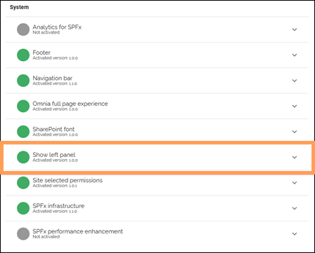

The Everywhere panel
================================

**This page is a work in progress**.

The Everywhere Panel, also called the left panel is available on the left while users browse different pages, allowing quick access to intranet areas and content in both Omnia and SharePoint.

The left panel feature is enabled in the publishing app features. Once enabled, the panel is available inside Omnia and SharePoint.

Panel content is configured in Omnia Admin under Workspace>Left panel. It supports links and layouts, with options comparable to those used for the mega menu. Audience targeting is also available, so different users can be shown relevant entries. Additional settings are configuread under Workspace>Settings Workspace>Left panel.

