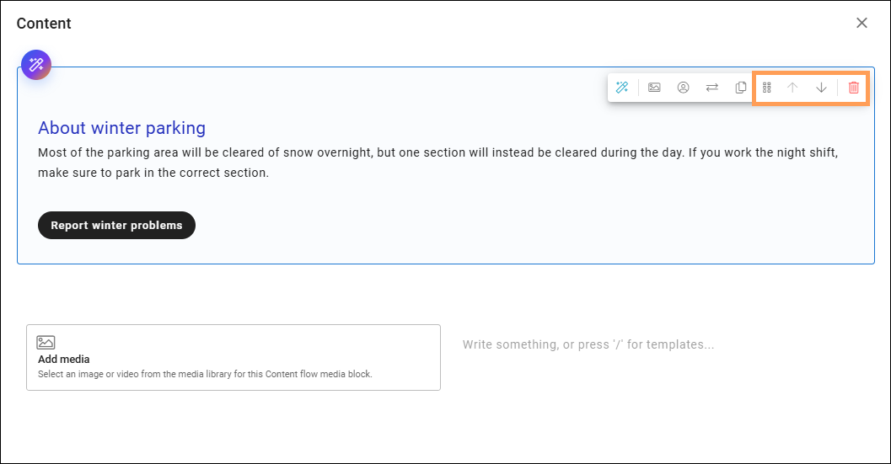
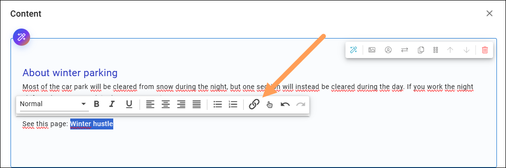
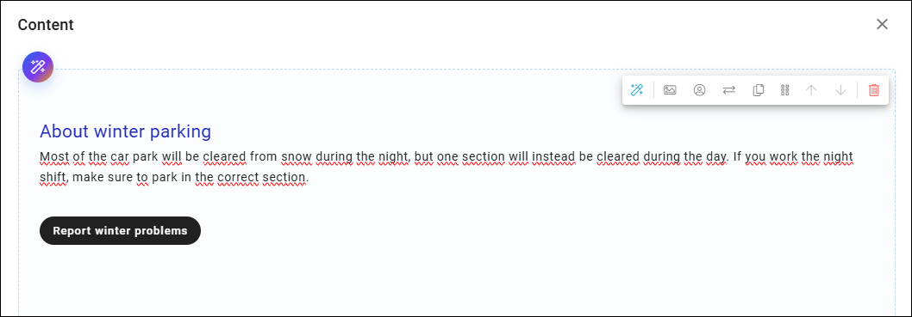
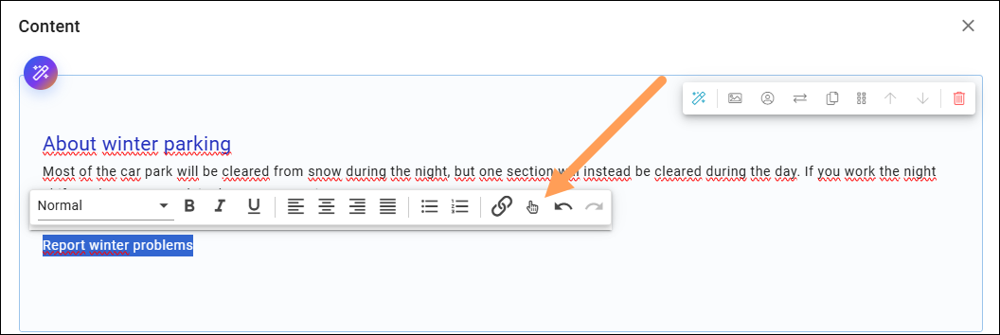
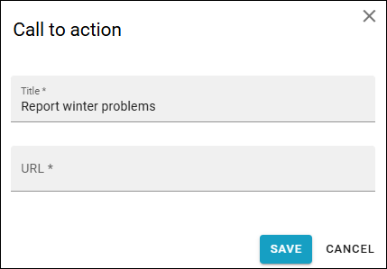
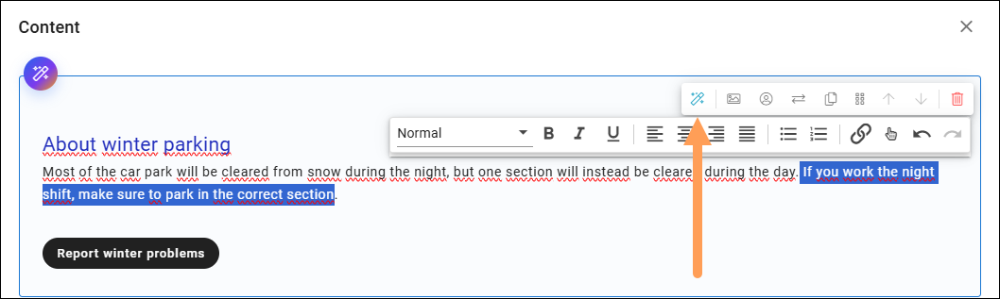
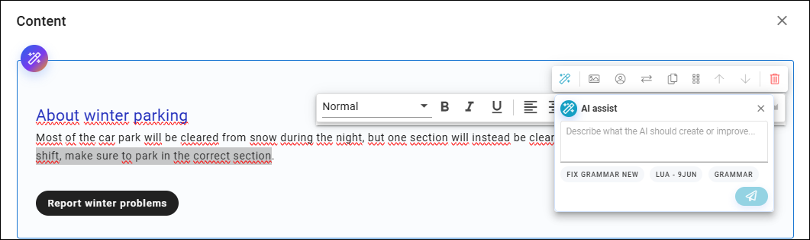

Using Content builder
=======================

**Work on this page is ongoing. This page will eventually describe all available options in the block.**

This block is an authoring tool. It can be used instead of a text block and the RTF editor. Available in Omnia 7.12 and later.

When you start working with content, it can look like this:

.. image:: add-content-content-builder.png

Se below for more information.

Add text to an area or add objects
*************************************
The first area is a text area. Just click and start writing.

To add objects, use the icons, explained below.

.. image:: content-builder-objects2.png

An AI assistant can be available (depends on settings for the block). If it is, you can clock this icon to use it:

.. image:: content-builder-ai-assistant.png

And don't forget to save when yo´re finished!

Reorder or delete
--------------------
When you have added one or more objects, you can reorder objects or delete them, using these icons.

.. image:: content-builder-reorder-delete.png

When click the dust bin, well no surprise, you remove the object. To reorder, grab the icon and move to another place. This will take som practice as you can move an object anywhere.

You can also delete or move whole sections. You can grab the icon here, or used the arrows to move up or down.

Add a template
***************
There's a number of templates available, as a quick and easy starting point. A new template is placed as a new area below.

Do the following:

1. Type / or click ADD BLOCK.
2. Select template.

.. image:: content-builder-template.png

You can now just choose a template by clicking it, or, if allowed (depends on settings for the block) create a new template with AI help. If he list is long, you can search for a template (notice the search field at the very top).

Just repeat to add the blocks needed. You can plan the content from the start or just work one step/template at a time.

You can then add or remove the objects as needed, before adding content. More info below.

Add text
***************
To add text, just click and write. When some text is in place, you can add some formats.

.. image:: content-builder-text.png

The formats in the list to the left is set up in Omnia admin. Most of the formats are general ones you easily recognize, just som words about som of them.

(To be continued ....)

Add link
----------
To add a link, do the following.

1. Click where the link should be added, or select some text that should be the clickable text for the link.
2. Click the icon in the toolbar.

The Add link general asset is shown. If you selected text, it's added to the title field.

See this page for more information: :doc:`Add link </general-assets/add-link/index>`

Call to action
----------------
An option called "Call to action" can be available. It's used to create link buttons in the text. Here's an example:

The button's appearance is set in the business profile's admin settings, see this page for more informtion: :doc:`Theme for business profile </admin-settings/business-group-settings/settings/theme/index>`

You use this option to add a "Call to action":

Add a title (the label on the button), and an URL.

Improve the text
------------------
You can use the AI assistant for some help with the text. 

1. Select some text if needed.
2. Clck the AI assistant button.

3. Type what you would like the assistant to do, or select one of the available prompts.

Add media
**************
(To be continued ....)

  

