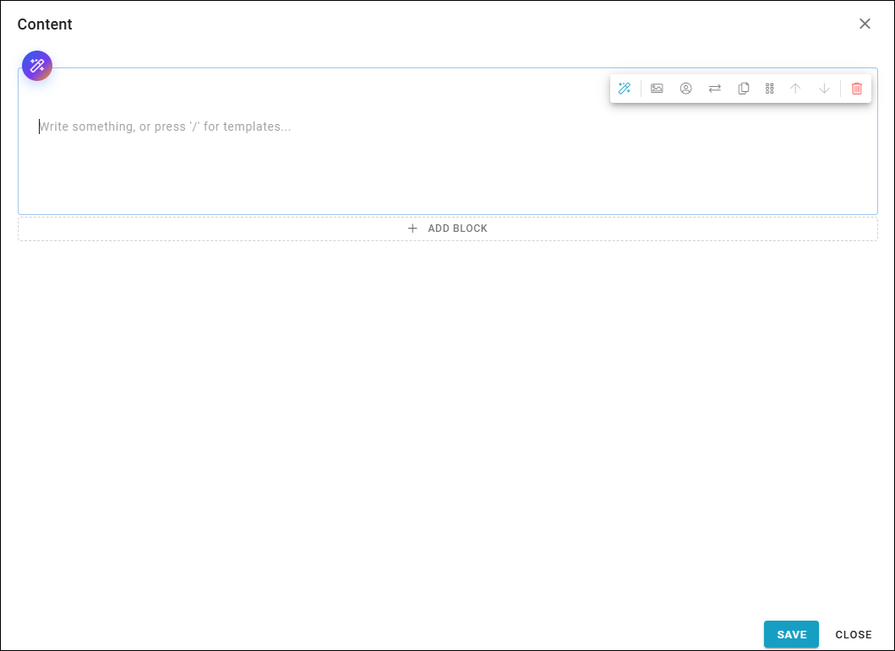
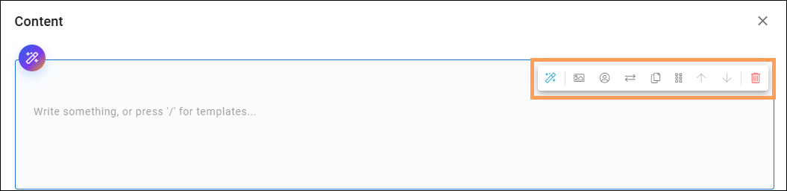
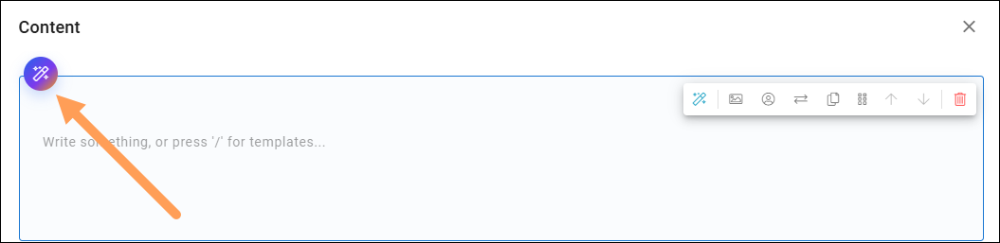
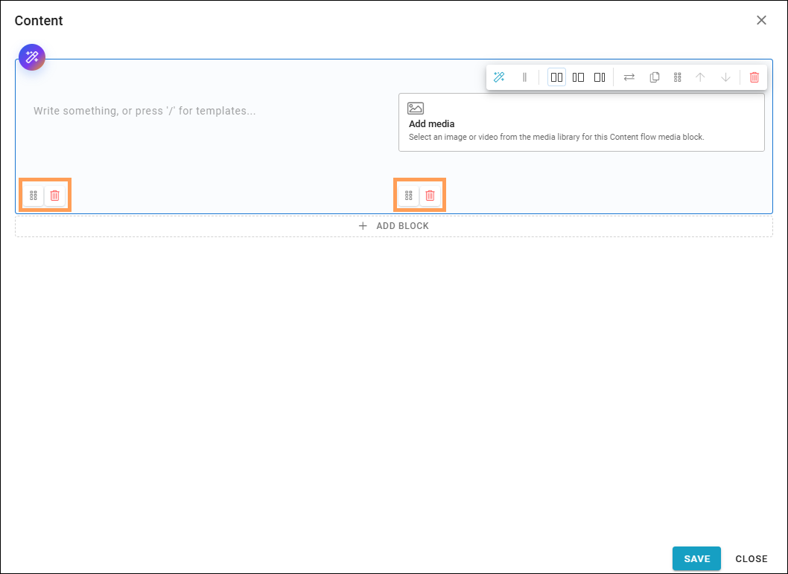
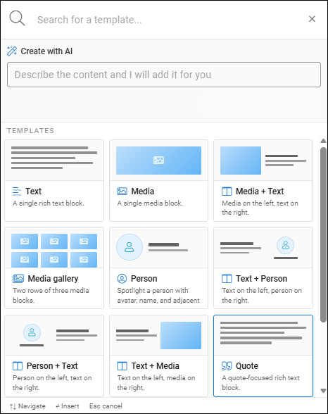
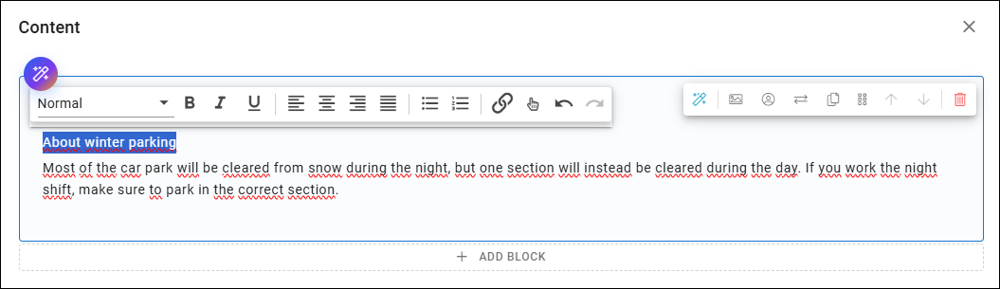

Using Content builder
=======================

**Work on this page is just started. This page will eventually describe all available options in the block.**

This block is an authoring tool. It can be used instead of a text block and the RTF editor. Available in Omnia 7.12 and later.

When you start working with content, it can look like this:

Se below for more information.

Add text to an area or add objects
*************************************
The first area is a text area. Just click and start writing.

To add objects, use the icons, explained below.

An AI assistant can be available (depends on settings for the block). If it is, you can clock this icon to use it:

And don't forget to save!

Reorder or delete
--------------------
When you have added one or more objects, you can reorder objects or delete them, using these icons.

When click the dust bin, well no surprise, you remove the object. To reorder, grab the icon and move to another place. This will take som practice as you can move an object anywhere.

Add a template
***************
There's a number of templates available, as a quick and easy starting point. A new template is placed as a new area below.

Do the following:

1. Type / or click ADD BLOCK.
2. Select template.

You can now just choose a template by clicking it, or, if allowed (depends on settings för the block) create a new template with AI help. Ifhe list is long, you can also search for a template (notice the search field at the very top).

Just repeat to add the blocks needed. You can plan the content from the start or just work one step/block at a time.

You can then add or remove the objects from the template as needed, before adding content. More info below.

Add text
***************
To add text, just click and write. When some text is in place, you can add some formats.

The formats in the list to the left is set up in Omnia admin. Most of the formats are general ones you easily recognize, just som words about som of them.

(To be continued ....)

