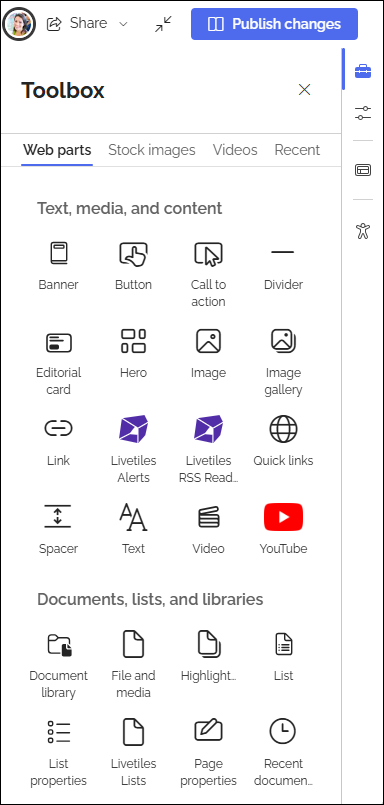

Using Omnia blocks (webparts) on a SharePoint page
===================================================

Some Omnia blocks can be used in any teamsite, including community sites, by using the Omnia blocks web part. More information is found on this page: :doc:`Using the Omnia block webpart </blocks/omnia-block-webpart>`

There's also another way of doing this. If you’re using SharePoint pages in an Omnia implementation, you can use all blocks defined in the webparts section, on ANY SharePoint page. These webparts (blocks) are described on this page, together with a general description on how to use them: :doc:`Webparts </admin-settings/tenant-settings/system/microsoft-365/system-webparts>`

Using the webparts on a teamsite
***********************************
As teamsites really are SharePoint sites, you can also opt to use the webparts on such pages. Here's how:

1. Edit the teamsite paage.

Now you can find the webparts in the toolbox, for example:

2. Click the webpart on the page, where you want to place the new webpart.
3. Select webpart in the toolbox.

The new webpart is now placed under the selected webpart.

4. Move webparts if needed.
5. Edit any settings to your liking.
6. Publish the changes.

