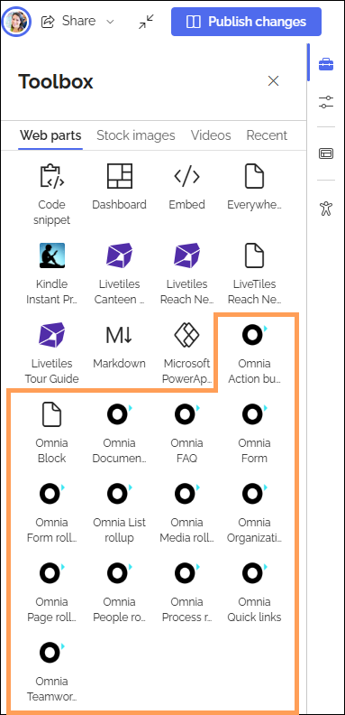

Using Omnia blocks (web parts) on a SharePoint page
===================================================

Some Omnia blocks can be used in any teamsite, including community sites, by using the Omnia blocks web part. More information is found on this page: :doc:`Using the Omnia block web part </blocks/omnia-block-webpart/index>`

There's also another way of doing this. If you’re using SharePoint pages in an Omnia implementation, you can use all blocks defined in the web parts section in Omnia admin, on ANY SharePoint page. These web parts (blocks) are described on this page, together with a general description on how to use them: :doc:`Web parts </admin-settings/tenant-settings/system/microsoft-365/system-webparts/index>`

Using Omnia web parts on a teamsite
***********************************
As teamsites really are SharePoint sites, you can also opt to use the webparts on such pages. Here's how:

1. Edit the teamsite page.

The toolbox is now shown. You may have to scroll to the bottom of the Web parts list to find the Omnia web parts.

2. Click a web part on the page, where you want to place the new we bpart.
3. Select web part in the toolbox.

The new web part is now placed under the selected web part.

4. Move web parts if needed.
5. Edit any settings to your liking.
6. Publish the changes.

