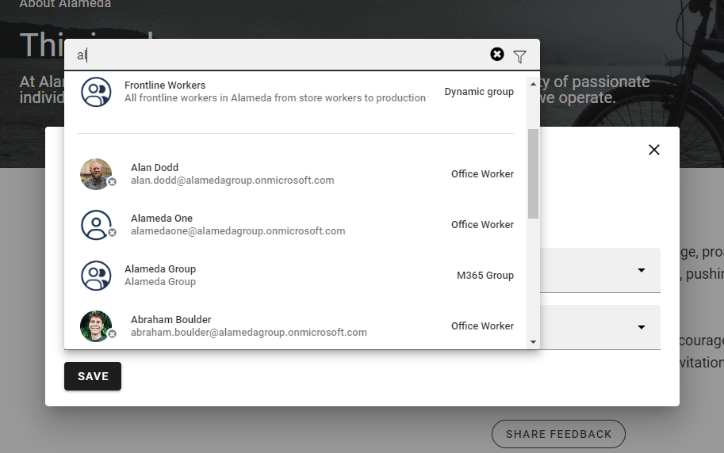
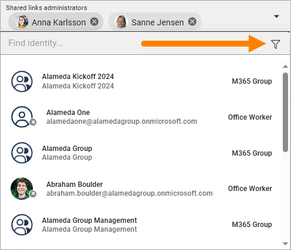
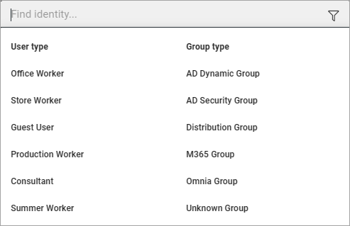
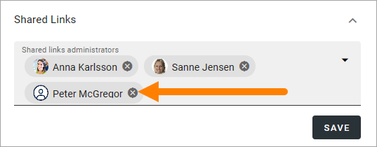

Using the people picker
=============================================

The people picker, sometimes called the identity picker, is used in many places in Omnia. There's two versions of the people picker, one general and another when accessibility features are used. This page describes the general people picker.

To be able to use the people picker, users must be added in the tenant permissions field "Directory reader". For more information about this, see: :doc:`Permissions for the tenant </admin-settings/tenant-settings/permissions/index>`

To use it, just click in the search field and start typing. Here' an example:

For information about how the people picker works when accessibility features are activated, see: :doc:`Accessibility </accessability/index>`

Normally, single users, security groups and Microsoft 365 groups can be added here (In Omnia on-prem, Microsoft 365 groups can’t be used). There are a few exceptions where only single users can be added.

External users that has been invited in Entra ID can be added here as well. Users invited this way can log in with their own Microsoft 365 account. 

To be available in the people picker, users and groups may have to be imported the correct way from Entra ID.

If the picker is used in a permission context, people and groups must by permissions enabled to show up in the list. Likewise, if the picker is used in a context where Email is used, people and groups must be Email enabled to show up in the list.

If you just want to search for a specific user type or a specific group type in the general people picker, click here to filter:

What you can filter on depends on settings in Omnia Admin. Here's an example:

If you happen to select a user or a group by mistake, just click the x to remove.

More information for administrators: :doc:`Synchronization (User management) </admin-settings/tenant-settings/user-management/synchronization/index>`

For a decsription of how the people picker works when accessibility features are on, see this page: :doc:`Accessibiity </accessability/index>`

