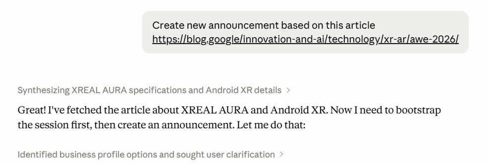
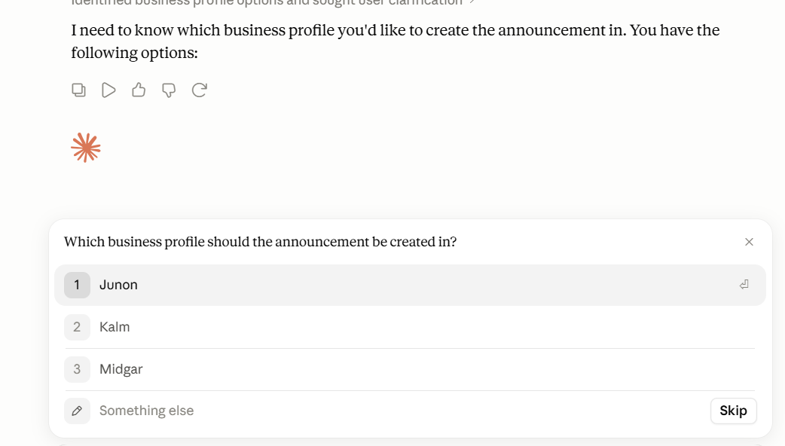
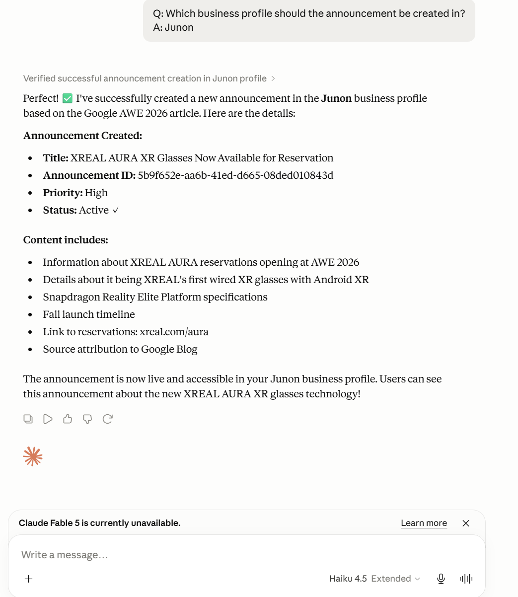

Announcements
=============

Announcements are the short messages shown at the top of a part of the intranet - a system outage, a new policy, a deadline. Through the connector you can list them, read one, publish a new one, change one and remove one, all from the conversation.

This is the area where the conversation pays off most: you can hand over an article, a mail or a set of notes and get an announcement written from it, in the right tone, with a start and end date, instead of copying text into a form.

What you can ask for
********************

+ List the announcements in this part of the intranet.
+ Read one announcement in detail.
+ Publish a new announcement, optionally written from something you provide.
+ Change an existing announcement - wording, dates, priority, type or status.
+ Remove an announcement.

An announcement carries:

+ **Title** and **description**, each of which can have a value per language.
+ **Priority** - Normal or High.
+ **Start date** and **end date**, controlling when it is shown.
+ **Can close** - whether a reader may dismiss it.
+ **Can comment** - whether readers may comment on it.
+ **Force redisplay** - show it again to users who have already dismissed it.
+ An **announcement type** and an **announcement status**, both optional. See :doc:`type/index` and :doc:`status/index`.

Example: an announcement written from an article
************************************************

1. Paste the source and say what you want. Here the source is a public article, but it can just as well be a mail, a set of notes or a page in your own intranet.

2. Answer the questions you get. An announcement belongs to a business profile, so if you have not said which part of the intranet you mean, you are given the profiles you have access to and pick one. The same happens for the announcement type and status - the existing ones are listed, with **None** as a valid answer.

3. Approve the write. The announcement is created and you get back what was published, including its id, so you can keep working with it in the same conversation.

Other things to try
*******************

::

   List the announcements in https://contoso.omniacloud.net/sites/hr

::

   Set the end date of the parking garage announcement to next Friday
   and drop the priority to normal

::

   Write the announcement about the office move in both English and Swedish

.. TODO screenshot: an announcement created through the connector, seen in the Omnia interface

Good to know
************

+ Announcements are **per business profile**, and publishing one requires the permission to manage announcements there.
+ An update changes only what you mention - the rest of the announcement is left as it is. For a title or description with several languages, only the languages you supply are changed.
+ **Force redisplay** shows the announcement again to everyone who has dismissed it. Use it when the content has changed materially, not for a typo.
+ Removing an announcement is immediate and not reversible from the conversation.
+ Type and status are optional, but if your tenant uses them, the guidance in :doc:`../mcp-tenant-context/index` is the place to say which ones to use when.

Actions
*******

+ ``Announcement.List`` - the announcements in this business profile.
+ ``Announcement.GetById`` - one announcement in detail.
+ ``Announcement.Add`` - publish a new announcement.
+ ``Announcement.Update`` - change an existing announcement.
+ ``Announcement.Remove`` - remove an announcement.

.. toctree::
   :titlesonly:

   type/index
   status/index
