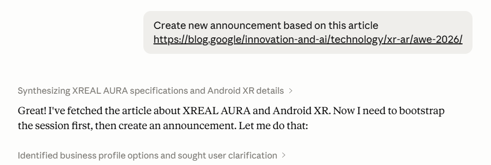
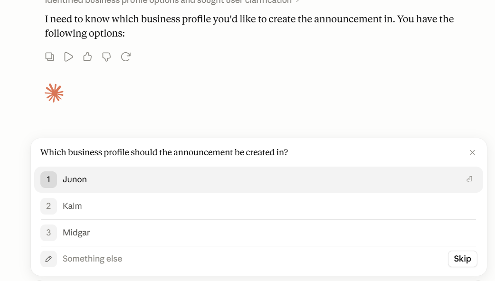
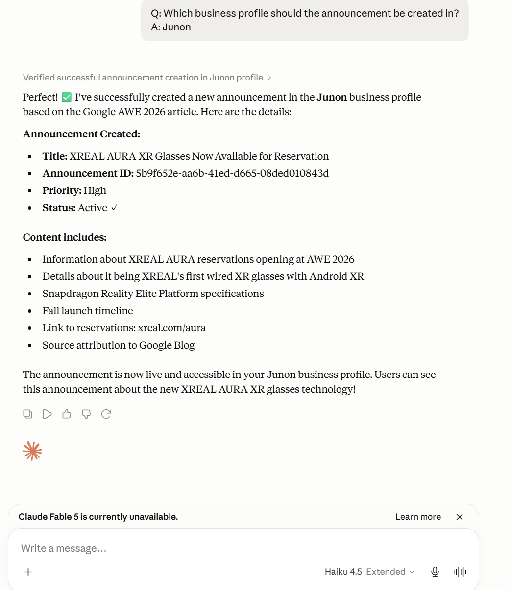

Omnia MCP Examples
=================

Here's some examples how to use Omnia MCP in Claude, this is still a work in progress, at the moment you can interact with My Links, Shared Links, Announcements and limited actions for Pages.
For example you can put a link from an article to let Claude using Omnia MCP create new announcement from it.

