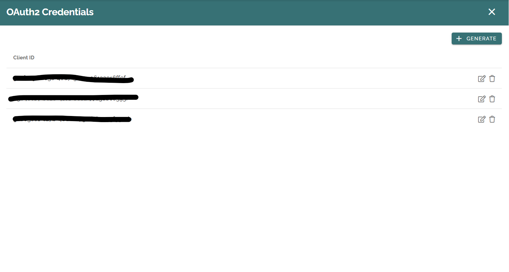
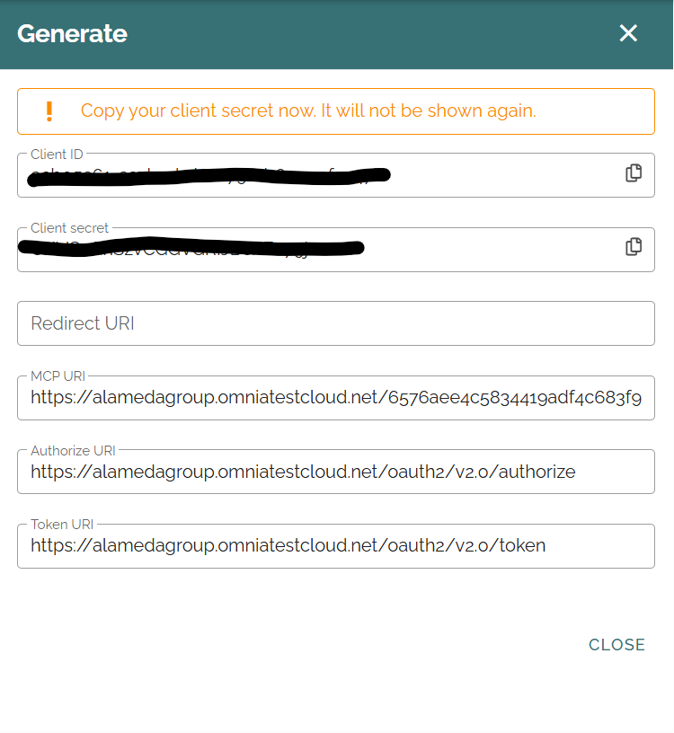
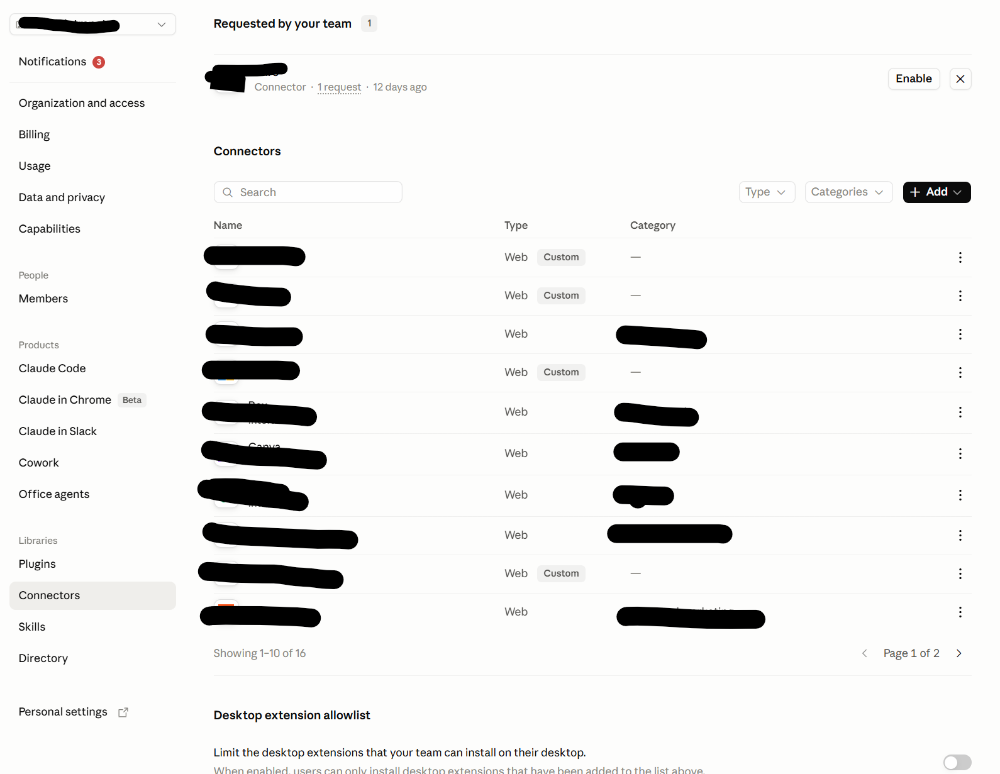
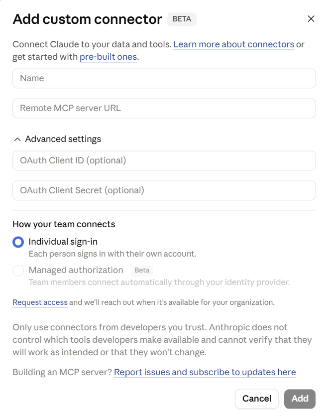
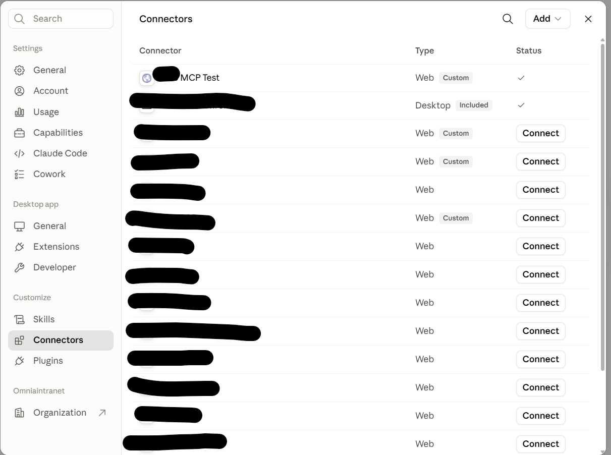

Setup MCP client integration
=================

Below is step by step how to setup Omnia MCP client integration. Your tenant need to install OmniaMCP extension first before doing any step.

Go to Omnia admin System / OAuth2 Credentials. Here, you can see all current client IDs connected to your tenant. Omnia MCP requires at least on client ID.

OAuth2 Credentials settings
**********
Click on generate button will give you new credential including client ID, client secret and some URIs information. You need these information to setup integration with desried MCP client so save them to use later.

Using Omnia MCP with Claude app
----------
Claude app is one of the supported MCP client in Omnia. You need to have permission to access Claude organization settings to be able to setup Omnia MCP. From the app, go to Organization settings / Connectors

Click Add / Custom / Web will open new dialog to input credential information. 

+ **Name**: custom connector name. 
+ **Remote MCP server URL**: Copy MCP URI from Omnia OAuth2 credential.
+ **OAuth Client ID**: Copy Client ID from Omnia OAuth2 credential.
+ **OAuth Client Secret**: Copy Client secret from Omnia OAuth2 credential.

Once custom connector added to Claude, go to your personal Customize / Connectors, you should see the connector you just added. Click on Connect and go through login request then you should be able to use Omnia MCP.

