Setup MCP client integration
============================

Below is step by step how to setup Omnia MCP client integration. Your tenant need to install OmniaMCP extension first before doing any step.

Go to Omnia admin System / OAuth2 Credentials. Here, you can see all current client IDs connected to your tenant. Omnia MCP requires at least on client ID.

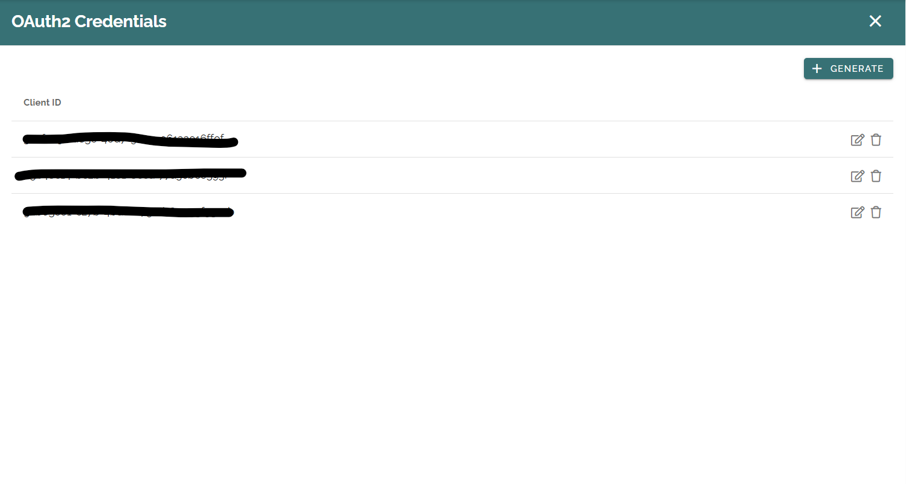

OAuth2 Credentials settings
***************************
Click on generate button will give you new credential including client ID, client secret and some URIs information. You need these information to setup integration with desried MCP client so save them to use later.

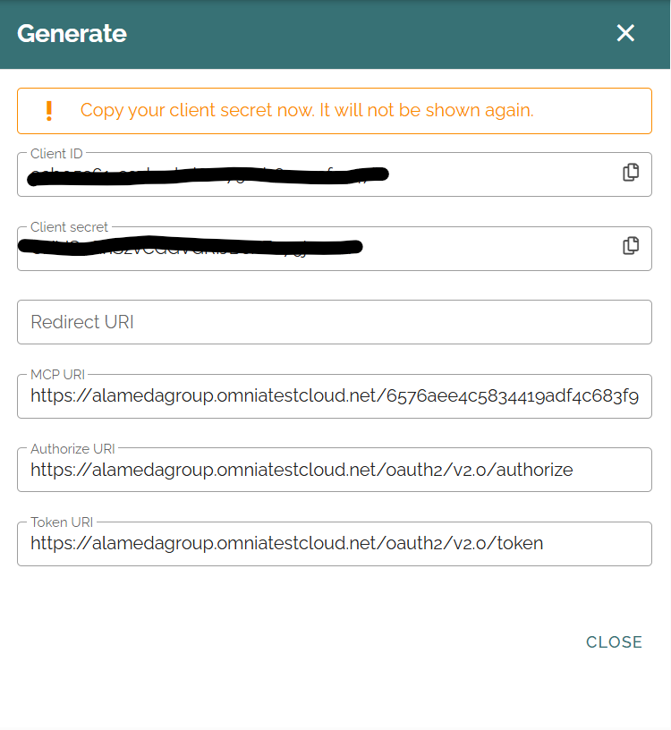

The client secret is only shown once. If you close the dialog without copying it, you have to generate a new credential.

**Redirect URI** is optional. If you leave it empty, Omnia accepts the redirect URI that the MCP client uses. If you do fill it in, it has to match exactly the redirect URI of the client, otherwise sign in will fail.

Using Omnia MCP with Claude app
*******************************
Claude app is one of the supported MCP client in Omnia. You need to have permission to access Claude organization settings to be able to setup Omnia MCP. From the app, go to Organization settings / Connectors

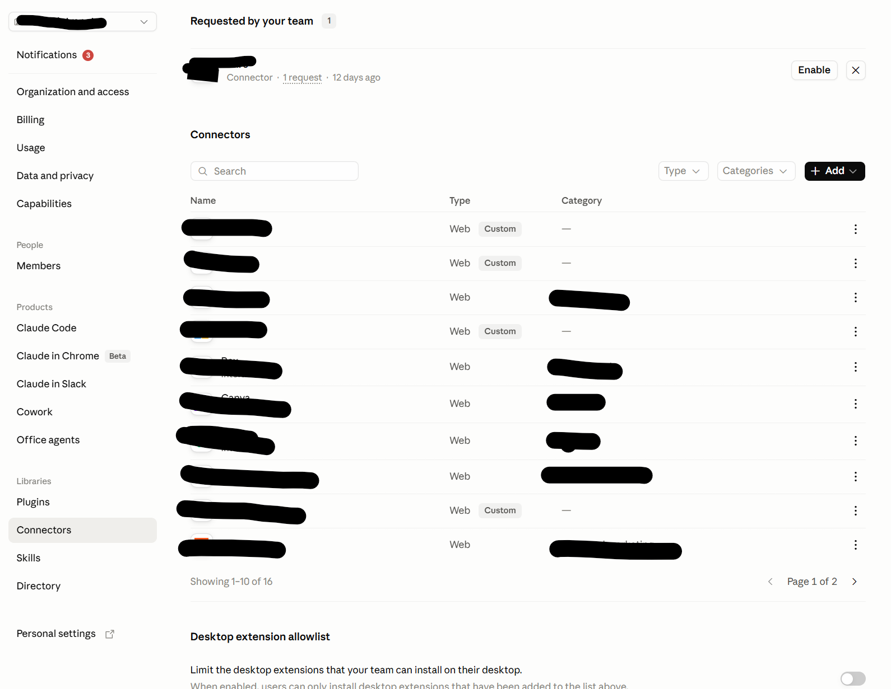

Click Add / Custom / Web will open new dialog to input credential information. 

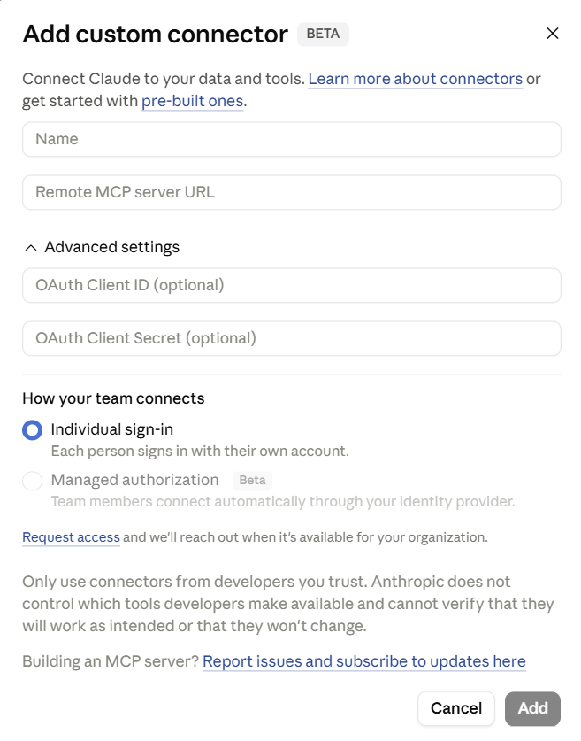

+ **Name**: custom connector name. 
+ **Remote MCP server URL**: Copy MCP URI from Omnia OAuth2 credential.
+ **OAuth Client ID**: Copy Client ID from Omnia OAuth2 credential.
+ **OAuth Client Secret**: Copy Client secret from Omnia OAuth2 credential.

Once custom connector added to Claude, go to your personal Customize / Connectors, you should see the connector you just added. Click on Connect and go through login request then you should be able to use Omnia MCP.

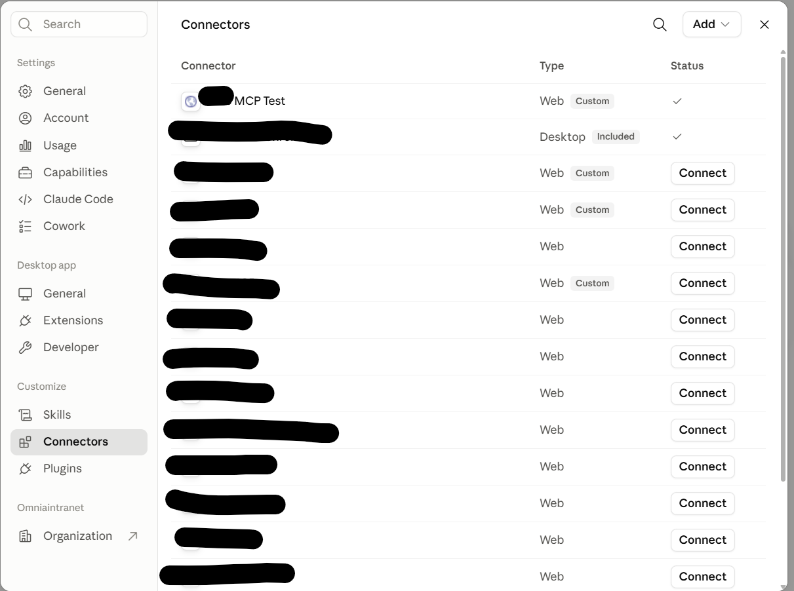

Using Omnia MCP with Microsoft Copilot Studio
*********************************************
Microsoft Copilot Studio is another supported MCP client. You add Omnia MCP as a tool on a Copilot Studio agent, and then publish that agent to the channel you want, for example Microsoft Teams and Microsoft 365 Copilot.

Before you start, make sure that:

+ The OmniaMCP extension is installed on your tenant.
+ You have a Copilot Studio license and permission to create agents in the environment you want to use.

Before you start - copy the credential values
---------------------------------------------
Copilot Studio asks for more values than the Claude setup does, so generate the credential first and keep the Generate dialog open while you fill in the Copilot Studio form.

Copy all of the following from the Generate dialog:

+ **Client ID**
+ **Client secret**
+ **MCP URI**
+ **Authorize URI**
+ **Token URI**

Step 1 - Create a new agent
---------------------------
Go to https://copilotstudio.microsoft.com/ and check that the environment picker in the lower left corner points at the environment you want the agent to live in. Select **Agents** in the left navigation, then click **New agent**.

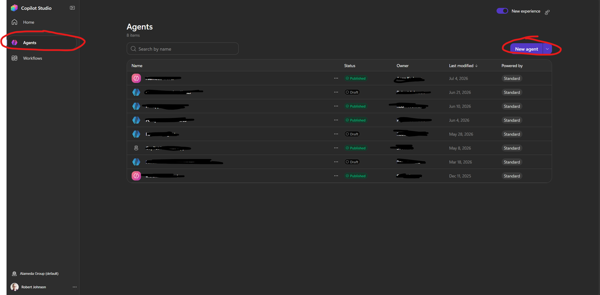

Give the agent a name and describe in the **Instructions** field what it should help users with, for example that it should use Omnia to look up news, links and colleagues on the intranet.

Step 2 - Open Tools
-------------------
In the panel on the right side of the agent, find the **Tools** section and click the **+** icon.

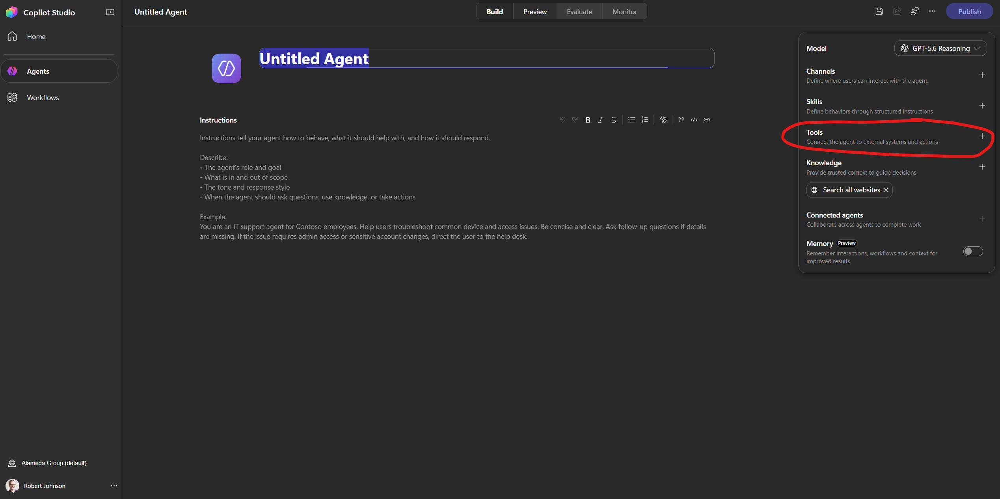

Step 3 - Add a new MCP server
-----------------------------
In the **Add a tool** dialog, click **Add** in the upper right corner and select **Model Context Protocol (MCP)**.

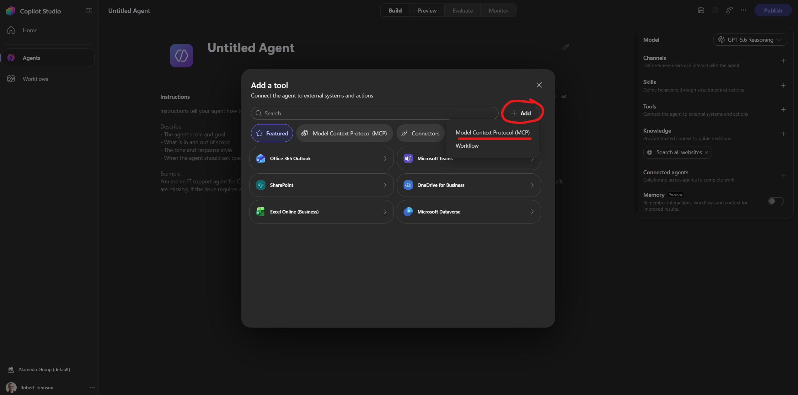

Step 4 - Fill in the server information
---------------------------------------
The **Add MCP server** dialog opens. Fill in the first part of the form.

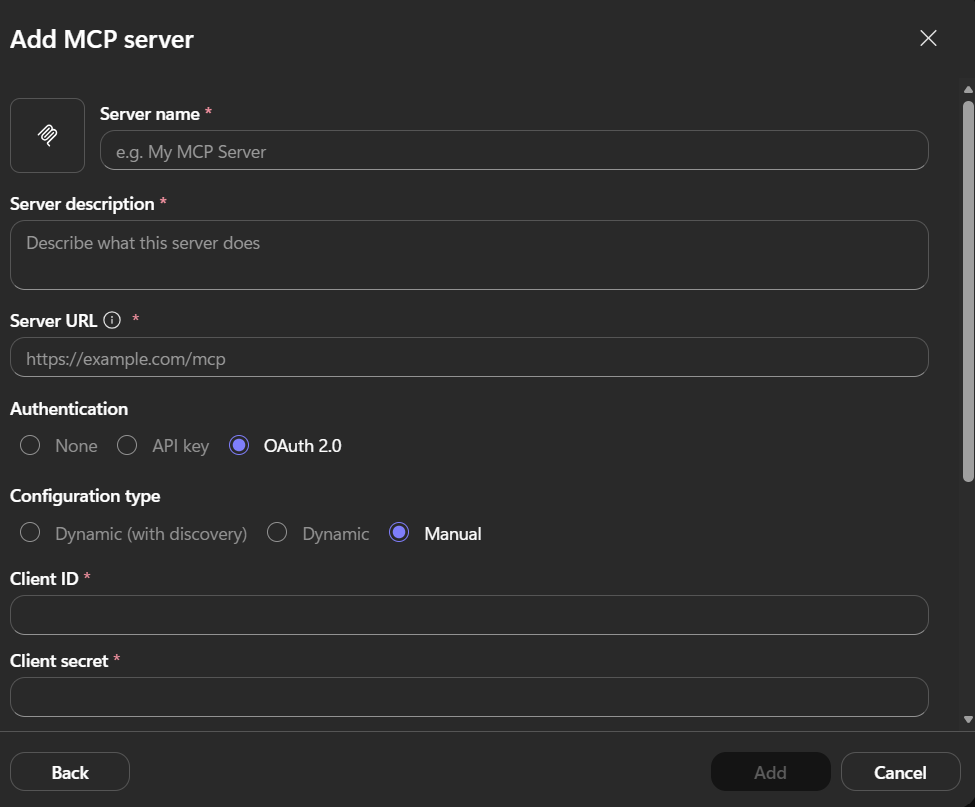

+ **Server name**: A name for the server, for example *Omnia Intranet*.
+ **Server description**: A short description of what the server does, for example *Search and manage content on the Omnia intranet*. The field is mandatory.
+ **Server URL**: Copy **MCP URI** from Omnia OAuth2 credential.
+ **Authentication**: Select **OAuth 2.0**.
+ **Configuration type**: Select **Manual**.

Step 5 - Fill in the OAuth 2.0 information
------------------------------------------
Scroll down in the same dialog to fill in the rest of the OAuth 2.0 settings.

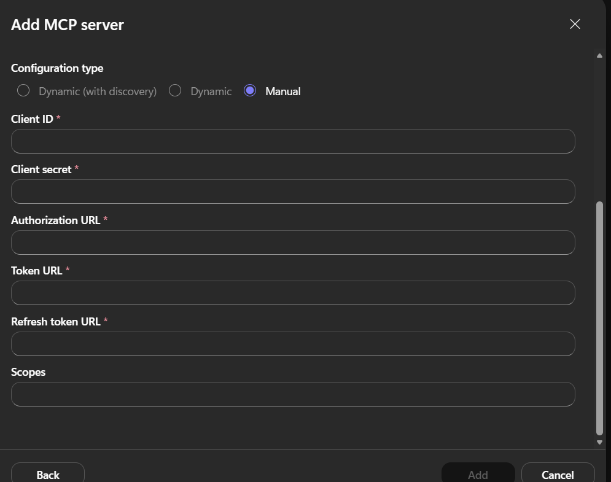

+ **Client ID**: Copy **Client ID** from Omnia OAuth2 credential.
+ **Client secret**: Copy **Client secret** from Omnia OAuth2 credential.
+ **Authorization URL**: Copy **Authorize URI** from Omnia OAuth2 credential.
+ **Token URL**: Copy **Token URI** from Omnia OAuth2 credential.
+ **Refresh token URL**: Copy **Token URI** from Omnia OAuth2 credential again. Omnia uses the same endpoint to issue and to refresh tokens.
+ **Scopes**: Leave empty. Omnia MCP does not require any specific scope.

Click **Add** when the form is filled in.

Step 6 - Create a connection
----------------------------
Copilot Studio now asks which connection the agent should use to reach the server. The first time the server is used there is no connection yet. Open the **Connection** dropdown and select **Create new connection**.

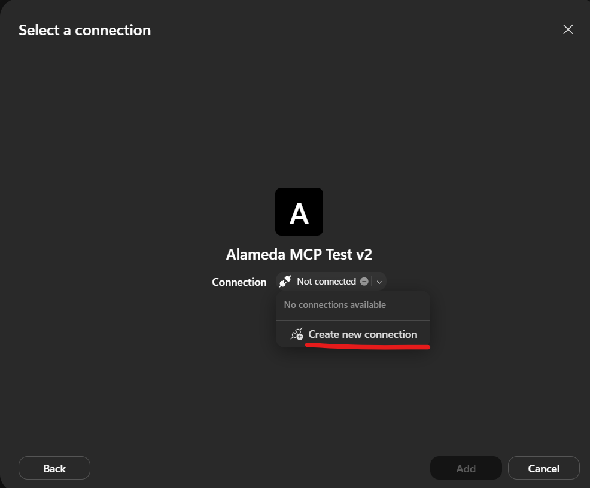

A sign in dialog opens. Sign in with the account you want the agent to use towards Omnia and approve the consent request. Omnia MCP acts on behalf of the signed in user, so the agent only sees the content that this user has permission to see.

When the connection is created, select it in the dropdown and click **Add**. The Omnia tools now show up under **Tools** on the agent.

Step 7 - Test and publish the agent
-----------------------------------
Use the **Preview** tab to verify the setup, for example by asking the agent to search for something on the intranet. The first call may ask you to confirm that the agent is allowed to use the connection.

When you are satisfied with the result:

1. Click **Publish** in the upper right corner.
2. Go to **Channels** in the panel on the right side of the agent.
3. Add the channel or channels you want to make the agent available in, for example **Microsoft Teams and Microsoft 365 Copilot**, and follow the steps for that channel.
4. Depending on your organization's settings, an administrator may have to approve the agent before other users can use it.

Troubleshooting
---------------
+ **Sign in fails or the connection ends up in an error state**: Check that Authorization URL and Token URL are copied exactly as they appear in the Omnia OAuth2 credential, and that the client secret comes from the same generated credential as the client ID. Also check that **Redirect URI** on the credential in Omnia is either empty or matches the redirect URI used by Copilot Studio.
+ **The client secret is lost**: The secret cannot be shown again. Generate a new credential in Omnia admin System / OAuth2 Credentials and update the MCP server settings in Copilot Studio.
+ **The agent does not find any content**: Omnia MCP runs as the signed in user. Check that the account used for the connection has access to the content you expect to find.
