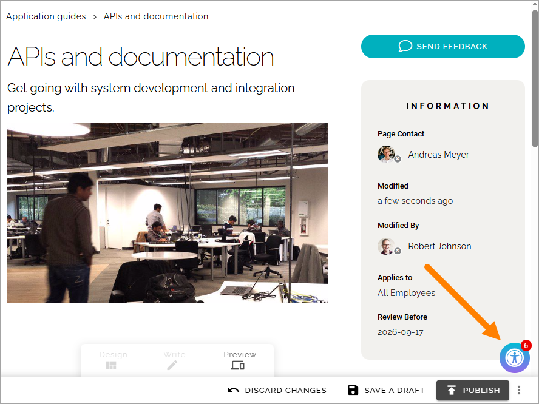
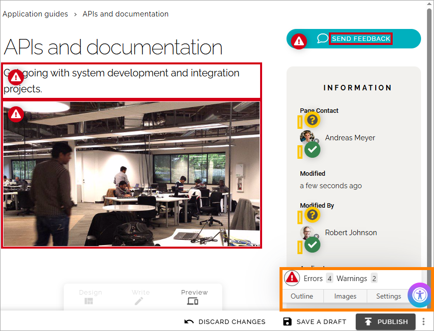

Accessibility check when editing pages
========================================

Available in Omnia 7.10 and later. 

When you are editing a page, you can use **Preview mode** to check for accessibility issues, including readability. This option must be activated for a page collection, using the page collection settings. Meaning, it can be activated for just some page collections, if needed. For more information, see: :doc:`Page collection settings </pages/page-collections/page-collection-settings/index>`

If there are any issues, an icon is shown in the down right corner:

Click the icon to see the comments. Here is an example:

Read the comments thoroughly and make the necessary changes.

