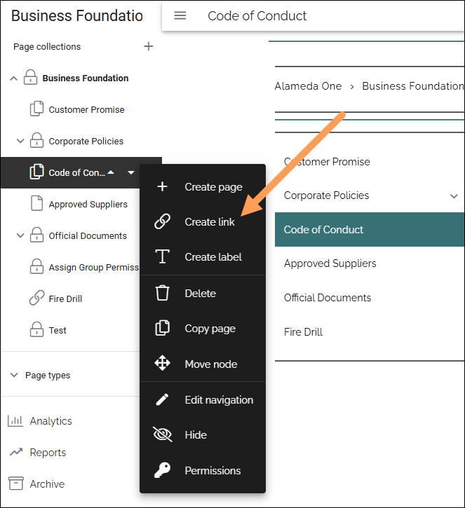
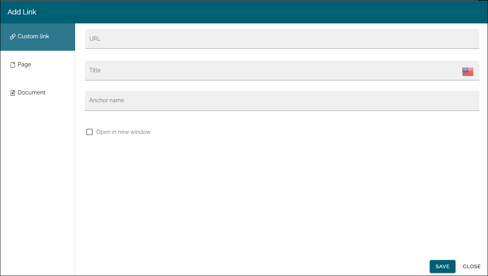

Create link (Navigation tree)
==============================================

Using the option "Create link" you can add a link to the navigation, to anything you can reach with a custom link, a page or a document. All link nodes can be moved and deleted, and sub pages and more can be added, the same way as for a page. Deleting/archiving works the same as for pages as well.

1. Select the page or heading the link will be placed under.
2. Open the menu and select "Create link".

The Add link general asset is opened and you use it to create the link. 

See this page for more information (but note that you can only create a Custom link here): :doc:`Add link </general-assets/add-link/index>`

