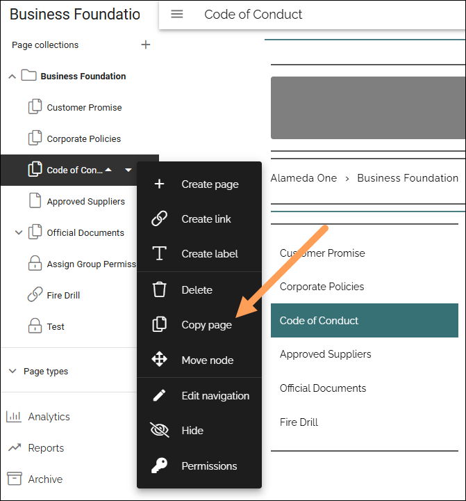
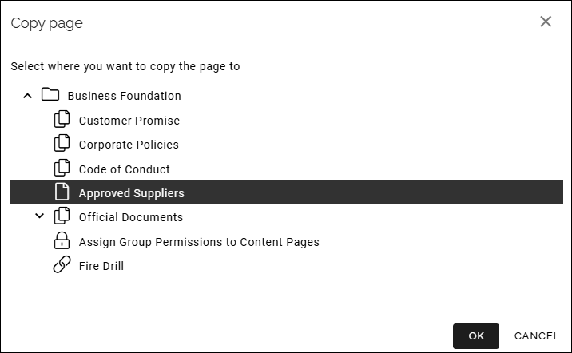

Copy a page
==============================================

You can copy a page and place the copy anywhere within the same publishing app. This could be really useful if you need to create a similar page. Then you just need to edit the differences. Here's how:

1. Edit a page.
2. Open the navigation tree.
3. Select the page you want to copy. 
4. Open the menu and select "Copy page".

5. Select the page where you want the copy placed as a sub page.

6. Click OK.

The page is now copied to the selected position.

