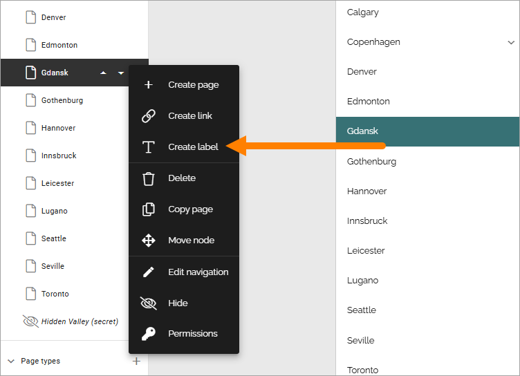
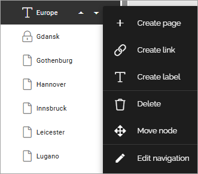

Create label (Navigation tree)
========================================

In Omnia 7.10 and later you can create labels in the page navigation menu. It's for example useful if you need to add headings. Note that you can't link to anything from a label.

You create the label as a sub node to the node you have selected, just like when you create a page. You can also move the label in the menu, with or without sub nodes, just as you would with a page. A deleted label is placed in the archive, where you can restore or terminate it, the same way as for a page.

When the label is created, you can create a sub page, a sub label, a sub link and use a few other options that works the same way as for pages:

