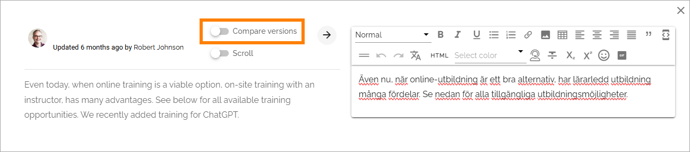

Edit page variations
========================

A page variation can be edited by a variation author, or can be automatically machine translated. This choice can be made for each variation that has been set up for a specific page. If a page is automatically machine translated, it's noted on the variation page and that page can't be edited manually at all. Don't confuse this with the machine translation option that CAN be used by a variation author during editing. 

This page describes how it works with one more variation authors assigned to the variation page. These options are not available if automatic machine translation has been selected for the variation.

The page describes how this option works in Omnia 7.8. In Omnia 7.9 and later, there's a tiny difference, the option "Changes" has been renamed "Compare versions", as seen in this image:

Other than that, this option works exactly the same in Omnia 7.9 and later, as described here.

When a page variation exists for a page, omnia keeps track of changes on the main page. When the main page has been edited, compare icons are displayed to notify the ariation author about where changes have been made. It's shown when a varation is edited.

.. image:: edit-variations-1-new.png

To edit the variation according to the changes, click the compare icon.

Something like the following is shown:

.. image:: edit-variations-2-new.png

To the left you can see the text on the main page, to the right the text for the variation you're editing.

If you would like to see what have been changed, click this icon:

.. image:: edit-variations-3-new.png

Now you can clearly see what's been altered, for example:

.. image:: edit-variations-4-new.png

**Note!** The comparison is made between the two last versions of the main page. If you haven't edited the variation for a while there can be more changes and they are not selected here - just the last changes are shown.

You can of course edit the variation manually by typing the text in the right field and just use the information in the left field as a reminder, but as a quick way, machine translation is an integrated part of this functionality. **Note!** Machine translation is not available in Omnia on-prem.

Click this button to machine translate all text in the left field.

.. image:: edit-variations-5-new.png

and select to which language you want the translation to be made:

.. image:: edit-variations-6-new.png

The list displays all languages that has been set up in Omnia admin.

**Note!** When you click the "Translate" button, a complete, new translation of the text in the left field is made. If you have done any changes manually in the right field before this, they are overwritten. 

If there is a lot of text, a scroll bar is available. Sometimes it can be handy to have separate scroll bars in each field. If you want that, click "Scroll".

.. image:: edit-variations-7-new.png

When you're finished, just close the compare window. You then save, or discard, changes and publish, the normal way.

Variation author
*****************
A variation author can be added for each variation. That is done in the publishing app settings, see: :doc:`Publishing app settings </pages/page-settings/index>`

Omnia 7.8 and earlier: Note that there can be only one variation author for each variation, regardless of on how many pages the variation is used. In Omnia 7.9, several variation authors can be added for a variation. In Omnia 7.9 it's also possible to add a permission for editing a specific variation page, if needed.

**Note!** In Omnia 7.8 and earlier, page collection administrators can always edit all variations as well.

The variation author is notified through Email when a main page, with a variation of the variation authors type, is updated.

The variation author needs the same permisions as the author of the main page, to be able to edit the variations for a page (but also see the note about specific permissions above).

For more information about permissions for specific variation pages, se the bottom of this page: :doc:`Edit permissions for a page </pages/edit-permissions/index>`

Variations and reusable content
*********************************
Variations can be used as reusable content, the same way as other pages, see: :doc:`Reusable content </pages/reusable-content/index>`

Delete variations
********************
You can delete a variation even if the main page should not be deleted. (If the main page is deleted, any variations for that page are always deleted as well.)

1. Open the variation.
2. Save or discard changes, if there are changes that has not been saved yet (or the DELETE button will not be available).
3. Click DELETE.

.. image:: archive-variation-delete-new.png

The delete option is also always available in the navigation tree menu.

.. image:: archive-variation-delete-navtree-new.png

Something like the following is shown:

.. image:: archive-variation-new2.png

4. Type a comment and click OK.

A variation can be restored or terminated the same way as pages in the archive.

More information about deleting, restoring and terminating of pages (which is fully applicable to variations) is found here: :doc:`Delete a page </pages/delete-page/index>`

