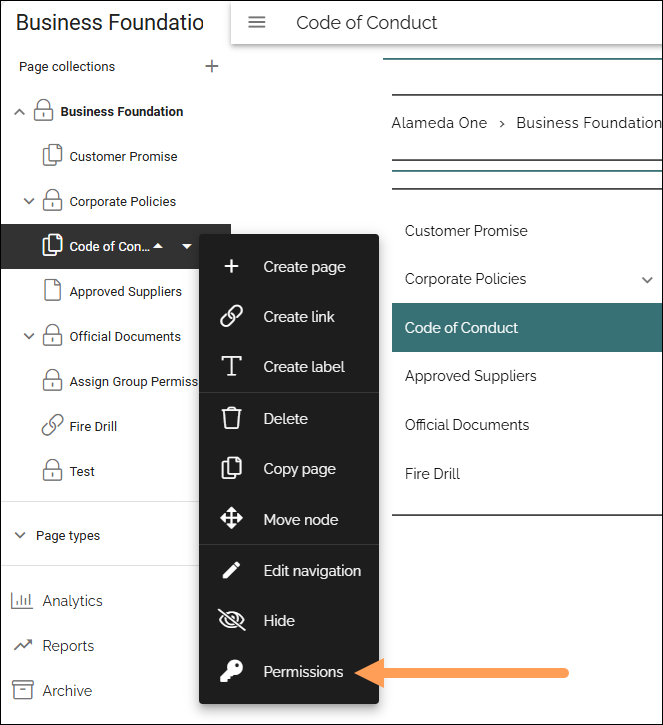
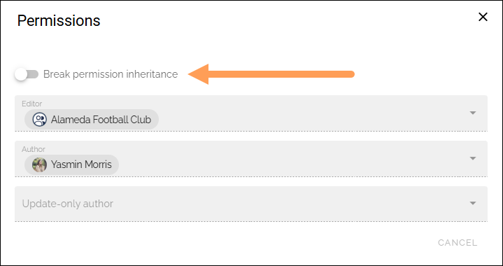
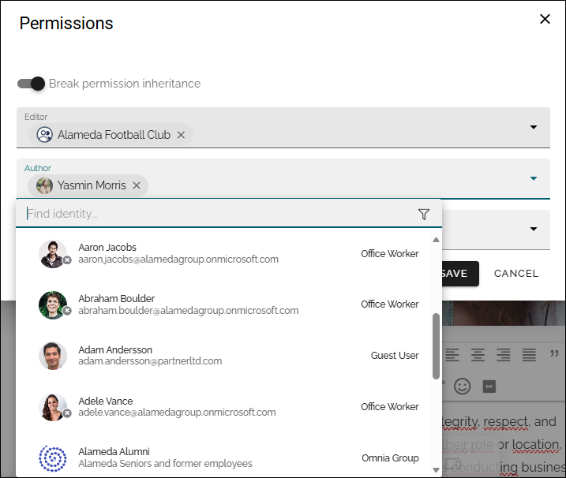

Permissions to edit a page
=============================

Per default the same edit permissions apply to all pages and other nodes, including variations in the whole page collection, but it can be changed if needed. If you change permissions for a page that has sub pages, the same permissions apply to the sub pages (they inherit the permissions settings from the "parent"). Also note the comments about variations, below.

For more information about permissions for the page collection, see: :doc:`Page collections permissions </pages/page-collections/page-collection-permissions/index>`

Do the following to set specific permissions for a page and it's sub pages:

1. Open Edit mode.
2. Select the page where you need to edit permissions.
3. Open the menu and select "Permissions".

Omnia works with inheritance, just as Sharepoint does, so the first thing you have to do is:

4. Click to break permission inheritance.

You can now set the following permissions, for this page and all sub pages:

+ **Editor**: Can create, delete and move pages and nodes, can use both Design mode and Write mode and can edit permissions here.
+ **Author**: Can create pages, can use the navigation panel to create new pages and other nodes, and can use Write mode to edit contents in some blocks.
+ **Update-only author**: Available in Omnia 7.10 and later. Colleagues with this permission can only update existing pages using Write mode, and publish a new version of the page, but can not use the navigation panel, meaning can not, for example, create new pages. Also, this permission does not allow pages being deleted.

**Note!** Page collection administrators are always permitted to work with pages (Editor permissions). They don't need to be added here.

5. To add an editor or an author, just open the list and select the user.

You can also search for users the same way as in other people lists. For more information, see: :doc:`Using the people picker </general-assets/using-people-picker/index>`

6. Click "SAVE" when you're done. (If you don't want to save, just close the window to ignore the changes.

Permissions for variations
***************************
A variation page is simply a copy of a source page, with some sort of alternative content, for example in another language.

Permissions for editing variations can be set up in several ways, see: :doc:`Permissions for variation pages </pages/permissions-for-variations/index>`

Read more about variation authors is found on this page: :doc:`Publishing app settings </pages/page-settings/index>`

