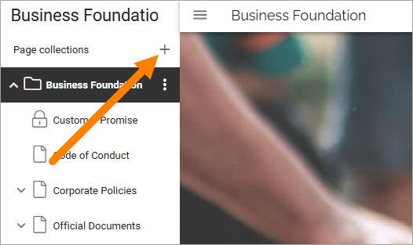
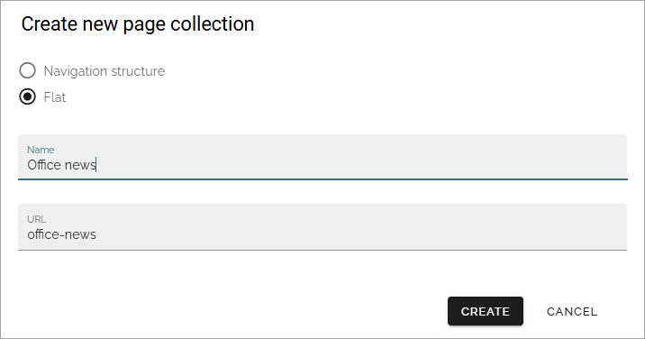

Create a new page collection
===============================

If needed, a new page collection can be created. Do the following:

1. Edit any page and open the navigation.
2. Click the plus besides "Page collections".

3. Choose to use a navigation structure or just flat, meaning no navigation structure.

One example where "Flat" is a relevant choice, is when creating a new page collection for news.

4. Type a name for the new page collection.
5. An URL is added, based on the name. It can be edited if needed.

6. Click CREATE.

The new page collection is created and placed in the editors navigation. You can now add pages and everything else that is described in the "Pages" section of this documentation.

For settings for the page collection, see :doc:`Settings for page collections </pages/page-collections/page-collection-settings/index>`

