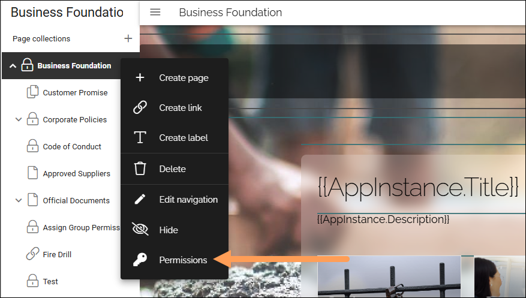

Page collection permissions
=============================

To be able to set page collection permissions, you must be page collection administrator or tenant administrator. The settings at this level apply to all pages and other nodes in the page collection, but can be changed for each page or node if needed.

Click the main node of the page collection, and select "Permissions" in the menu:

You can edit the following settings here:

.. image:: page-collection-permissions-711.png

+ **Page collection admin**: Needed to be able to edit all page collection settings. The page collection admin permission is also needed to be able to edit the top node of the page collection. Publishing app administrators (set in the publishing app settings) can edit the top node as well. 
+ **Editor**: Editors can create pages using the available page types and edit pages using both Design mode and Write mode. 
+ **Author**: Authors can create new pages and add and edit other nodes in the navigation tre. Authors can edit page contents using Write mode only. 
+ **Update-only author**:  Available in Omnia 7.10 and later. Colleagues with this permission can only update existing pages using Write mode, and publish a new version of the page, but can not use the navigation panel, meaning can not, for example, create new pages. Also, this permission does not allow pages being deleted.
+ **Reader**: All colleagues that should be able to read information in this page collection must be added here or belong to a permission group added here. "Everyone" (Internal users + External users) or "Everyone except external users" (Internal users except restricted") are two commonly used permission groups.

For more information on the people picker, see: :doc:`Using the people picker </general-assets/using-people-picker/index>`

For information on how to change edit permissions for a page and it's sub pages, see: :doc:`General block settings </blocks/general-block-settings/index>`

