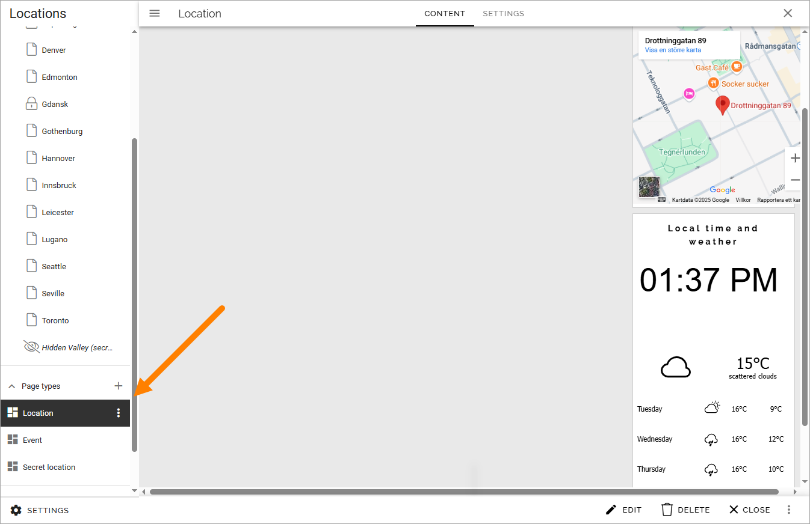
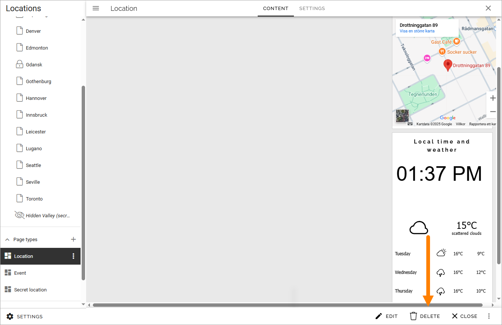
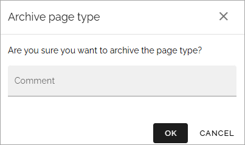
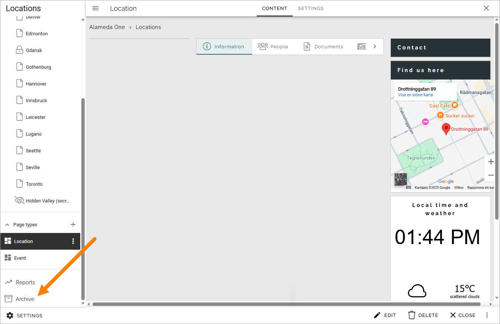
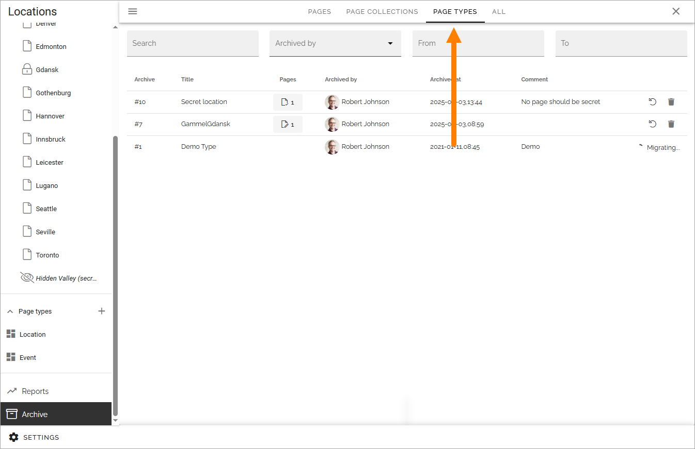

Delete or restore a local page type
======================================

An unused page type can be deleted (archived). If the page type is used for any active page, it can't be deleted. If the pages are deleted, the page type can also be deleted.

Do the following to delete a local page type:

1. Select the page type.

2. Click DELETE.

3. Type a comment and click OK.

Restore or terminate a page type
**********************************
A page type can be restored from the archive if you should need it again. An archived page type can also be terminated if needed.

1. Edit any page.
2. Select Archive.

3. Select PAGE TYPES.

4. Use the icons to the right to restore or terminate a page type from the archive.

.. image:: archive-page-type-restore-icons-79.png
