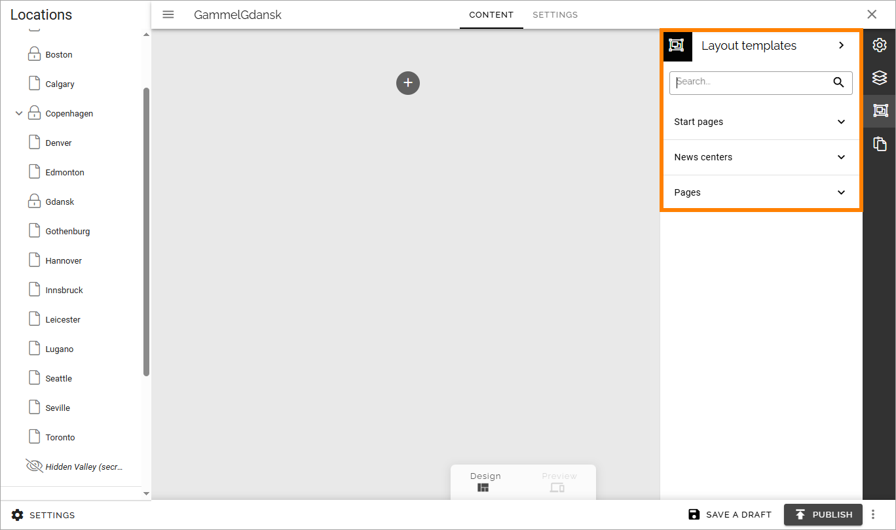
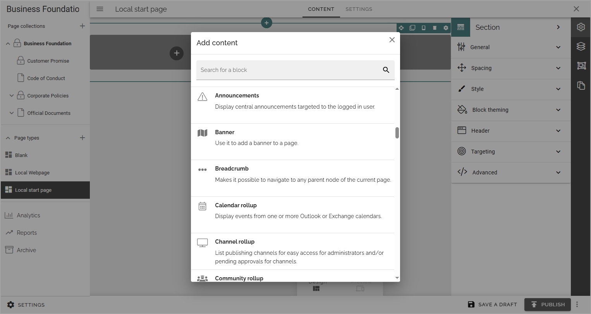

Create a new page type
========================

This page describes how to create a local page type, meaning a page type is available only in the publishing app where it was created. The page contains images from Omnia 7.9.

Note that if your organization works with tenant page types you first have to consider if you should add it as a tenant page type or a local page type. For more information, see this page: :doc:`Tenant page types </admin-settings/tenant-settings/webcontent-managament/page-types/index>`

Here's how to create a local page type:

1. Click the plus for Page types.

2. Add a name for the new page type and click "CREATE".

3. Now start to build the the base layout by adding sections. Note that there are a number of layout templates you can use as a starting point. You can find them in a list to the right:

There are a number of sections you can use. See the images on the icons for the layouts, for a simple preview of the layout.

For a description of the section settings, see: :doc:`Section settings </pages/page-types/section-settings/index>`

5. You then add blocks for the page's content.

For more information on how to use sections and blocks on pages, see: :doc:`Sections and blocks in a page type </pages/page-types/working-with-sections-and-blocks/index>`

For information on how to work with blocks, see: :doc:`Working with blocks on pages </blocks/working-with-blocks/index>`

All blocks you can use are listed here: :doc:`Blocks </blocks/index>`

