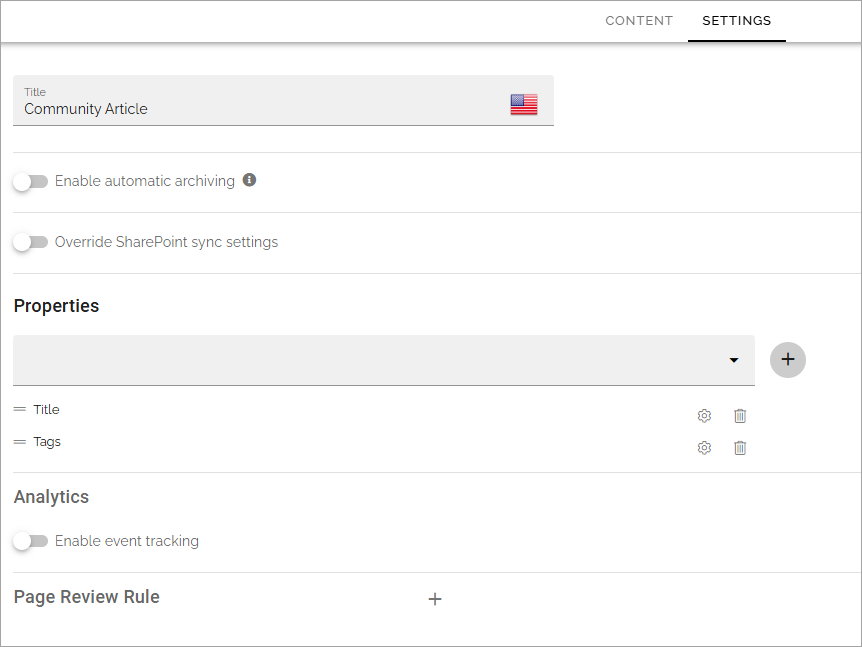
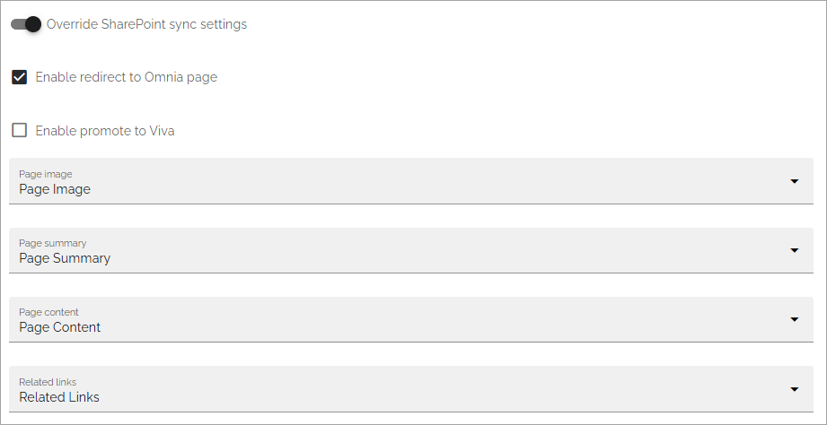
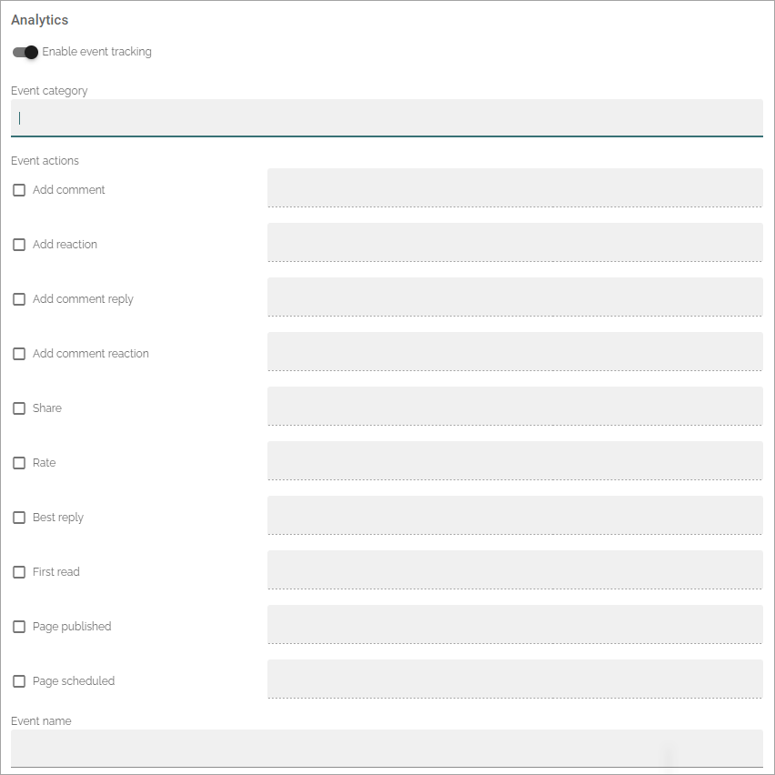
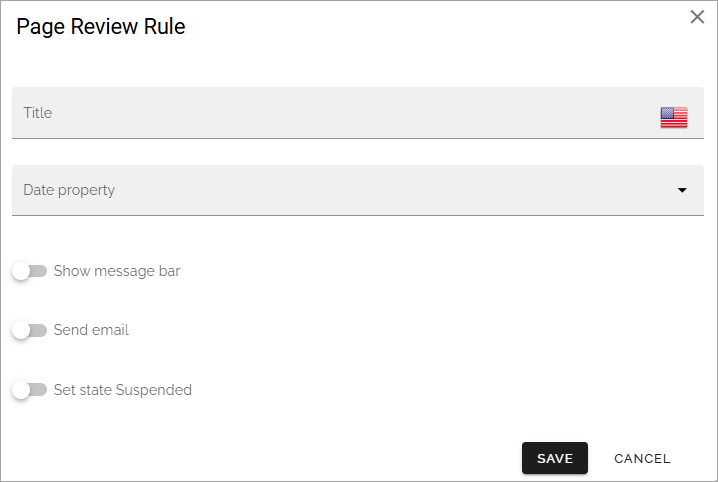
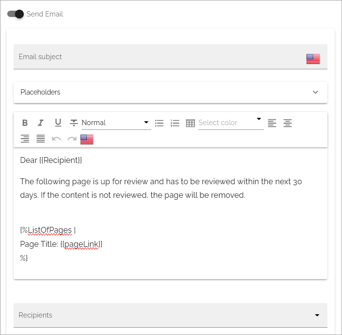
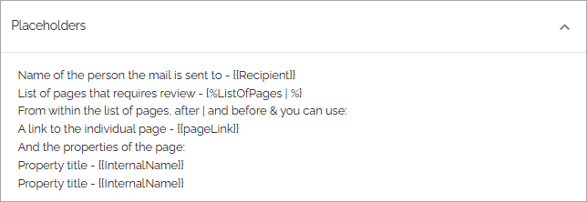
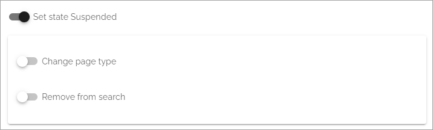

Page type settings
======================

The following can be available on the Settings tab (image from Omnia 7.9):

+ **Title**: The name of the page type can be edited here.
+ **Enable automatic archiving**: Set automatic archiving on or off for the page type. See below for more information.
+ **Override SharePoint sync settings**: Available for local page types (not for tenant ones). See below for a description.
+ **Properties**: Select the properties that should be available for pages created from this page type. In many cases it results in fields the page editor has to or can fill in for a page. You can select any of the properties defined in the tenant. See this page for more information about setting up properties: :doc:`Tenant settings - Properties </admin-settings/tenant-settings/properties/index>` 
+ **Analytics**: Available in Omnia 7.8 and later. Here you can enable event tracking and add some settings. See below for more information.
+ **Page review rule**: Available in Omnia 7.9 and later. Using this option you can create settings for page review rules, if needed. See below for more information.

Enable automatic archiving
***************************
Using this option you can activate automatic archiving for pages created from this page type. When a page is automatically archived, it is deleted and placed in the archive, the same way as when an editor deletes a page manually.

When you click "Enable automatic Aachive" the following is shown:

.. image:: automatic-archive-settings-new.png

Select a property to base the automatic archiving on. **Note!** Best practice is to create a specific property to use for this purpose. Any custom property of type date or time can be used.

You can then edit the settings for the property you have chosen by clicking the cogwheel for the property.

.. image:: automatic-archive-settings-select.png

Available options can differ depending on how the property is set up. Here's an example:

.. image:: automatic-archive-settings-settings-edited.png

Note that the settings you do for a property here is valid for this page type only. It does not affect the property in any other way.

For a description of the fields, see below under *Settings for a property*. Note that a poperty used for automatic archiving should always be read only. 

For more information on deleting, archiving, retrieving and terminating pages, see: :doc:`Delete a page </pages/delete-page/index>`

Calculate based on another property on the page
------------------------------------------------
Automatic archiving can be a calculated value. Note that the property that is used as base for the calculation, must be one of the other properties for the page.

In this example, the page should be automatically archived one month after the article date:

.. image:: automatic-archive-settings-calculated.png

Note that if the value for the base property can be edited, which often is the case for Article date, the automatic archiving date is automatically recalculated if the value of the base property is edited.

In Omnia 7.9, there's a small addition. Now you can set both plus and minus for the recalculation.

Automatic termination
-----------------------
Furthermore you can set automatic termination from the archive, based on archiving date. You can find that setting in the publishing app settings. See the heading "Archive" at the bottom of this page: :doc:`Publishing app settings </pages/page-settings/index>`

Override SharePoint sync settings
************************************
SharePoint sync settings are set in Omnia admin (available under Web content management), for the whole tenant. If you need some other synchronization for pages created from this page type, you can override the tenant settings and create a specific synchronization here.

This option is available for local page eypes, not for Tenant Page Types.

When you activate this option, the following is shown:

.. image:: page-type-settings-override-message-v7.png

And then something like the following is available (image from Omnia 7.8):

+ **Enable promote to Viva**: Available in Omnia 7.8 and later. Select this option if pages of this page type should appear in Viva connections.

The rest of the settings are used exactly the same way as the settings for the tenant. See this page for more information: :doc:`SharePoint sync </admin-settings/tenant-settings/webcontent-managament/sharepoint-sync/index>`

When you have set up the sync here, you must execute a reindex/full sync to SharePoint, as the message stated. You do that in the publishing app settings:

.. image:: tenant-properties-settings-sync-v7-frame.png

Settings for properties
******************************
Add a property to the page type this way:

1. Select the property in the list and click the plus.

.. image:: page-type-property-plus-v7.png

Remove a property by clicking the dust bin.

To edit settings for a property, do the following:

1. Click the cog wheel for the property.

.. image:: page-type-settings-cogwheel-v7.png

Something like the following is shown:

.. image:: page-type-settings-dot-menu-settings-v7.png

Note that the settings you do for a property here is valid for this page type only. It does not affect the property in any other way.

The following settings can be available for a property (not all are shown in the image above):

+ **Required**: Select this option to make it mandatory to add settings to this property for all pages that use this page type.
+ **Allow multiple values**: For some properties multiple values are possible. If you will allow the editor to enter more than one value, check this option. If multiple values are not possible for the property, this option is not shown.
+ **Date only**: If date should be the only type of data possible for this property, select this option.
+ **Show in new page**: if this property should be available in the wizard when a new page is created, select this option.
+ **Show in edit properties**: if this property should be available in settings for a page when it's edited, select this option.
+ **Show label**: Select this to show the label for the property.
+ **Custom label**: If "Show label" is selected, the property name is displayed per default. If you want another label to be displayed, add it here.
+ **Category**: You can add a category for this property, used when listing properties for the page type.
+ **Default value**: Use this setting to decide what should be shown for the property as a suggested value, when the page is created. Empty is just that, no value. Today displays todays date. You can also base the automatic archiving on another property. See above for more information.
+ **Read only**: You should normally not edit this option. (But see above concerning automatic archiving).
+ **Limit access permission**: If not all authors are permitted to edit this setting for the page type, add the colleagues or groups that should be able to edit these settings here. Note that a person or group must be permissions enabled to show up in the list.

2. Edit the settings as needed and click OK.

Enable event tracking
************************
This option is available in Omnia 7.8 and later, if Matomo analytics is used in the tenant. 

If analytics data is collected by Matomo, navigation is always tracked. Here you can add different Matomo events for pages, to also be tracked, if needed. Also note that analytics data collecting must be on for the business profile for this to work.

When activated, the following settings can be made:

To display data for event tracking, use the query type "Event" in the Analytics report block.

For more information about how Matomo event tracking works and how to use the settings, see: :doc:`About Matomo event tracking </general-assets/about-matomo-event-tracking/index>`

Page review rule
***********************
Available in Omnia 7.9 and later (this description is ongoing).

Here you can create a rule for page reviews, for this page type:

+ **Title**: Add a title for the rule.
+ **Date property**: Select a date property from the list.
+ **Show message bar**: Select this option if you would like to show a message bar for a page that have not been reviewed. See below for more information.
+ **Send Email**: Select this option if you would like to send an Email message for a page that has not been reviewed. See below for more information.
+ **Set state Suspended**: If a page that is suspended should be flag for, select this option. Then suspended pages can be filteret, for example in a page rollup. There are also some addtional settings, see below.

Show message bar
-----------------
If you selected to display a message bar, you can add a title (heading) and a text, that you probably shouldn't make too long, and add some settings for icon, background and text color.

.. image:: show-message-bar.png

Send Email
-----------------
If you selected to send an Email, add the Email subject and the message, and then add one or more recipients. You can send this Email to any colleague, yourself as well of course.

When you add a new page review rule, a suggested message can be available, which you can edit to your liking. Here's an example:

You can also add placeholders to the message to add a link to the page and more. For information about the placeholders you can use, open the "Placeholder" list, for example:

Note that this is information, you can't select a placeholder in the list, you can add one or more manually to the Email message, as shown in the image above.

Set state suspended
---------------------
When you select thais option, suspended pages with this page type are flagged. The following options also become available:

+ **Change page type**: When a page becomes suspended, the page type can be changed for the page. This will allow the end user to identify pages that has not been reviewed. The page type changed to can either hide the original content completely or simply put a big disclaimer on the page, depending on settings for that page type. 
+ **Remove from search**: A suspended page can be removed from search. It will not be possible to find the page neither with SharePoint search nor with Omnia search. The page will still show up in rollups, though.

