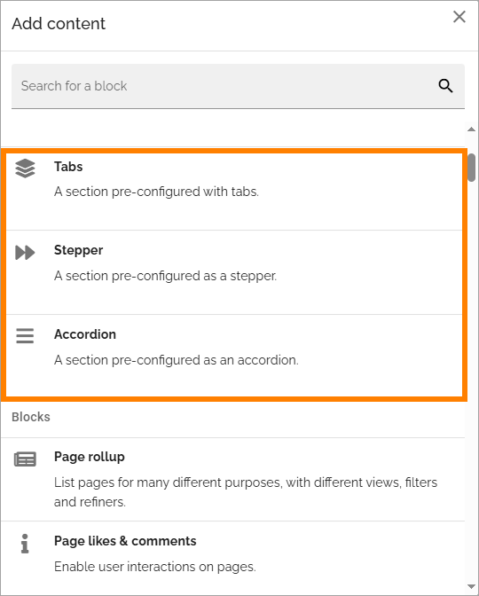
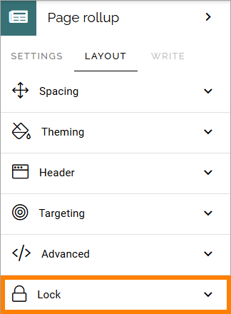

Working with sections and blocks
=================================================
**This page is being edited. Will be finsihed soon.**

When working on a layout, including a layout for a page type, you use sections and blocks to create suitable containers for the content.

Regarding page types, you work the same way with local page types and tenant page types. For the very first steps when creating a new page type, see: :doc:`Create new page type </pages/page-types/create-new-page-type/index>`

In this description, we use a page type as an example. You work the same way with other layouts. Images in this description from Omnia 7.9.

The first steps
******************************
You can really work the way you want, you don't need a section to add a block, for example, but common steps will probably be:

1. Click the plus to add a layout with one or more columns.

2. select the base layout.

3. Add a suitable section in a column.

Just to be clear, you can add such a section directly to the page as well, if needed.

The folllwing are the type of sections you can use. All sections can be added to the page or to another section.

+ **Section with columns**: Used primarily for the base layout, to add other sections or blocks for the content. 
+ **Section with tabs**: Useful for many types of layout where content are added to different tabs.
+ **Accordion section**: Useful for a layout or content organized with labels or headings that can be expanded to display the full content.
+ **Stepper section**: Useful when organizing information in steps. It's also used with the forms functionality. It is possible to configure the stepper to allow for an author to add new steps in Write mode.

Here's an example where a stepper section is used:

.. image:: working-with-stepper-example.png

For a description of available settings for a section, see: :doc:`Settings for sections </pages/page-types/section-settings/index>`

Decide to show a section on a device or not
**********************************************
When you're working on a section you can select if it should be shown, or not, on different devices.

Click this icon:

You can now use the following settings:

To hide a section for a device, do the following:

1. Select the device.
2. Click LAYOUT.
3. Click the pen for "Visibility".
4. Select "Hide section".

To add some padding for the section, for a specific device, do the following:

1. Select the device.
2. Click LAYOUT.
3. Click the pen for "Section padding".
4. Set the padding.

Delete a section
*****************
If you need to delete a section, here's how to do it:

1. Click in the section (not on any plus).
2. Click the dust bin for the section.

3. Click OK to delete the section.

Move a section
***************
Do the following to move a section to another place on the page.

1. Click the section.
2. Click the Move icon.

Icons now show where you can move the section, for example:

3. Click the icon where you want the section and it's moved there.

Copy a section
***************
If you need a section with roughly the same settings somewhere else on the page, you can copy a section and place the copy where you want it, and then edit the settings. Do the following:

1. Click the section.
2. Click the Copy icon.

Icons now show where you can add the new section, the same way as when you move a section (see above).

3. Click the icon where you want the copied section and it's placed there.
4. Edit the settings that you want to change for the copy, and save.

Copy a section from the clipboard
-----------------------------------
There's also a clipboard available, that can be used to copy sections between pages or page types, see this page for more information: :doc:`Clipboard for sections and blocks </general-assets/layout-explorer/clipboard-sections-blocks/index>`

Adding blocks to a section
***************************
Here's how to add a block to a section:

1. Click the plus for the section.

2. Select block to add. Alla blocks are listed after "Block".

There's many, many blocks you can use. You add additional blocks, work with the settings, move or delete blocks the same way as editors do when editing a page, see: :doc:`Working with blocks </blocks/working-with-blocks/index>`

**Note!** When editing a page, blocks that belong to the page type may be locked, meaning they can not be moved or deleted, and settings for those blocks can't be edited. But content can be edited, if applicable, using Write mode. For more information on this, see *Lock a block or not*, below.

In Omnia 7.9 and later, there can be section or block templates available, that you can use. A template is a section or a block with a number of pre defined settings.

If any are available, you can find them under a separate heading, for example:

Copy a block from the clipboard
---------------------------------------------
There's also a clipboard available, that can be used to copy blocks between pages or page types, see: :doc:`Clipboard for sections and blocks </general-assets/layout-explorer/clipboard-sections-blocks/index>`

Lock a block or not
************************
Additional settings for locking of blocks are available, under "Lock" in the LAYOUT menu:

You can decide if it should be possible to unlock the settings for a block. The block can still not be moved and can not be deleted.

The following options are available here:

+ **Locked by default**: If this option is selected, and not the following, it works as before; settings for the block can not be changed but content can be edited using Write mode. If this option is NOT selected and the next is, the block's settings are simply not locked. Design permission is still needed to be able to change settings.
+ **Lock can be edited**: If this option is selected, editors (Design permission) can unlock or lock the settings for the block - and if unlocked, can edit the block's settings.

For information on the settings: :doc:`Section settings </pages/page-types/section-settings/index>`

