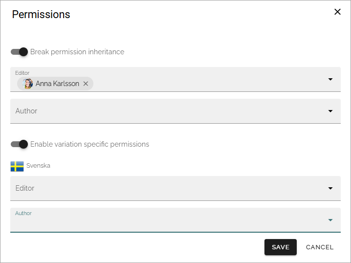

Permissions for variation pages
====================================

A variation page is a copy of a source page that contains some sort of alternative content. It can for example be the source text in another language, but variations can really be used for a lot of purposes.

As a variation is a page, normal permissions for pages within a page collection apply. If no permissions are changed, colleagues that are permitted to edit pages in the page collection, can edit the variation pages as well.

Specific authors can be assigned for each variation. If that is done, only they can edit the variation pages. More information about variation authors can be found on this page: :doc:`Publishing app settings </pages/page-settings/index>`

Variation specific permissions
**********************************
In Omnia 7.9 and later, you can set variation specific permissions if needed. 

This is how:

1. Select "Permissions" for a page of the variation where you want to set variation specific permission. (This option is not available for pages of the default variation).
2. Break permission inheritance.
3. Select "Enable variation specific permissions". 
4. Add editor and/or author permissions for the variation if needed.

