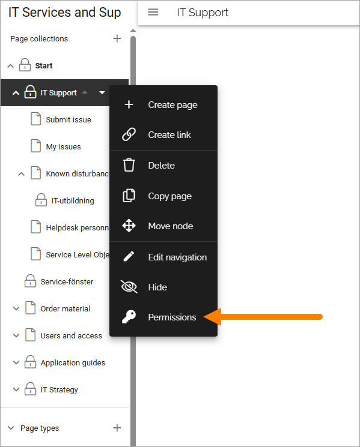
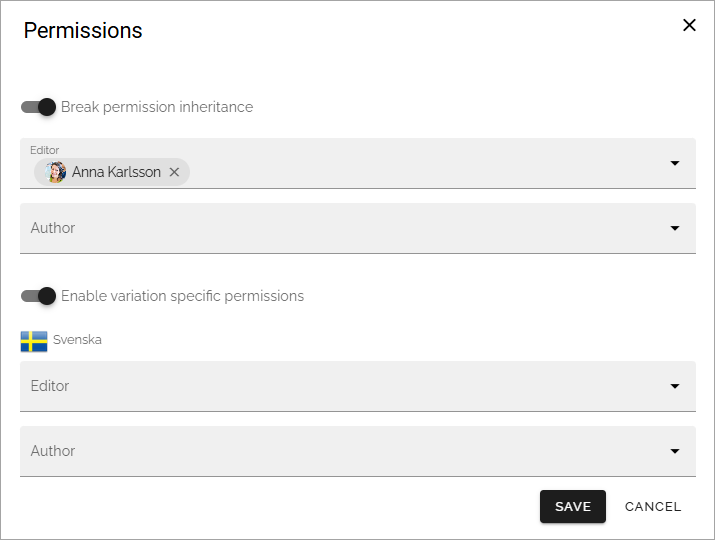
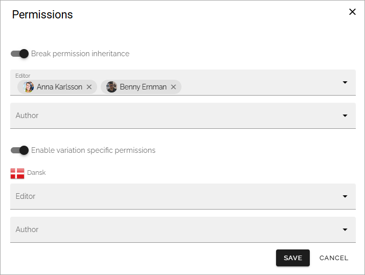

Permissions for variation pages
====================================

A variation page is a copy of a source page that contains some sort of alternative content. It can for example be the source text in another language, but variations can really be used for a lot of purposes.

As a variation is a page, normal permissions for pages within a page collection apply. If no permissions are changed, colleagues that are permitted to edit pages in the page collection, can edit the variation pages as well. That is true for page collection administrators, as well, they can always edit all pages in a page collection, variation pages included.

Specific authors can be assigned for each variation. More information about variation authors can be found on this page: :doc:`Publishing app settings </pages/page-settings/index>`

Variation specific permissions
**********************************
In Omnia 7.9 and later, you can set variation specific permissions if needed, using the navigation view.

You can set permissions for all variation pages of a certain type in the page collection, this way:

1. Open a page for editing.
2. Select the variation you would like to set permissions for.
3. Select permissions for the page collection.

4. Break inheritance if it's not done already.
5. Select "Enable variation specific permissions".
6. Set permissions for editor and/or author.

7. Save.

Note that the variation you set permissions for is shown, in this example "Svenska".

Permission for a specific variation page
---------------------------------------------
If needed, you can set permissions for a specific varition of a page. Here's an example of a case where that could be needed: The page collection is an employee handbook and two colleagues in Sweden are responsible for the handbook, but there is a local variation in Denmark for the page regarding holidays. A local Danish colleague is appointed responsible for the Danish variation of the holidays page only. He or she should not be able to edit any other pages in the page collection. 
 
This is how it's set up: 

1. Open the page for editing.
2. Select the variation you would like to set permissions for.
3. Break inheritance.
4. Select "Enable variation specific permissions". 
5. Add editor and/or author permissions for the variation.

6. Save.

Now the variation of this page, Dansk in this example, can be edited only by the colleauge(s) you have selected.

