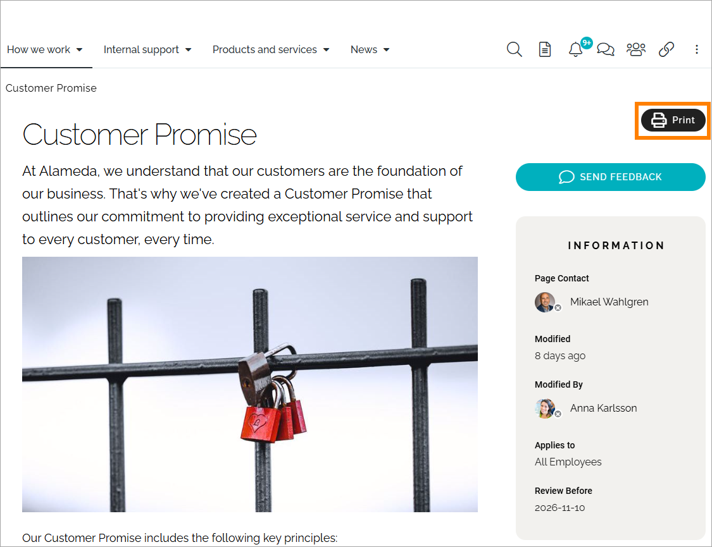
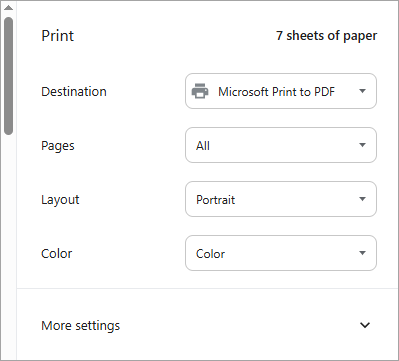
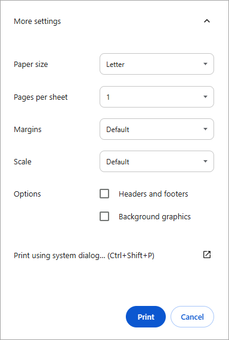

Print a page
=====================================

It can be possible to print a page, using an action button in a block, or a button in the navigation bar. Here's an example:

If available, click the button to print.  The following options are available:

At the top normal print options are available, as set up in your organization.

Under "More settings", the following options are available:

Here you can set paper size and more. Note that you can decide to print the page's header and footer, and the background image as well, if any.

If you would like to use the normal system print dialog, click the option "Print using system dialog". If not, just click "Print" or "Save" depending on print destination.

