Release 7
========================================

(7.11) Integration to Copilot 
------------------------------------------------------
Support has been added for integration with Copilot.

This includes the ability to enable Copilot integration as well as a Copilot plugin generator, supporting extended use of Omnia content and functionality in Copilot-based scenarios.

(7.11) Silent publish
------------------------------------------------------
This new setting enables the author to decide if an update of a page should generate a notification in the notification panel or not. And also to variation authors if variations are enabled in the publishing app.

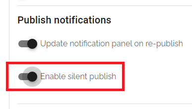

The setting is on page collection level, and when the setting is enabled there is an additional publish button to choose from when publishing a page.

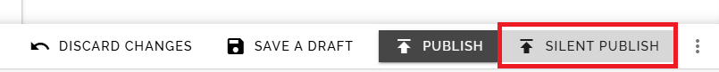

Please note that the combination of disabling the setting "Update notification panel on re-publish" and enabling the setting "Enable silent publish" only makes sense if variations are used within the publishing app.

(7.11) Improved querying of people based page properties
------------------------------------------------------
Querying of people based on page properties has been updated.

Querying of people in People rollups based on page properties has been enhanced.

It is now possible to match multiple values within a page property (for example, Department = HR + IT), enabling more accurate and flexible people listings.

(7.11) Print pages
------------------------------------------------------
Printing of pages has been significantly improved.

When printing, headers (including mega menu), notifications, and footers are automatically hidden. A dedicated print display breakpoint ensures content flows cleanly to the left and empty sections are removed.

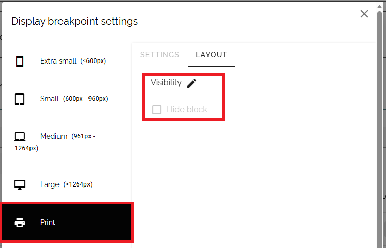

In addition, individual blocks can be configured to be visible or hidden in print, giving editors greater control over the printed output.
The print action button make it possible to print a page with an accordion unfolded.

.. image:: Print-pages.png

(7.11) Improved document creation
------------------------------------------------------
The document creation dialog has been significantly enhanced by focusing on what is relevant in the context it's used.

Editors can now select one or multiple document types, templates, and target locations when creating documents using a action button. 
Document creation in context of a SharePoint or Controlled library always default to create documents within that library simplifying the creation process.

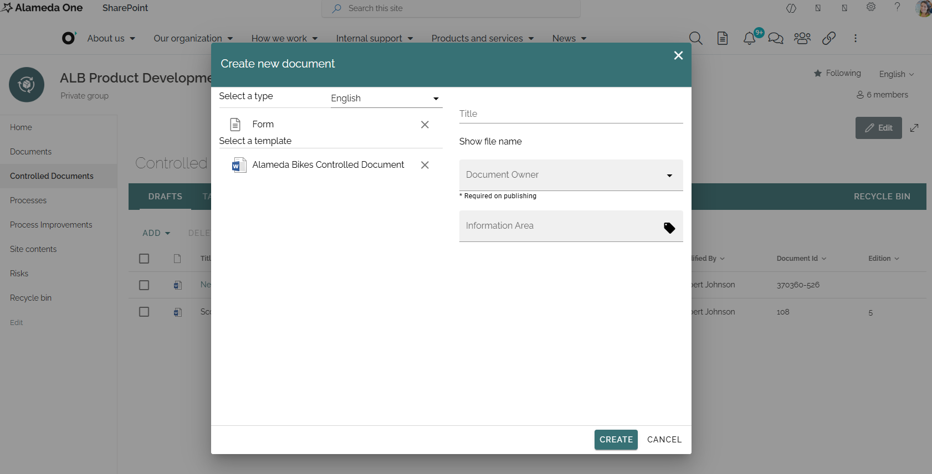

This provides a clearer and more flexible document creation experience.

(7.11) Reusable sections
------------------------------------------------------
Support has been added for reusable sections.

A new “Reusable” section type can be configured and mapped to a data property. Content blocks are maintained centrally on a source page and reused across target pages through property connection.

This ensures consistent content across pages and simplifies maintenance. Certain limitations apply, such as restrictions on moving or copying blocks within reusable sections.

(7.11) Improved lifecycle of archive link and text 
------------------------------------------------------
Lifecycle management of navigation link and label nodes has been improved.

It is now easier to archive, restore, move, and manage these nodes over time, supporting better governance and navigation structure maintenance.

(7.11) Restrict Omnia permissions to specific sites
------------------------------------------------------
Administrators can now restrict Omnia permissions to specific SharePoint sites with the delegated Sites.Selected permission, strengthening security and governance.

(7.11) Semantic search response
------------------------------------------------------
The semantic search response has been enhanced with improved formatting, significantly increasing readability. This enables users to quickly review the summary and decide whether to consult one of the references or refine their question.

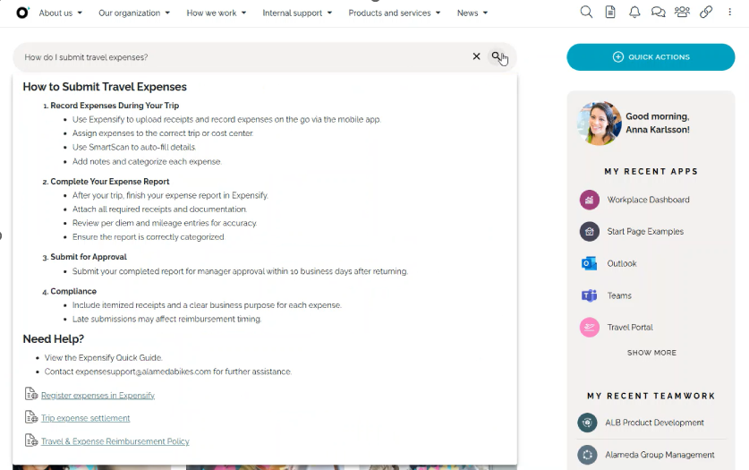

(7.10) Approval flow for deleting pages
------------------------------------------------------
A new approval flow has been introduced for page deletion, giving organizations better control and traceability when content is removed.

Editors can now be required to submit deletion requests for approval, ensuring that page removals follow established governance and compliance rules before being finalized.

(7.10) A-Z paging
------------------------------------------------------
A–Z paging has been added to relevant rollup and listing scenarios, available in both card and list views.

This provides an additional navigation option for end users when browsing large sets of structured or alphabetically sorted content.

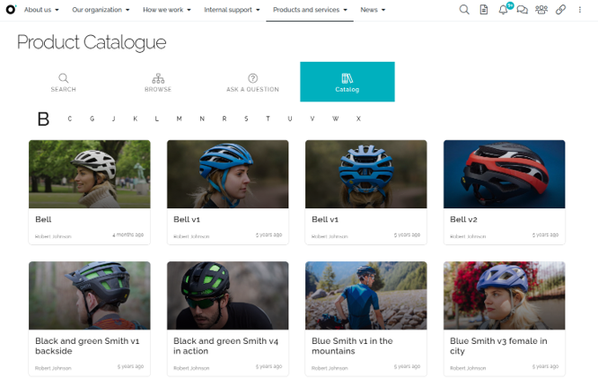

(7.10) Better display templates for search results from SharePoint
------------------------------------------------------
Display templates for search results originating from SharePoint have been improved.

These updates enhance how SharePoint-based content — such as sites, pages, documents, and list items — is presented in search results, providing clearer and more consistent information display.

(7.10) Pick in write mode
------------------------------------------------------
Picking content is now supported directly in Write mode for People, Page, and Document rollups.

This allows editors to select specific items while authoring content, improving efficiency and reducing the need to switch between modes.

.. image:: Pick-write-mode.png

(7.10) Rollup SharePoint list content 
------------------------------------------------------
Omnia now supports rolling up content from SharePoint Lists using KQL queries, specific lists, list views, or selected columns.

This makes it possible to reuse and present structured SharePoint list data within Omnia pages, supporting advanced aggregation and integration scenarios.

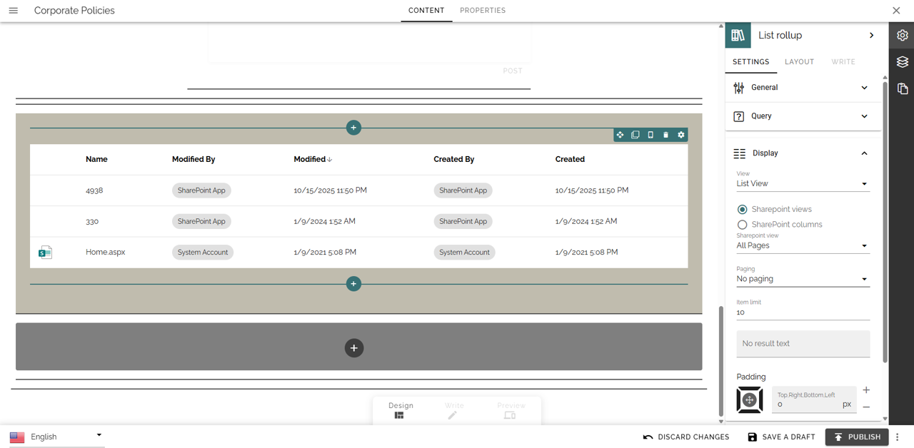

(7.10) Export search statistics
------------------------------------------------------
Search statistics can now be exported using a dedicated action button.

Exports can be scoped to specific business profiles and custom time periods, enabling deeper analysis of search usage and behavior outside of Omnia.
xport of search statistics is also available within Omnia admin Search section.

(7.10) Update only authors
------------------------------------------------------
A new editorial role, Update-only author, has been introduced.

Users with this role can update existing pages but cannot create new pages, delete pages, or access advanced configuration options such as automatic page creation, reusable content setup, or Yammer integration. On existing pages, Update-only authors have the same editing permissions as Authors.

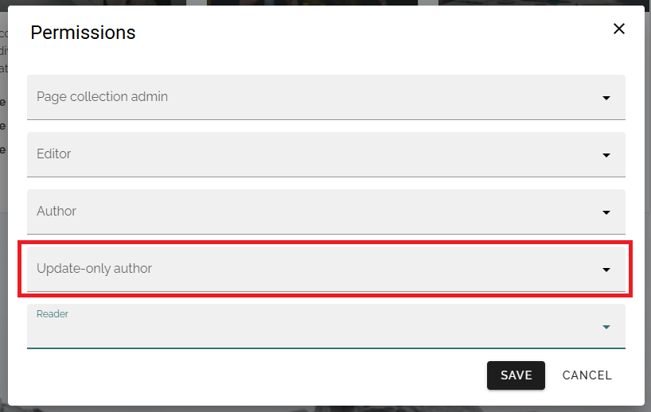

(7.10) Target publishing channels to editors
------------------------------------------------------
Publishing channels can now be targeted to specific editors.

This helps organizations limit available publishing options based on editorial responsibility, supporting clearer workflows and reduced publishing complexity.

(7.10) Check WCAG compliance when publishing pages
------------------------------------------------------
WCAG compliance checks are now available during page preview before publishing.

This supports early identification of accessibility-related issues and helps organizations align published content with WCAG requirements.

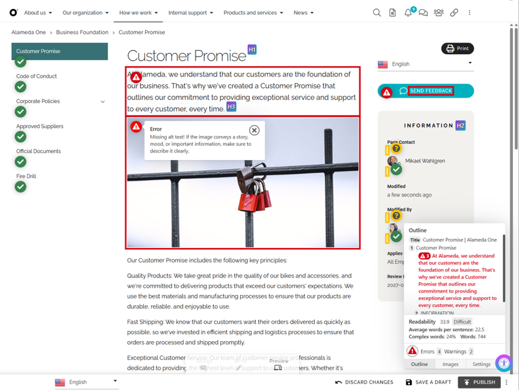

(7.10) Scheduled publishing of Documents
------------------------------------------------------
Support has been added for scheduled publishing of documents.

This allows documents to be published at a defined time, aligning document governance with page publishing workflows and supporting planned releases.

(7.10) Support for link and text nodes
------------------------------------------------------
Navigation now supports both Link and Label nodes.

Link nodes can point to custom URLs, pages, or documents and can be edited, moved, archived, restored, or deleted. Label nodes allow grouping of navigation items, improving structure and manageability in complex navigation setups.

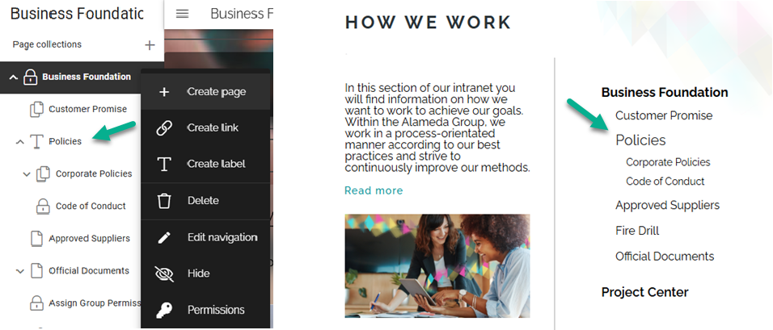

(7.9) Block Gallery
------------------------------------------------------

We are excited to introduce the Block Gallery, a new feature that empowers admins to configure available blocks and create custom blocks tailored to their needs. Admins can also create personal block templates from existing blocks or by combining multiple blocks into a section, making it easier to reuse complex setups. 

.. image:: BlockGallery01.png

Once block templates are created, editors can easily insert them when building pages - Instead of starting from scratch.

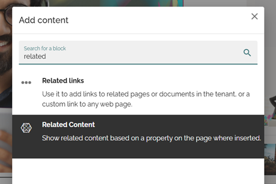

Key Benefits:

- Increased Efficiency: Users can quickly select from pre-configured blocks instead of recreating content from scratch.

- Customization: Teams can create blocks that reflect their unique workflows or business requirements.

- Consistency: Standardized blocks ensure uniformity in content structure and presentation, reducing errors and improving collaboration.

Use Case Examples:

- A marketing team configures a set of approved content blocks for campaign templates, ensuring consistent branding and messaging.

- A product team creates custom blocks for reporting metrics specific to their project, enabling faster and more accurate data presentation.

- Any user can leverage existing blocks to streamline repetitive tasks, saving time and reducing manual effort.

(7.9) Page Bulk update
------------------------------------------------------

The new Page Bulk Update feature allows users to update multiple pages at the same time. Instead of making the same change repeatedly on individual pages, you can now apply updates in one go. This streamlines workflows, reduces manual effort, and ensures greater consistency across content.

.. image:: PageBulkUpdate01.png

Key Benefits:

- Time Savings: Significant reduction in repetitive work when the same update needs to be applied to multiple pages.

- Consistency: Ensures updates (e.g., structure, layout, or blocks) are applied uniformly, minimizing the risk of errors.

- Scalability: Makes it easier to maintain large sets of pages, especially for teams managing complex sites or frequent changes.

- Control: Bulk updates can be applied with precision, ensuring governance and oversight when making widespread changes.

(7.9) Page Review and suspend 
------------------------------------------------------

The new Page Review & Suspend functionality adds governance and quality control to the publishing process. Pages can now be submitted for review, approved before publishing, or suspended if they are outdated or inaccurate. The feature also includes user-facing notifications, ensuring transparency and clarity for both editors and end users.

This is how a published page looks to end users. All content is fully visible and accessible.

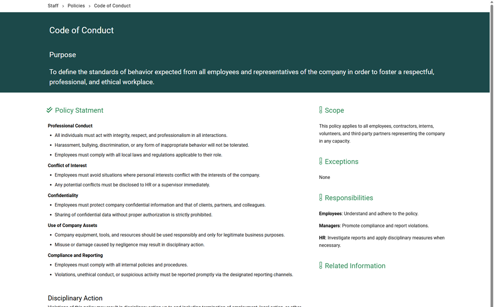

A banner is displayed at the top of the page to let users know that the content is currently under review and may be updated.

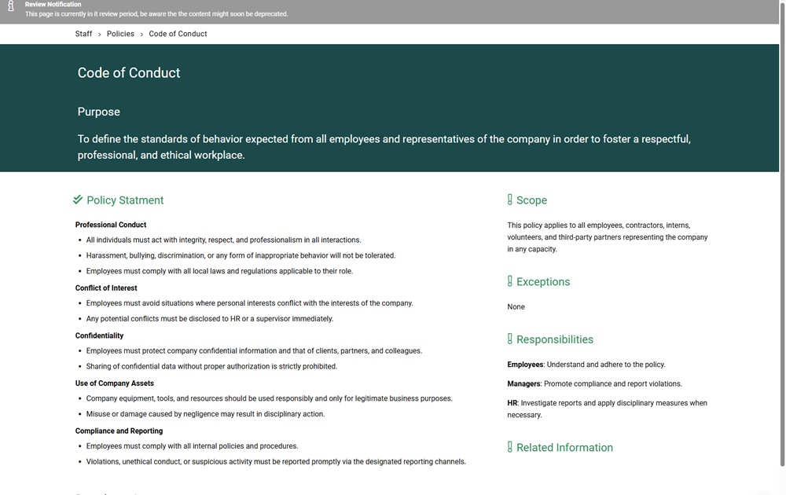

The page content is hidden. Instead, a message is shown to users explaining that the page is unavailable due to missing or pending review

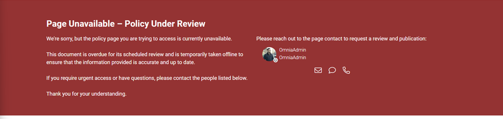

Key Benefits:

- User Transparency: End users are clearly informed when content is under review or unavailable, avoiding confusion.

- Governance & Compliance: Organizations gain precise control over which content is visible, with the ability to suspend without deleting.

- Configurable Flows: Each page type can have its own review and suspend flow, making it possible to apply stricter governance to sensitive content (e.g., HR policies, compliance documents) while keeping lighter workflows for less critical pages.

- Efficiency: Editors and reviewers are automatically notified via email, keeping the review cycle fast and coordinated.

(7.9) Variation enhancements 
------------------------------------------------------

It's now possible to add specific author and editor permissions for a variation within a page collection.

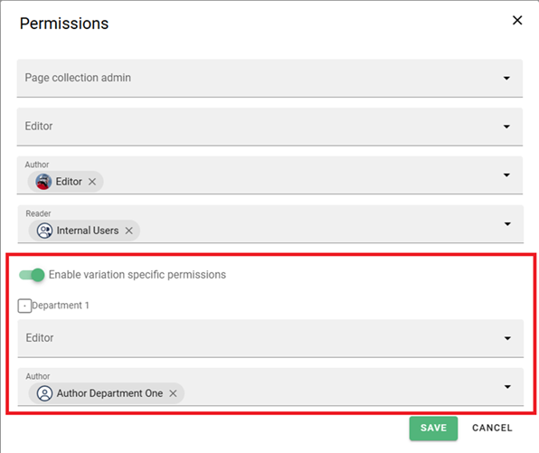

There are new settings to configure who will receive notifications when the default variation of a page is updated.
Apart from the variation author, it's now also possible to receive notifications based on a page property on the actual page.
 
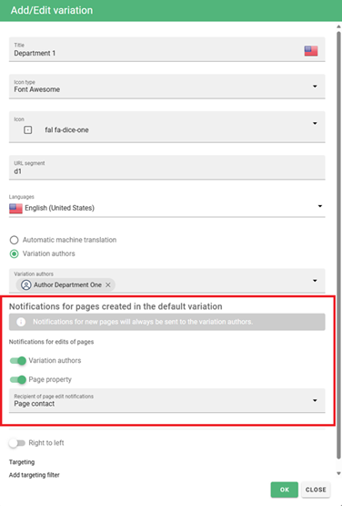

Support is added for using email enabled groups as variation authors.

Another minor improvement is that when creating a new variation of a page which is configured to use reusable content, the menu for configuring reusable content is opened by default.

(7.8) More Analytics Possibilities 
------------------------------------------------------

There is now a new metric in the analytics report block: Visitor Frequency. It represents the ratio between visits and unique visitors.

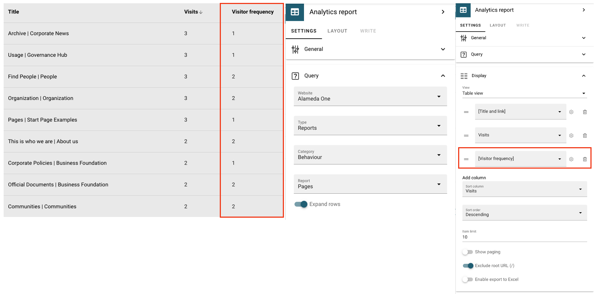

We are also expanding event tracking in: Forms, Pages, Action Buttons and Document Rollup. With this, we are adding a new query type "Event" to the analytics report block.

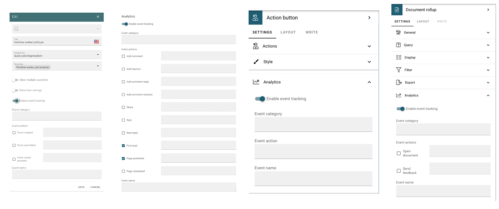

It's now possible to combine the data collection for multiple Business Profiles into a single Matomo website by enabling "Share website with other business profiles". This removes the need to maintain multiple Matomo sites and allows for navigation tracking across different business profiles.

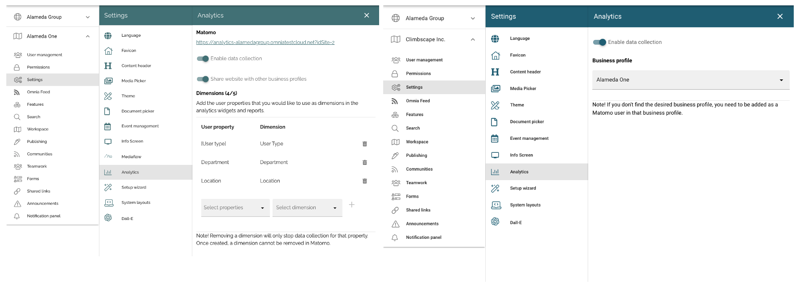

(7.8) New AI Powered Search Experience
------------------------------------------------------

We are introducting a new AI powered search category: Semantic Search. 

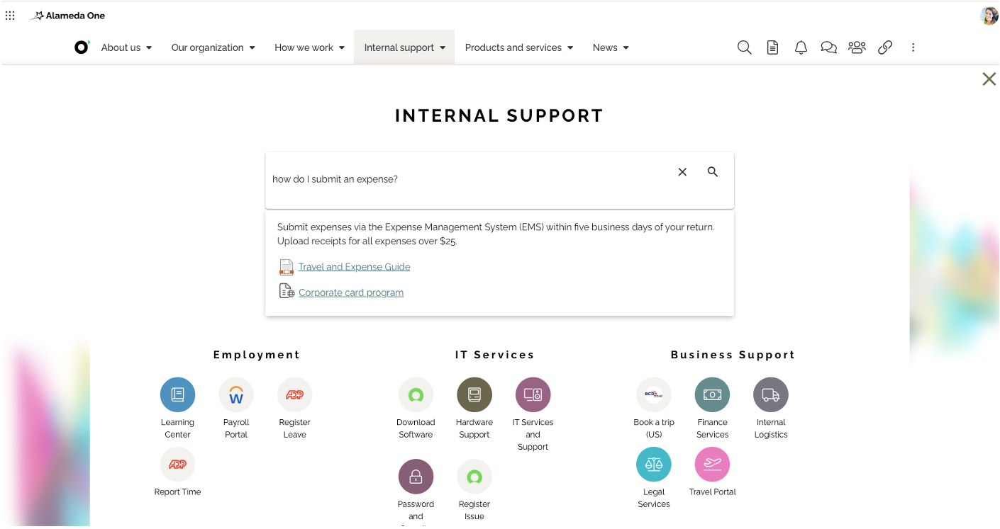

Users can now use natural language queries and get both Controlled Documents and/or Page excerpts as results as well as a natural language answer.

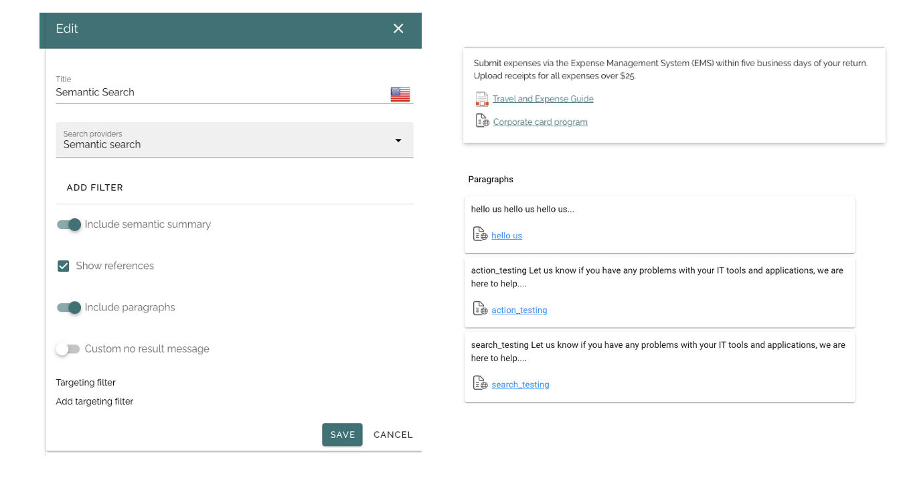

Only selected Page collections and Controlled Document are indexed and only users with the proper group permission can use the semantic search feature.

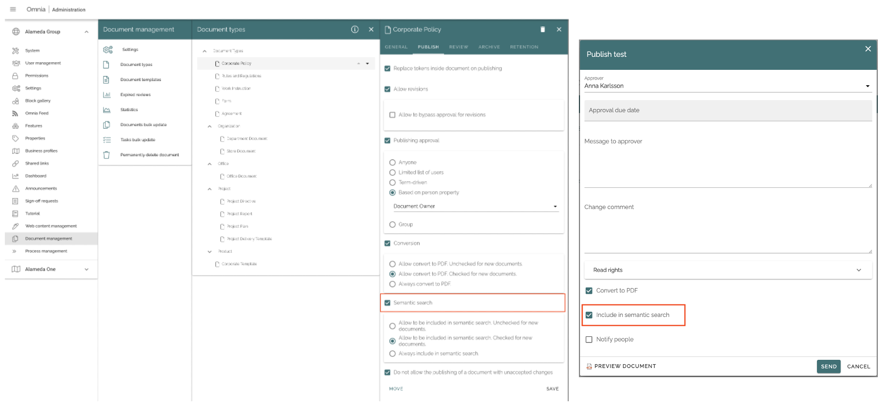

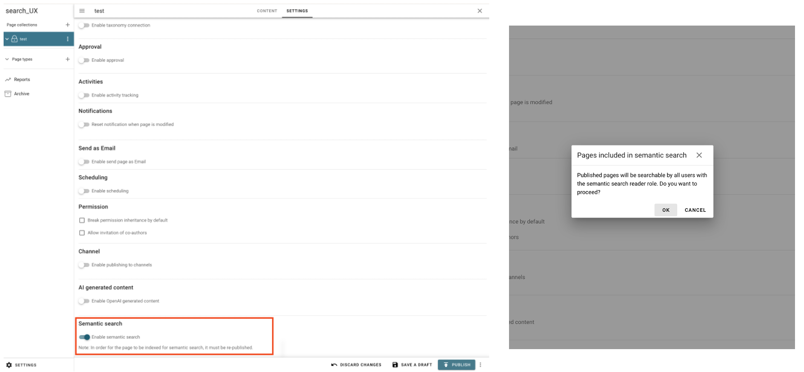

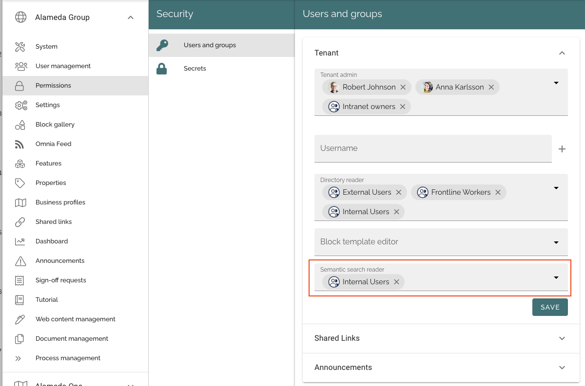

(7.8) Improved SharePoint integration
----------------------------------------

We’ve introduced a more flexible way to manage our SharePoint integrations. With this release, you can now select and deploy individual features as standalone web parts—rather than a full package—allowing you to roll out specific functionality to the sites that need it.

Key Benefits:

- Targeted deployment: Apply features to specific SharePoint sites or teams.

- Reduced complexity: Streamlined updates and maintenance.

- Increased control: Tailor the user experience without impacting the broader environment.

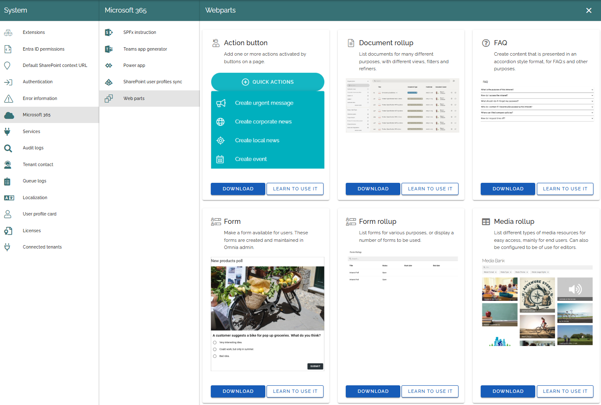

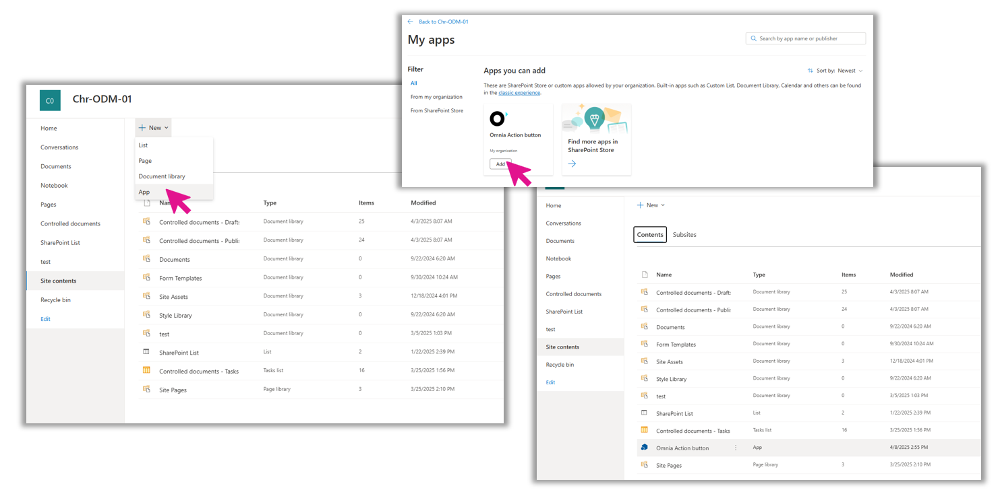

This modular approach supports more agile governance, improves performance, and ensures the right tools are in the right hands.

(7.8) Improved Accessibility Support
----------------------------------------

As part of our ongoing commitment to accessibility and inclusive design, this release delivers several key improvements aligned with the [Web Content Accessibility Guidelines (WCAG)][https://www.w3.org/WAI/standards-guidelines/wcag/] 2.1 AA standards. These updates enhance the experience for users who rely on keyboard navigation or screen reader software.

Keyboard Navigation
********************************************
- Improved logical tab order across all major interfaces to support a seamless navigation experience without a mouse.

- Added clear and consistent focus indicators to all interactive elements (e.g., buttons, links, form fields).

- Resolved focus trapping issues in modal dialogs and dropdown menus.

- Added "Skip to Content" functionality allowing user to navigate straight to the page content.

Screen Reader Support
********************************************
- Ensured appropriate use of ARIA roles, labels, and landmarks for better interpretation by screen readers.

- Updated descriptive alt text for key visual elements and icons.

- Improved heading structure and reading order for better context and navigation.

- Enhanced form field labeling and error messaging for screen reader clarity.

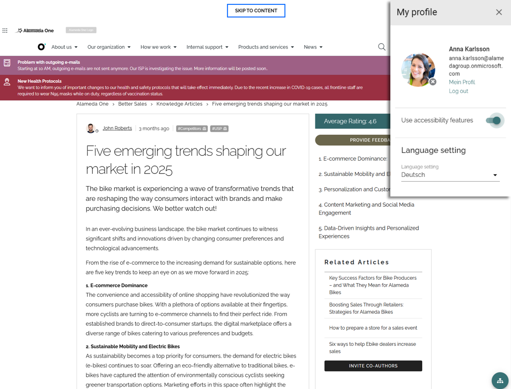

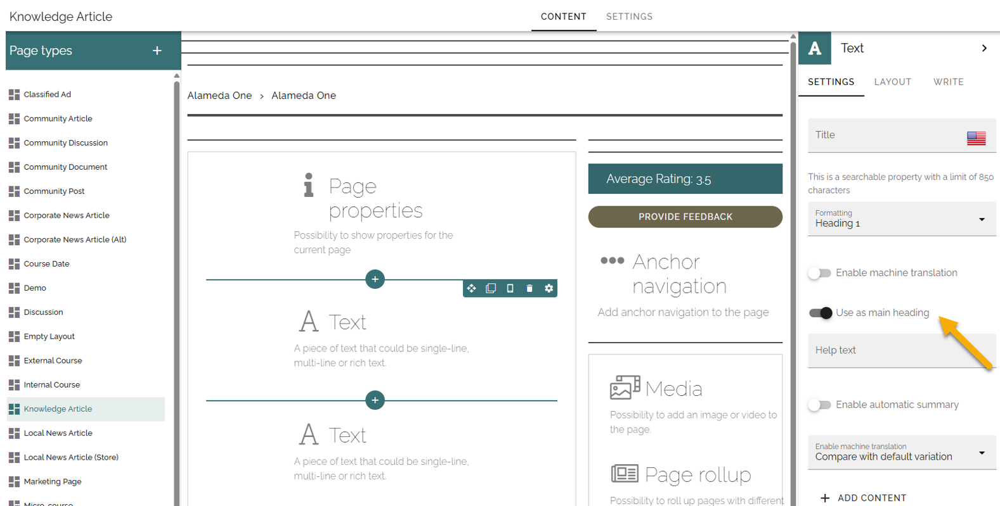

(7.8) Additional functionality for Omnia users
------------------------------------------------------

With this release, we’ve enhanced the People Search functionality to support combined search across both Omnia users and Microsoft 365 users. This makes it easier than ever to discover and connect with colleagues—whether they’re active in Omnia or only present in M365.

What’s New:
********************************************
- Unified search results showing users from both Omnia and Microsoft 365.

- Clear indicators to distinguish between user types.

- Enhanced filters and profile access for improved usability and context.

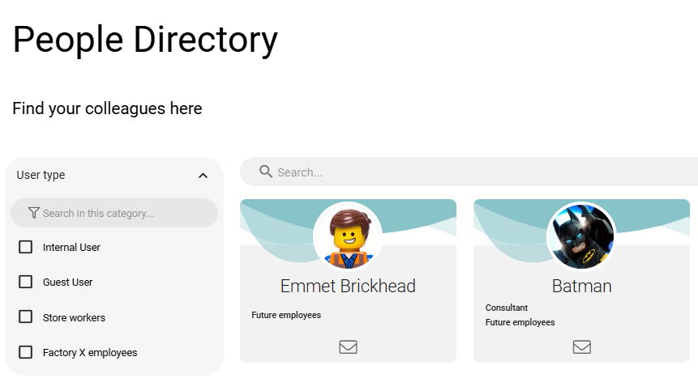

(7.8) Promote stories to Viva
------------------------------------------------------

We’re excited to introduce a new capability that allows selected information published in Omnia to be promoted directly into Microsoft Viva Connections. This integration bridges the gap between your intranet and the Viva experience, ensuring high-value content, like corporate news articles, reaches employees where they work every day—in Microsoft Teams. This feature supports better content discoverability, drives engagement, and brings the Omnia and Microsoft 365 ecosystems closer together. 

(7.7) Improved User Management
----------------------------------------

The User Management solution has been enhanced with some key new features on 7.7.
User Profile Completion is now done within the User Type. This allows better management of the different User Types within an organization, as well as better handling of the Omnia User.

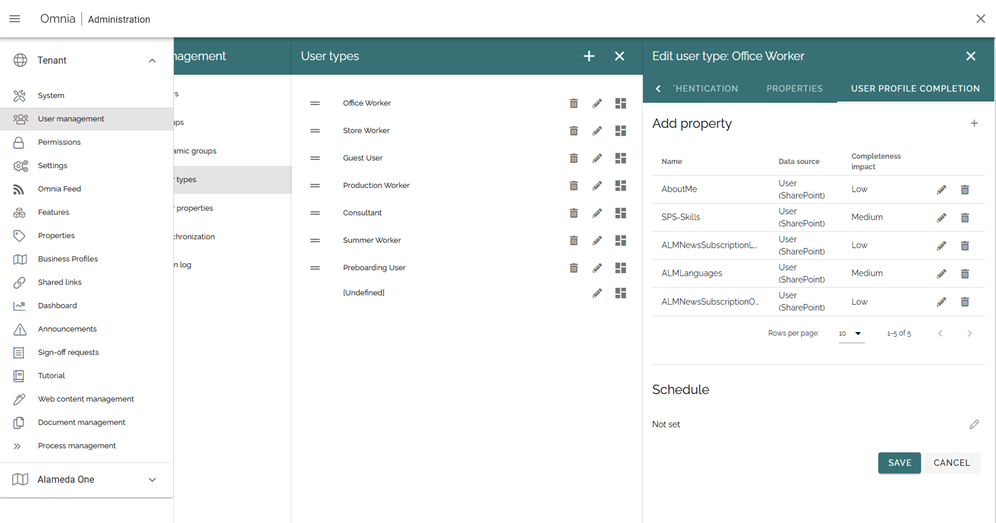

New blocks improving the end user experience are also available with this release:

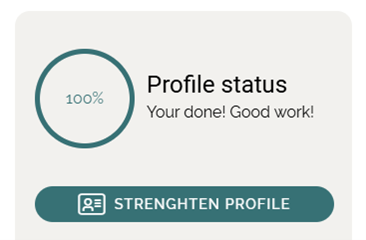

(7.7) Additional Query Options with Date Properties
----------------------------------------

It is now possible to perform more advanced queries for Processes, People, Documents, and Teamwork apps based on date properties. By selecting the “Custom date” option, you can create dynamic queries relative to the current date and specify the start and end of a period either before or after the current date.

For example, this feature can be used to display people who have started in your organization within the last month.

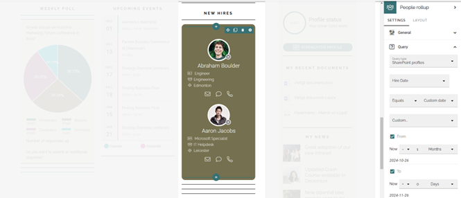

Or documents that are due for review within the next 3 months.

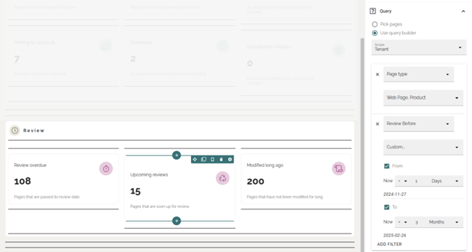

(7.7) Sign-Off Requests for Controlled Documents
----------------------------------------

It is now possible to include controlled documents in the Sign-Off Request functionality. A Sign-Off Request can be used to create an overview of multiple documents, which is particularly useful during onboarding or as part of a periodic process.

By combining controlled documents and pages, you can provide an easy-to-understand overview of relevant information in each context. The Sign-Off Request can be sent to individuals or groups to ensure it reaches the right people.

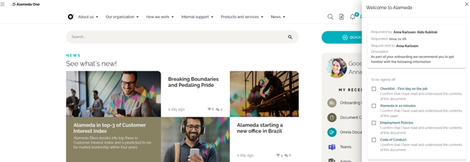

Sign-Off Requests can also be created directly from a controlled document to ensure a record is kept, confirming that an individual or group has received specific information.

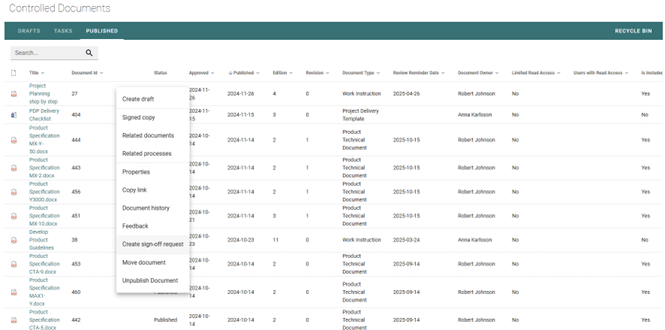

(7.7) Restrict Who Omnia Can Send Emails As Through Exchange
----------------------------------------

To use Exchange for sending emails from Omnia, the Microsoft permission model currently requires Omnia to be granted permission to send emails on behalf of any user in the organization. This approach may raise security concerns. To address this, we have included a guide for the Exchange admin to restrict Omnia to only send emails as a specified user.

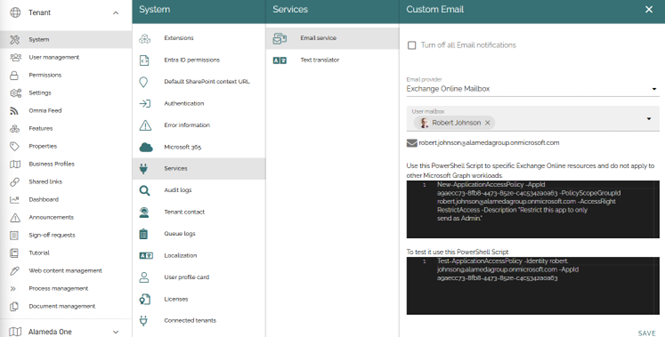

(7.6) Improved mobile and frontline
------------------------------------------------------

A new feature has been added to the user management section that empowers group owners with enhanced administrative capabilities within their groups.
Group owners can now create and manage individual users directly within their groups. This feature provides greater flexibility and control, allowing group owners to tailor the user management process to their specific needs.

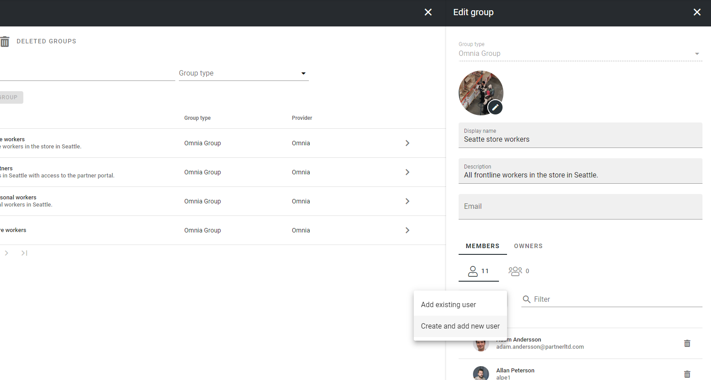

We have also added the possibility to add Entra ID users to Omnia groups as part of this feature.

Administrators can now create local forms directly within an Omnia publishing app. Additionally, we've introduced a streamlined method for form creation using an action button.
This simplified form creation allows for the rapid development and publishing of quick polls or similar forms to specific target audiences.
Users can also assign properties to these forms, which can be utilized for targeting purposes and incorporated into a new Forms rollup block.

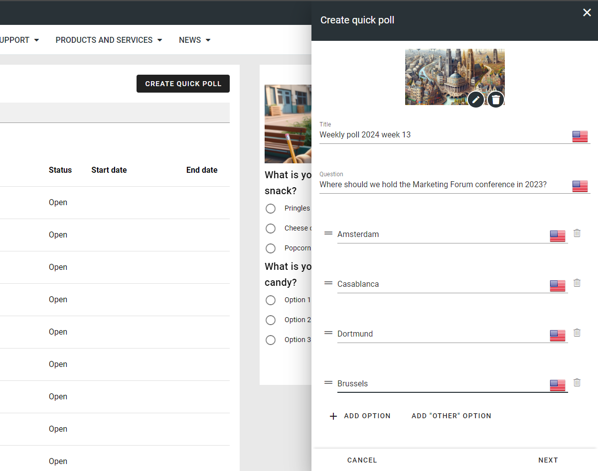

The Forms rollup block offers both an end-user view, enabling users to respond to one or multiple forms, and an administrative view that provides an overview of all
open forms within the solution.

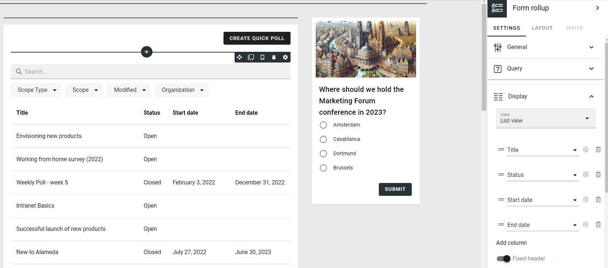

Moreover, the Omnia Feed mobile app now features a setting that enables new forms to be published with a push notification.
These forms will be displayed natively in the master feed within the mobile app.

(7.6) Improved communication
--------------------------------------------

You can now utilize the newly introduced Media rollup block to showcase images, videos, and audio files sourced from a SharePoint library.
This versatile block offers two distinct views: a visually engaging Photowall view and a straightforward list view.

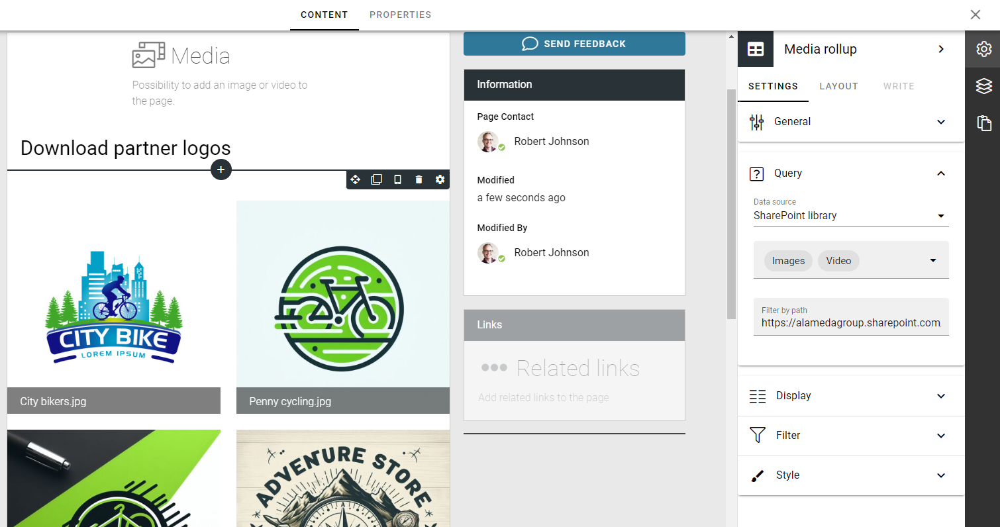

For end users, navigating through the various media items is intuitive and user-friendly. They can easily browse the content in a dialog format,
facilitating quick actions such as downloading the desired media files with ease.

The sign-off request feature has been significantly improved to offer greater flexibility and functionality.
Now, users can create both one-time scheduled sign-off requests and recurring sign-off requests that are automatically sent out at specified intervals.
This enhancement streamlines the sign-off process, enabling more efficient management of approvals and ensuring timely responses from recipients.

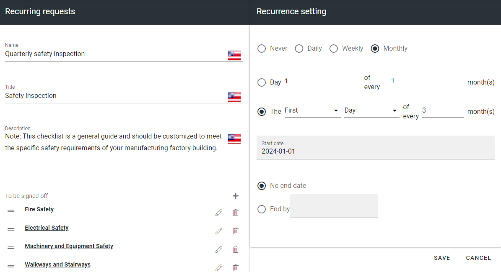

The mobile experience for authors has been enhanced to provide a more seamless and user-friendly interface.
Now, when authors upload images from their mobile devices in portrait format, the images will retain their original orientation. 

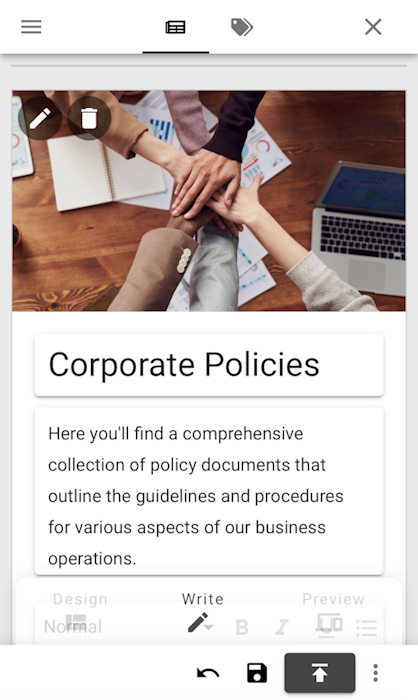

The RTF editor has been enhanced to include support for subscript and superscript formatting options. 

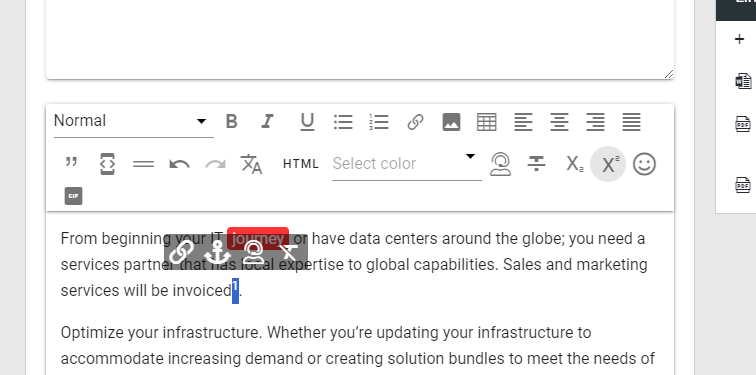

(7.6) Improved governance and analytics
------------------------------------------------------

The analytics solution, powered by Matomo, has been enhanced to incorporate an Analytics report block.
This feature enables widgets from Matomo to be displayed in a table style with Omnia look and feel.

It is now possible in Omnia Admin to centrally reassign tasks for controlled documents in bulk.

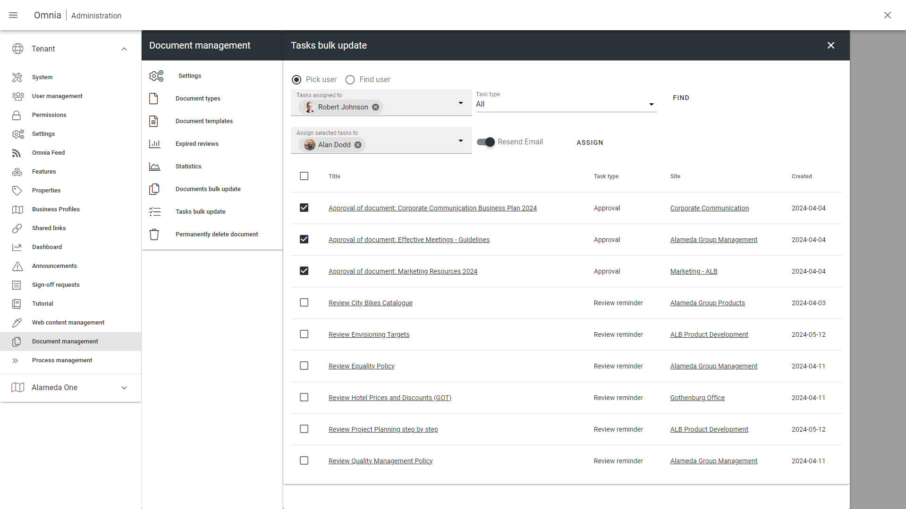

(7.5) Improved user management
--------------------------------------------

Business profile users and groups
********************************************

Users and groups can now be specifically scoped to a business profile, enabling seamless management by a business profile administrator.
This functionality empowers administrators to oversee users with access limited to designated sections of the solution, such as front-line workers or partners.

.. image:: usermgmt-businessprofileusers.png

Self-service account creation and on-boarding
**********************************************

You can now activate self-service account creation for a business profile, with the option to configure whether approval is necessary or not.

.. image:: usermgmt-selfservice.png

The account request form can be configured to allow users to submit account information in advance for an administrator to validate.

.. image:: usermgmt-requestformsettings.png

You can configure anonymous access to a specific section of a business profile to set up a welcome page providing information about the account request procedure.

.. image:: usermgmt-loginscreen-anonymous.png

A user type with password as authentication mechanism can be setup to force password change on first login.

.. image:: usermgmt-forcepasswordchange.png

A unique onboarding URL can be configured for each user type, enabling users to be redirected to a specific portal once their new account has been set up.

.. image:: usermgmt-onboardingurl.png

  
Improved identity picker
*********************************************

In response to customer feedback, we have revamped the identity picker UI. Now, users and groups are conveniently listed in a single interface,
offering the option to filter based on specific user and group types.

.. image:: usermgmt-identitypicker.png

Improved user profile cards
*********************************************

The user profile card can now feature two distinct layouts. A public layout is displayed when someone else views your profile card,
while a private layout can be configured for your own viewing. This customization allows for a focus on different properties and roll-ups depending on the target audience.

.. image:: usermgmt-publicprivate-profilecard.png

User properties can be configured as either public or private. Private properties are exclusively accessible by the user and can be utilized to
store information meant solely for the user's eyes, ensuring that it is only displayed on the private profile layout.

.. image:: usermgmt-publicprivate-properties.png

Both public and private properties can be used to aggregate information on a profile card.
A new dynamic value in rollups is now available, allowing for the aggregation of information about the selected user in focus when opening a profile card.

.. image:: usermgmt-queryonselecteduser.png

The profile card settings can be adjusted to enable users to update their profile photos.
Additionally, for users with an M365 license, the profile photo will automatically synchronize across all M365 services.

.. image:: usermgmt-editprofilephoto.png

New scope in the People rollup block
**********************************************

A new scope in the People rollup block makes it possible to find all users that are synchronized to Omnia or created as Omnia accounts.

.. image:: usermgmt-peoplerollup-users.png

Improved user management governance
**********************************************

We have introduced a login log feature to track all successful and unsuccessful login attempts made by Omnia accounts within the system.

.. image:: usermgmt-loginlog.png

There is also a possibility to create custom authentication layouts for the following activities: Request account, Setup account, Login and Logout.

.. image:: usermgmt-authenticationscreens.png

Accounts can now be setup to be time-limited. It is also possible for an administrator to disable an account at any time.

.. image:: usermgmt-timelimited-and-disabled.png

(7.5) Analytics powered by Matomo
--------------------------------------------

The analytics features have transitioned to being powered by Matomo. A local instance of Matomo will be automatically established in the tenant,
offering access to over 100 widgets for analyzing usage and behavior within your solution.

.. image:: analytics-widget-settings.png

.. image:: analytics-widget-read.png

(7.5) Anchor navigation
--------------------------------------------

We've added a new block to enhance anchor navigation, making it easier and more efficient for users to navigate through content.
This improvement ensures a smoother and more user-friendly experience when moving through different sections of a page.

.. image:: anchornavigation-settings.png

.. image:: anchornavigation-read.png

(7.5) Publishing campaigns
--------------------------------------------

We've simplified the process of creating publishing campaigns in the solution. Two new features have been added to enhance this functionality further, making it more powerful.

You can set up a calendar view in the page rollup to allow page creation directly from the calendar.

.. image:: publishingcampaigns-createarticlefromcalendar-settings.png

.. image:: publishingcampaigns-createarticlefromcalendar.png

You can now configure promotion channels to send teasers to Microsoft Teams, Viva Engage, and via email.

.. image:: promotionchannels-settings.png

.. image:: promotionchannels-email.png

(7.5) Improved metrics
--------------------------------------------

The possibility to configure metrics have now been added to the publishing, community and teamwork rollup blocks.

.. image:: approllups-metric.png

We've introduced a new custom date query builder, allowing users to perform advanced date queries for creating metrics.

.. image:: datequery-custom.png

(7.5) Improved page feedback
--------------------------------------------

It is now possible to use an action button to provide feedback on a page.

.. image:: feedback-action.png

Accessing feedback is now made simple through the menu in the content editor.

.. image:: feedback-list.png

(7.1) Media gallery
--------------------------------------------

The media block and RTF editor now offer the option to enable the multi-selection of images and videos in the media picker.
When multiple images or videos are selected, a media gallery is displayed to the end user, allowing them to open the gallery
and navigate through each image or video for additional details.

.. image:: media-gallery-add-edit-media.png

.. image:: media-gallery-wall.png

Each image or video can also include a caption, which will be displayed beneath it in the details dialog.

.. image:: media-gallery-dialog-video.png

(7.1) Media provider for Mediaflow
--------------------------------------------

A new out-of-the-box media provider, that integrates with Mediaflow, is now available in the media picker.

.. image:: media-flow-administration.png

.. image:: media-flow-mediapicker.png

Please find more information about Mediaflow here: https://www.mediaflow.com/.

(Note! This feature requires a subscription to the Mediaflow service.)

(7.1) Media provider for Dall-E 
--------------------------------------------

A new out-of-the-box media provider, that integrates with Dall-E (Azure Open AI), is now available in the media picker.
DALL-E is an AI model developed by OpenAI. It is a variation of the GPT architecture and is designed specifically for generating images from textual descriptions.

.. image:: openai-dalle-mediapicker.png

(Note! Open AI requires an Azure Open AI subscription)

(7.1) Multi-level approval on pages
--------------------------------------------

It is now possible to enable multi-level approval on pages in a page collection.

.. image:: multistep-approval-settings-2.png

The approval process is sequential, with each step governed by a set of business rules determining
the appropriate approver for that step and specifying the tasks that the approver is authorized to perform.

.. image:: multistep-approval-dialog-2.png

(7.1) Dynamic 401/404 pages
--------------------------------------------

It is now possible to design your own 401/404 error pages. Instead of generic and unhelpful error messages,
you can make these pages more engaging, maintain brand consistency, and guide users back to valuable content.
It's a simple yet effective way to enhance the overall user experience and build trust with your audience.

.. image:: system-layouts-404-edit.png

(7.1) Broken links detection and metrics
--------------------------------------------

Omnia now features a built-in broken link detector. It identifies all 404 errors within the solution and provides
comprehensive metrics, showing the frequency of user encounters with broken links each month.
Additionally, you can access in-depth information regarding these broken links, including their referring page.

.. image:: broken-links-dashboard-metrics.png

.. image:: broken-links-details.png

(7.1) Colors in calendar view
--------------------------------------------

We have added 'Page Type' and 'Workflow Status' to the Enterprise Glossary, allowing them to be customized with colors and icons.

.. image:: calendar-colors-enterprise-glossary.png

Now, these properties can be chosen within the page rollup calendar view and used as the foundation
for the icon and background color assigned to each page on the calendar.

.. image:: pagerollup-calendar-colors-edit.png

(7.1) Process management shape descriptions
--------------------------------------------

It is now possible to add a rich text description to shapes on a process template.

.. image:: shape-descriptions-administration.png

This will assist the process designer in making decisions on which shape to use when adding shapes to a process.

.. image:: shape-descriptions-add-shape.png

(7.1) Generate page content with AI
--------------------------------------------

You can enable authors in a page collection to utilize AI when generating content for a page.
The author describes which content to create...

.. image:: openai-generatedcontent-createpagedialog-1.png

.. image:: openai-generatedcontent-createpagedialog-2.png

...and AI generates a draft that the author can further refine and edit.

.. image:: openai-generatedcontent-draft.png

A text block can also be set up to automatically generate a summary based on another text property on the page.
This allows the page author to concentrate on the narrative, while AI handles the summary creation.

.. image:: openai-automaticsummary-edit.png

(Note! Open AI requires an Azure Open AI subscription)

(7.1) Improve text with AI
--------------------------------------------

Now, it's possible to centrally configure AI prompts within Omnia Admin, offering support to page authors as they enhance their content during the writing process.

.. image:: openai-improvetext-dialog.png

(Note! Open AI requires an Azure Open AI subscription)

(7.1) Analyze content with AI
--------------------------------------------

AI can assist editors in analyzing content within a publishing app, generating a well-structured report of the results.
The reports are generated based on the assumption that a page will either meet or not meet specific criteria.

.. image:: openai-contentanalysis-report.png

AI will also show a detailed description on why a certain page doesn't meet the criteria.

.. image:: openai-contentanalysis-details.png

(Note! Open AI requires an Azure Open AI subscription)

(7.0) User Management
----------------------------------------

Omnia now offers the ability to create and manage users within the platform, allowing for seamless user onboarding without requiring a Microsoft 365 license.

.. image:: usermgmt-users.png

In addition to user management, Omnia provides the capability to create and manage security groups that can be utilized to safeguard content and features throughout the platform.

.. image:: usermgmt-groups.png

All users in Omnia will be assigned a user type. Examples of a user type can be Office worker, Production worker, Partner, Customer etc.
Customized user profile cards can be created for each user type, featuring unique sets of properties.

.. image:: usermgmt-usertypes.png

Omnia supports dynamic security groups based on user types. The dynamic security groups will replace and expand on the built-in groups "Internal users" and "External users".

.. image:: usermgmt-dynamicgroups.png

It is possible to create user properties in Omnia. These properties can be shown on the customized user profile cards together with properties from Azure AD and SharePoint.
The user properties in Omnia will also be used to manage targeted mobile push notifications and statistics going forward.

.. image:: usermgmt-userproperties.png

Omnia supports any custom user directory provider to synchronize groups and users into the system. Built-in providers are Microsoft Graph (Azure AD) and Active Directory (On-prem).

.. image:: usermgmt-sync.png

Omnia supports any custom authentication provider to be plugged into the system. Built-in authentication providers are Azure AD, Active Directory (On-prem) and Omnia.
Omnia provides support for a range of authentication options, including passwords, one-time passwords (OTPs), magic links, and combinations of these methods.

.. image:: usermgmt-authentication.png

(7.0) Process Management improvements
----------------------------------------

Enhancements have been made to process templates, now encompassing a process layout along with default canvas size and available shapes settings.

.. image:: pm-processlayout.png

.. image:: pm-processlayout-shapes.png

The process editor has undergone a division into two distinct modes, namely Design and Content. In Design mode, you are able to work with the process drawing and the layout.
The layout for each process step can either be inherited from the overall process or customized specifically for that particular step.

.. image:: pm-process-design.png

.. image:: pm-process-design-layout.png

The process drawing tool has been improved:

* Move shapes with keyboard.
* Select multiple shapes.
* Snap to grid when rotating.
* Full support to clone all properties of a shape.
* Option to determine the priority of layers when overlaying shapes on top of one another.
* Input boxes to adjust width and height of a shape.
* Enable image cropping on background image.
* Default canvas size.

.. image:: pm-process-shapes.png

(7.0) Document Management improvements
----------------------------------------

The Documents Bulk Update feature now includes the ability to find and replace inactive user accounts for employees who have left the company.

.. image:: dm-batchupdate.png

The create document wizard will now display a tooltip for document types that include a description.

.. image:: dm-doctypedescription.png

It is now possible to restore controlled document drafts from the SharePoint recycle bin.

.. image:: dm-restoredrafts.png

(7.0) Teamwork governance as Microsoft Teams app
------------------------------------------

Teamwork governance can now be deployed as a Microsoft Teams app.

.. image:: msteamsapp-teamworkgovernance.png

(7.0) Improved end user filters
----------------------------------------

The end user filters for all rollups have undergone significant enhancements.

.. image:: new-filters-1.png

.. image:: new-filters-2.png

The refiners section in the settings have been removed and merged into the filters section.
Rollups that support refiners (all rollups based on SharePoint Search) will have a new filter setting
to allow the possiblity to "Show result count".

.. image:: new-filters-3.png

(7.0) Least privilege app permission model
----------------------------------------

Omnia now use a least privilege app permission model. Any app permissions required to run Omnia will be consent based on tenant features that are activated.
All application access to SharePoint sites will utilize the SharePoint Site Selected permission model.

(7.0) Reusable content cross tenants
----------------------------------------

It is now possible to connect one or more tenants together (both on-premise and online) to allow cross tenant publishing.
The automatic page creation feature has been enhanced to allow a page created in one tenant to be automatic published in another tenant.

.. image:: crosstenant-automaticpagecreation.png

(7.0) Security-trimmed apps
----------------------------------------

All rollups of apps (Publishing, Community, Teamwork) has been enhanced to support security trimming. The security trimming can be configured to be based on five different types of permission:

* Administrator: Administrator of the app, for example a publishing app administrator or an M365 group owner.
* Author: Author role in the app, for example a publishing app editor/author or a controlled documents author.
* Contributor: Contributor role in the app, for example a community member or an M365 group member.
* Reader: Reader role in the app, for example reader in a page collection or SharePoint site reader.
* Viewer: Viewer role in the app, possibility to read meta information about an app and public teamwork information.

.. image:: approllup-securitytrimming.png

(7.0) Multi-lingual improvements
----------------------------------------

Enhanded multi-lingual support:

* Tenant and Business Profile names.
* Publishing App title and description.
* Navigation node titles.
* Page Types titles.

Versions
-----------------------------------------

.. toctree::
   :titlesonly:

   versions
