Release 7.12 (Functional release notes, draft)
========================================================

.. REVIEW NOTE: Draft written for use cases and business value. Items marked "REVIEW" in rst comments need a fact check before publishing.
.. Sections: Highlights, then one section per theme. "New to customers since 7.11" and "Recently added" are at the end.

Omnia 7.12 is about three things: making it easier to create engaging content, bringing Omnia pages and SharePoint closer together, and making the intranet faster, more consistent and more accessible for everyone who uses it.

**Highlights**

- **Content Builder** - a simple, guided way to build engaging content, with built-in AI assistance that follows your organization's editorial standards.
- **Omnia in SharePoint** - view, create and edit Omnia pages directly from SharePoint, so no one has to choose between the two.
- **Run as persona** - experience the intranet as a target audience, to verify that the right content reaches the right people.
- **Everywhere Panel** - the mega menu in a permanent panel on the left, always one click away.
- **Accessibility (WCAG)** - improvements across rollups, search, notifications, comments and dialogs.
- **Performance** - faster, smoother page loading across the platform.

Creating content
------------------------------------------------------

Content Builder
~~~~~~~~~~~~~~~~~~~~~~~~~~~~~~~~~~~~~~~~~~~~~~~~~~~~~~
Content Builder is a new authoring experience designed to be simple. It gives editors more flexibility to create engaging content without needing design skills or detailed knowledge of Omnia blocks.

.. image:: content-builder-authoring.png

Editors can compose a page from ready-made elements, reorder them, convert an element to another layout, split elements and adjust element settings such as people and tables. With AI assistance enabled, editors can have AI create full content or individual texts, or ask it to add a new block to the page.

Content Builder is a block like any other. It is added to page types in the same way as other blocks, it can be used as an alternative to the rich text editor, and styling (layout spacing, media, divider style) is controlled in the block settings. The Block Gallery can be used to create customer-specific versions of the block. Administrators can also decide whether editors must confirm deletions, and select the AI assistance and media provider used by the block.

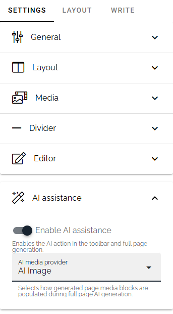

Content Builder AI is guided by prompts that are managed centrally. Administrators can write the organization's tone of voice and requirements, such as accessibility, once, and every editor in the business profile benefits from them. Administrators start from the default, make customer adjustments, state what must be preserved and can reset to the default at any time. The prompts act as a governance layer between the editor and the AI model: the aim is not to automate editorial judgment, but to give every editor a more consistent, organization-aware starting point.

.. REVIEW: Does the customer need to bring their own AI model/provider for Content Builder AI? The Q&A answer was unclear. Add a sentence once confirmed.

Key Benefits:

- Easier creation: Editors can build engaging pages quickly without needing design experience.
- Consistency: Layout, spacing and styling are controlled centrally, so pages look and feel the same across authors.
- Organization-aware AI: Central prompts carry your tone of voice and content standards into every AI suggestion.
- Findable content: Content Builder can be connected to an Omnia property and is searchable. It also works with reusable content through property mapping.

Use Case Examples:

- A communications team wants colleagues across the organization to publish local news. Content Builder gives them a simple structure to follow, and the central AI prompts keep the tone of voice consistent.
- An intranet owner wants every news article to meet accessibility requirements. The requirements are added to the central AI prompts once.

Please note:

- There is no migration path from the rich text editor to Content Builder. Existing content is not converted, so Content Builder is used for new content.
- The rich text formatting options of Content Builder are standard and cannot be configured.
- If deletion confirmation is turned off, deleted elements are removed without warning. We recommend starting with the confirmation turned on.

Divider block
~~~~~~~~~~~~~~~~~~~~~~~~~~~~~~~~~~~~~~~~~~~~~~~~~~~~~~
A new Divider block makes it easy to structure long pages and separate topics with a clean visual line. Style, color, weight, width and opacity can be configured.

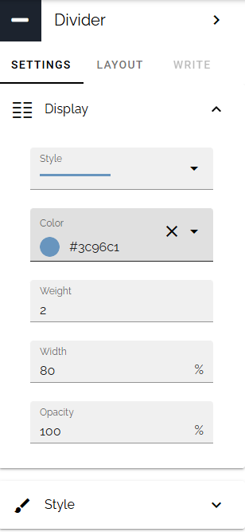

.. image:: divider-block-display.png

Easy Call to Action in the text editor
~~~~~~~~~~~~~~~~~~~~~~~~~~~~~~~~~~~~~~~~~~~~~~~~~~~~~~
Editors can add a call to action button directly in the text editor by providing a label and a URL. This helps editors guide readers to the next step, such as signing up, opening a form or reading more, without having to add a separate block.

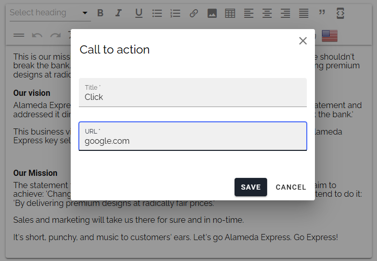

The look of call to actions is configured by administrators on the business profile (Settings, Theme, Call to action style), so every call to action looks the same, whoever creates it.

.. image:: call-to-action-result.png

Link directly to users from text
~~~~~~~~~~~~~~~~~~~~~~~~~~~~~~~~~~~~~~~~~~~~~~~~~~~~~~
Editors can now link directly to a person from within a text. This makes it easy to point readers to the right contact, for example the owner of a process or the author of a statement, and reaches the person's profile in one click.

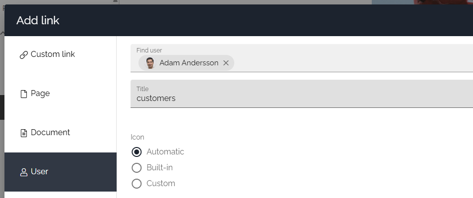

Rounded corners on images and cards
~~~~~~~~~~~~~~~~~~~~~~~~~~~~~~~~~~~~~~~~~~~~~~~~~~~~~~
Images and cards can now have rounded corners, so the intranet can follow a modern brand expression. The style is configured under Media Picker, Image style, on both tenant and business profile level, and is applied consistently wherever images are shown.

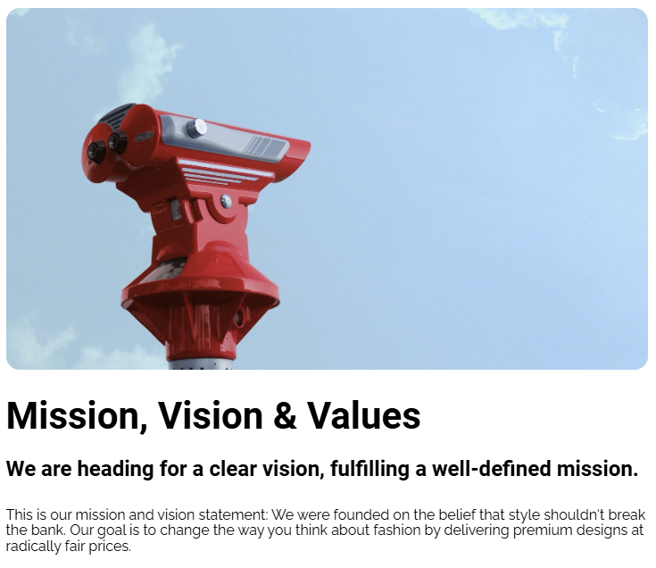

.. image:: rounded-corners-cards.png

Consistent text styles
~~~~~~~~~~~~~~~~~~~~~~~~~~~~~~~~~~~~~~~~~~~~~~~~~~~~~~
Text styles can now be inherited consistently across content, so headings and body text look the same everywhere, regardless of who wrote the page.

Custom fonts
~~~~~~~~~~~~~~~~~~~~~~~~~~~~~~~~~~~~~~~~~~~~~~~~~~~~~~
Organizations can upload their own fonts and use their corporate typography in Omnia. Fonts can be set on tenant and business profile level, applied to read mode only or everywhere, and the out-of-the-box text styles can be applied to all matching elements across Omnia.

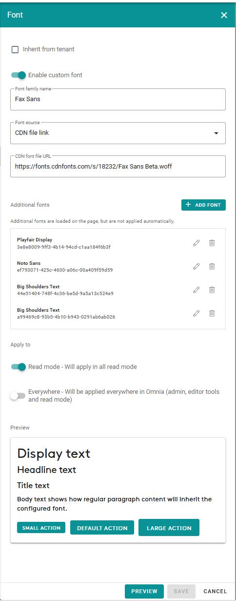

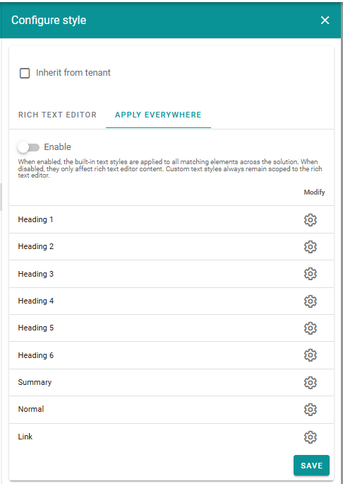

Key Benefits:

- Brand consistency: The intranet reflects the corporate identity, in both content and the surrounding interface.
- Less custom code: Typography is configured in the settings instead of added with custom CSS.

.. REVIEW: The deck asks whether Custom Font can replace a custom extension. Confirm before claiming "less custom code".

Navigation selectors for links and labels
~~~~~~~~~~~~~~~~~~~~~~~~~~~~~~~~~~~~~~~~~~~~~~~~~~~~~~
Wherever a navigation node is selected, for example in action buttons and navigation blocks, editors can now choose both link nodes and label nodes. This gives more flexibility when building navigation that mixes grouping and direct links.

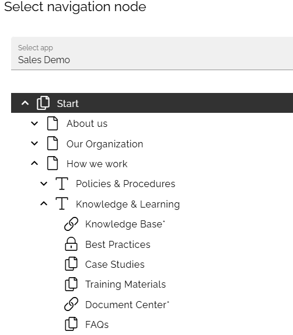

Action buttons can create pages in dialogs
~~~~~~~~~~~~~~~~~~~~~~~~~~~~~~~~~~~~~~~~~~~~~~~~~~~~~~
The "Create page" action button has a new setting: select page type. If nothing is selected, the end user can choose from any page type allowed in the page collection. If one or more page types are selected, the end user can only choose among those.

This lets an intranet owner offer a one-click "Submit an idea" or "Share a story" button that only offers the right page type, and the page is created in a dialog without leaving the current page.

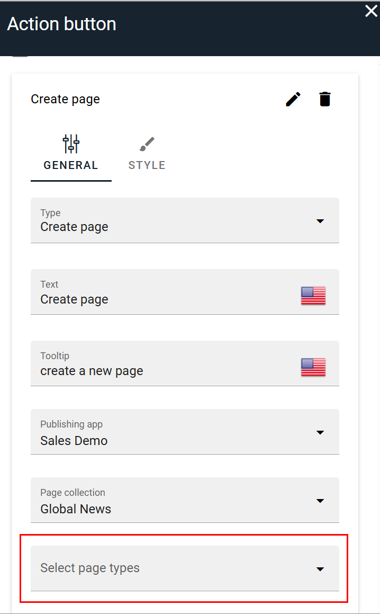

Scheduled publishing and auto-publishing combined
~~~~~~~~~~~~~~~~~~~~~~~~~~~~~~~~~~~~~~~~~~~~~~~~~~~~~~
Scheduled publishing and auto-publishing can now be used together. Editors can plan when a page goes live and still have the page publish automatically when other conditions are met, which supports campaigns and planned announcements with less manual follow-up.

.. REVIEW: Confirm what "auto-publishing" refers to here (e.g. after approval) and add a concrete example.

Other authoring improvements
~~~~~~~~~~~~~~~~~~~~~~~~~~~~~~~~~~~~~~~~~~~~~~~~~~~~~~
- New page and page type templates give editors a faster start.
- The improved property selector makes it easier to find and pick the right properties.
- Formatting is available in multilingual plain-text fields.
- Auto-translated variations keep the original section order.
- Editing document links is now possible in the rich text editor.
- Non-sticky announcements are handled in the page editor and on SharePoint.

Pages, rollups and blocks
------------------------------------------------------

Page Rollup: react and discover
~~~~~~~~~~~~~~~~~~~~~~~~~~~~~~~~~~~~~~~~~~~~~~~~~~~~~~
Readers can now react to content directly from Page Rollup, without opening the page. This lowers the threshold for engagement and gives authors faster feedback on which content works.

.. image:: page-rollup-card-reactions.png

Reacting is available in the Roller, Listing with image, Dynamic Roller, Card and Card (WCAG) views, and is enabled with the "Allow liking" setting.

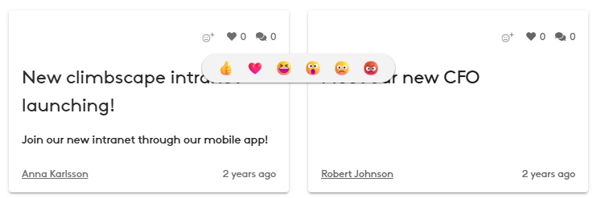

The new horizontal card view shows additional metadata next to the image, making it easier for readers to decide what to read.

Event Rollup card view
~~~~~~~~~~~~~~~~~~~~~~~~~~~~~~~~~~~~~~~~~~~~~~~~~~~~~~
The Event Rollup card view has additional display options for event information, so organizers can show what matters most, such as time, location and type, directly on the card.

.. image:: event-rollup-card-view.png

Event participant counter
~~~~~~~~~~~~~~~~~~~~~~~~~~~~~~~~~~~~~~~~~~~~~~~~~~~~~~
A new block shows how many people have registered and how many places there are in total ("registered / max"), and shows a full state when the event is fully booked. Attendees see at a glance whether there is still room, and organizers avoid answering the same question repeatedly. The block has responsive settings.

Table of contents block
~~~~~~~~~~~~~~~~~~~~~~~~~~~~~~~~~~~~~~~~~~~~~~~~~~~~~~
The Table of contents block creates navigation from the headings on a page, or from a configured property. For long pages, such as policies, guides and handbooks, readers can see the structure and jump straight to the section they need.

.. REVIEW: Landed after 7.11 but was never announced. Confirm the property-based option, and whether there is a screenshot available.

Banner
~~~~~~~~~~~~~~~~~~~~~~~~~~~~~~~~~~~~~~~~~~~~~~~~~~~~~~
The Banner block has been redesigned with new views and a new editor. Predefined layouts and a live preview make it easier for editors to create banners and immediately see the result.

.. image:: banner-block-predefined-layouts.png

In addition to the existing layouts, two new options are available for banners combining text and images: Image on left and Image on right. For these, you can also control the ratio between the image and text areas. The result is more variation in how campaigns and messages are presented, without custom design work.

Quick Links: new app launcher view
~~~~~~~~~~~~~~~~~~~~~~~~~~~~~~~~~~~~~~~~~~~~~~~~~~~~~~
Quick Links has a new app launcher design with default icons provided, and the app icons view has new design options. This makes it simple to give colleagues a clear "my apps" area, in the style they know from Microsoft 365.

Current navigation and Breadcrumb
~~~~~~~~~~~~~~~~~~~~~~~~~~~~~~~~~~~~~~~~~~~~~~~~~~~~~~
Current navigation and Breadcrumb now come with style presets and a live preview, so the navigation can match the design of the intranet in a few clicks. Both also have responsive settings.

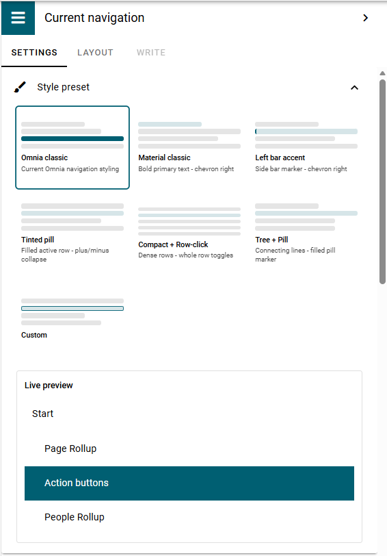

With the Custom preset, Current navigation can be fine-tuned: current node indicator, open and collapse controls, row density, hover state and indent guide.

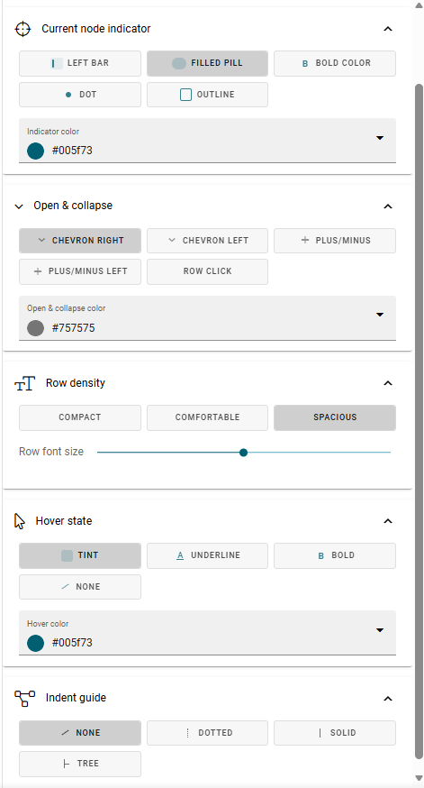

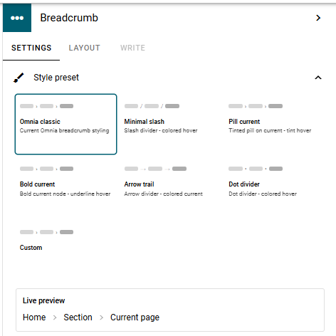

The Breadcrumb block also has a Custom preset, with settings for the current node indicator, separator, font size and spacing, and hover state.

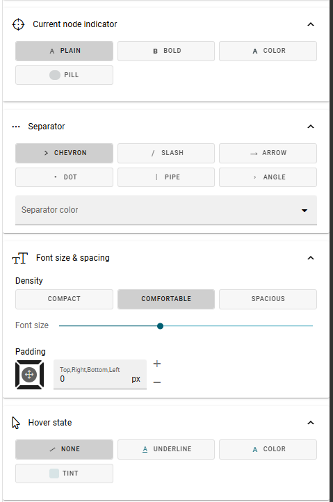

Mega menu
~~~~~~~~~~~~~~~~~~~~~~~~~~~~~~~~~~~~~~~~~~~~~~~~~~~~~~
The workspace mega menu has new settings to centre the menu, show or hide icons and use uppercase letters. Dynamic content in the mega menu is also ordered better.

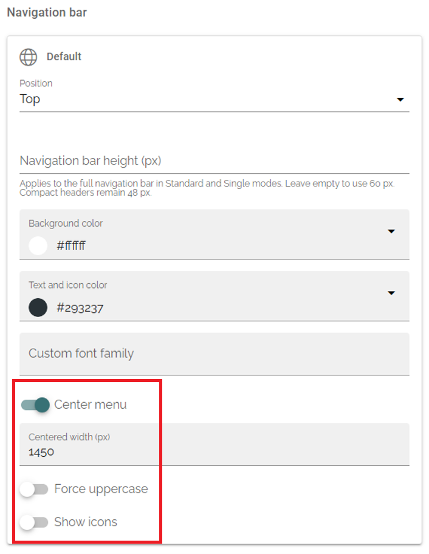

.. image:: mega-menu-centered.png

Please note that the centering, uppercase and icon settings apply to the workspace mega menu only, not the classic mega menu.

Threaded comments
~~~~~~~~~~~~~~~~~~~~~~~~~~~~~~~~~~~~~~~~~~~~~~~~~~~~~~
Comments can be shown in a threaded view, with settings for the comment input style. Conversations stay together under the comment they respond to, which makes longer discussions on news and announcements much easier to follow. Deletion of comments is also tracked in more detail.

Document Library Display
~~~~~~~~~~~~~~~~~~~~~~~~~~~~~~~~~~~~~~~~~~~~~~~~~~~~~~
The Document Library Display block makes it easy to display files and folders from a SharePoint document library directly on an Omnia page. It provides a familiar way for users to find and browse SharePoint content without having to leave the Omnia context.

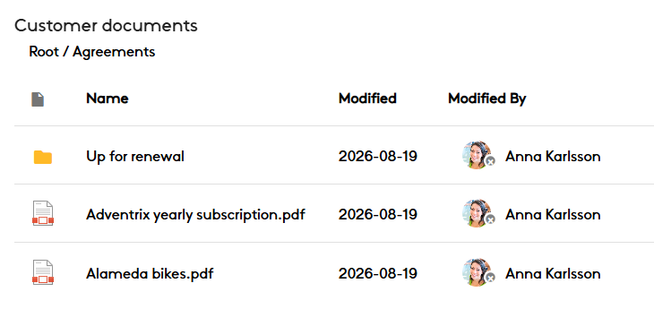

Setting up the block starts with a SharePoint URL. From there, you can select the document library and, if needed, a specific folder as the starting point. This gives editors the flexibility to expose an entire library, or focus the block on the content most relevant to the page.

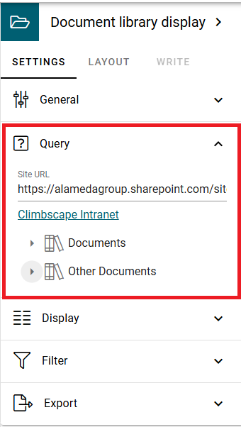

You can control how documents are presented by using an existing SharePoint view or by selecting the specific SharePoint fields to include. This makes it possible to reuse views that are already configured in SharePoint or tailor the information for a particular intranet experience.

The block now has a search box and supports more SharePoint column types, including currency and SharePoint-style date and time. The List Rollup block also has a search box.

Use Case Example:

- A department shows its team folder from SharePoint on the department page, using the SharePoint view the team already maintains, so there is nothing to keep in sync.

Blocks that hide when empty
~~~~~~~~~~~~~~~~~~~~~~~~~~~~~~~~~~~~~~~~~~~~~~~~~~~~~~
Blocks such as Document Rollup and process documents can now hide themselves when they have nothing to show. Pages stay clean, and readers do not see empty headings or empty lists.

Other block improvements
~~~~~~~~~~~~~~~~~~~~~~~~~~~~~~~~~~~~~~~~~~~~~~~~~~~~~~
- Built-in properties can be shown in the "Show in dialog" settings.
- Glossary terms can have a configurable default style.
- Targeting filters can hide the "include child terms" option, for a simpler filter.
- A new "Omnia Content" enterprise property type.

Targeting and personalization
------------------------------------------------------

Run as persona
~~~~~~~~~~~~~~~~~~~~~~~~~~~~~~~~~~~~~~~~~~~~~~~~~~~~~~
One of the most requested features from last year's Omnia Conference! Targeting personas make it possible for selected users to experience the intranet as a predefined persona, helping them understand what content different target audiences will see.

.. image:: run-as-a-persona-display.png

This is particularly useful for intranet owners, editors and administrators who want to verify targeting and make sure the right content reaches the right people. Instead of creating test accounts or asking colleagues to check, they can see the start page, news and navigation exactly as, for example, a frontline employee in a given country would.

Targeting personas are created and managed in Omnia Admin. Each persona represents a specific target audience. Access to create and manage targeting personas requires specific permissions.

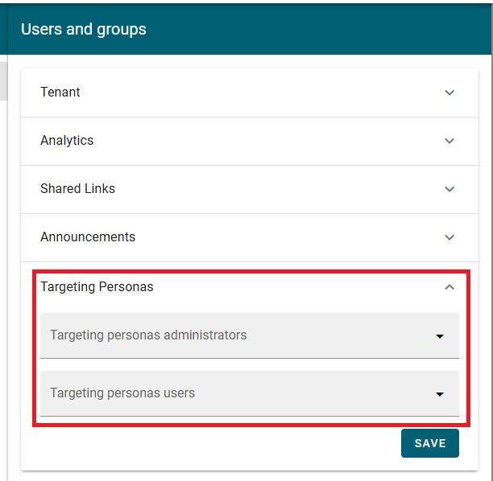

Users with the required permissions can select a targeting persona in their profile settings. Once selected, they browse the intranet based on the targeting associated with that persona rather than their own. A clear frame around the intranet indicates that a persona is active, helping users distinguish the persona experience from their normal view.

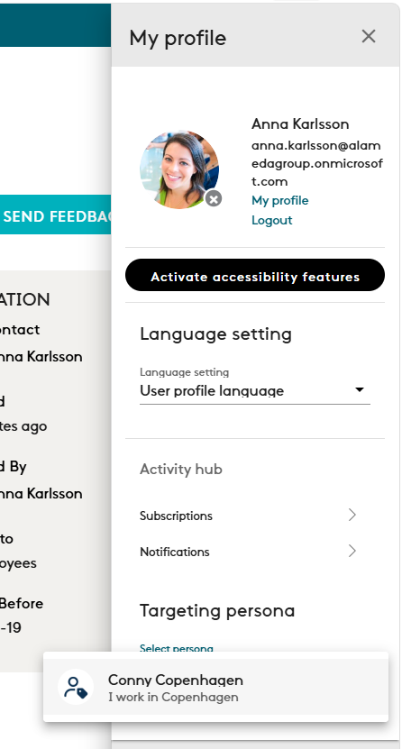

.. image:: persona-active-frame.png

Important to note that targeting personas affect targeting only. They do not impersonate another user or grant additional permissions.

Key Benefits:

- Confidence: Verify targeted content before and after publishing.
- Efficiency: No test accounts or manual checks.
- Quality: Catch gaps, for example a target audience that sees nothing on its start page.

Targeted semantic search filters
~~~~~~~~~~~~~~~~~~~~~~~~~~~~~~~~~~~~~~~~~~~~~~~~~~~~~~
Semantic Search filters can be targeted to the user, so each audience is offered the filters that are relevant for them.

Search and AI
------------------------------------------------------

Semantic Search: reindex and Excel files
~~~~~~~~~~~~~~~~~~~~~~~~~~~~~~~~~~~~~~~~~~~~~~~~~~~~~~
Administrators can reindex the Semantic Search page and document indexes. A full reindex is an online rebuild: users keep searching in the current index while Omnia builds the replacement in the background, and only switches when the new index is ready. This means a reindex can be done without taking search away from users.

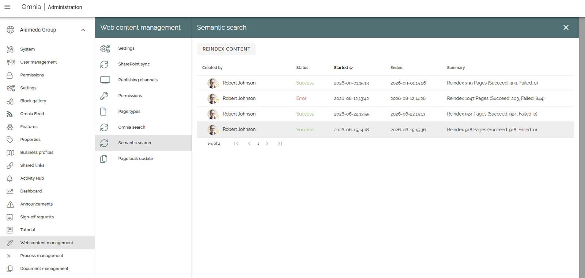

A reindex is relevant when, for example, Semantic Search has just been enabled, a provider or major configuration has changed, pages or documents are unexpectedly missing or out of date, or search permissions appear out of sync.

Semantic Search now also supports Excel files, so answers can include the content of spreadsheets, such as price lists, schedules and reports.

Search result consolidation
~~~~~~~~~~~~~~~~~~~~~~~~~~~~~~~~~~~~~~~~~~~~~~~~~~~~~~
We have improved the alignment between the different types of search result templates, creating a more consistent experience when a search scope contains results from several sources or content types. Results share common properties (title, description, responsible person or author, date, URL and source location), presentation options and property mapping, and templates are evaluated in the order configured, in both Quick Search and Advanced Search.

.. image:: search-result-consolidation-display.png

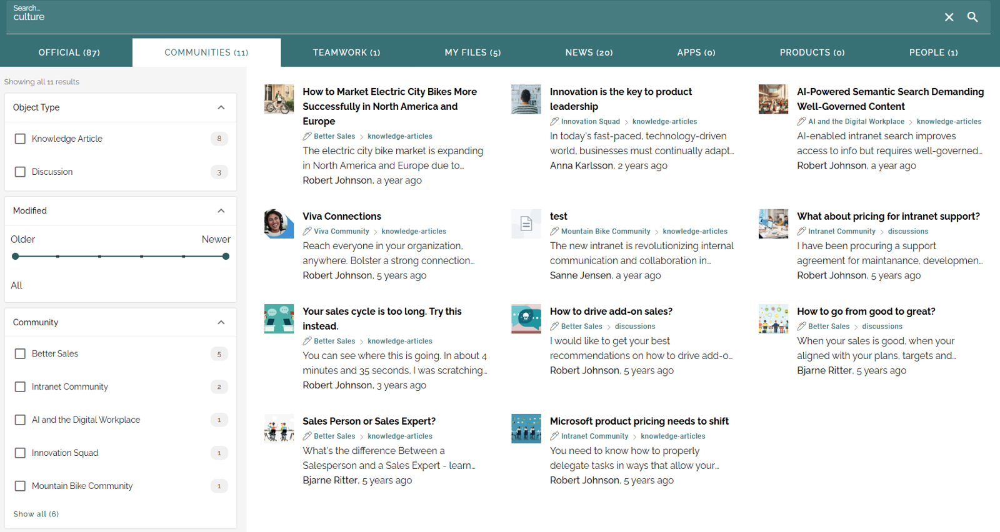

This is especially useful for search solutions that combine different types of content. Readers can recognize what each result is at a glance, while content-specific functionality, such as document preview, is kept.

Please note that it is not possible to set a default placeholder image for results without an image.

.. REVIEW: "Admin customization of AI prompts (pre- and post-prompts)" is listed for 7.13. In 7.12 the pre- and post-prompts are in Content Builder AI. The semantic search pre- and post-prompts were announced in 7.11.x. Confirm whether the 7.13 item is the same or an extension, and wording here.

Header search and Advanced Search
~~~~~~~~~~~~~~~~~~~~~~~~~~~~~~~~~~~~~~~~~~~~~~~~~~~~~~
The header search has a Microsoft 365 look and feel, and is WCAG-compliant. Advanced Search has new refiners.

AI-ready content
~~~~~~~~~~~~~~~~~~~~~~~~~~~~~~~~~~~~~~~~~~~~~~~~~~~~~~
The data structure has been improved to enhance Copilot and AI capabilities, so AI assistants can better find and understand your content.

Omnia and SharePoint
------------------------------------------------------

Omnia full page experience in SharePoint
~~~~~~~~~~~~~~~~~~~~~~~~~~~~~~~~~~~~~~~~~~~~~~~~~~~~~~
Some organizations have decided to run strategically inside SharePoint, and others have a hybrid setup where some people work in SharePoint and others work in both SharePoint and Omnia. In 7.12 it is possible to view, create and edit Omnia pages from SharePoint, so these organizations get the Omnia publishing experience without leaving the tool they use every day.

An administrator activates the "Omnia full page experience" feature in the publishing app, which provisions a system page in the SharePoint site page library. A default rendering is selected in the tenant settings, and Page Rollup gets a setting to open pages in the SharePoint full page, so readers can open Omnia pages in SharePoint straight from a rollup.

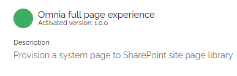

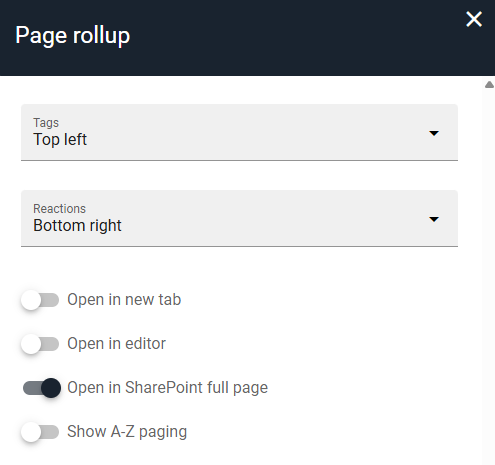

An Omnia block can be inserted on a page in SharePoint to show a selected Omnia page. With the "Allow edit" setting, authors get quick access to edit mode in SharePoint, with reduced functionality, and to the full edit mode in Omnia.

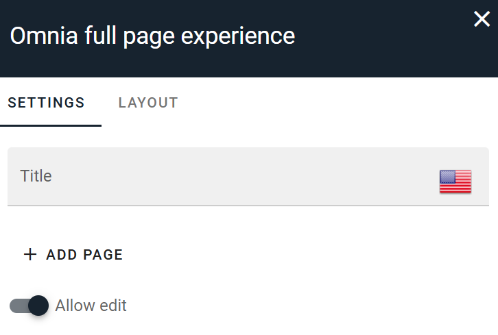

Please note that "Open in SharePoint full page" is disabled if no default rendering has been set, or if no publishing site has the feature enabled.

Readers can also react to content in Page Rollup directly from SharePoint, using the "Allow liking" setting.

.. image:: sharepoint-rollup-reactions.png

Please note that Omnia's like and comment controls cannot be added as a SharePoint web part (SPFx), as this would conflict with SharePoint's built-in functionality. They are available in the full page experience of Omnia pages.

Key Benefits:

- Flexibility: Customers can choose where people work, in SharePoint or Omnia, without separating the content.
- One source: Omnia pages are the same wherever they are viewed.
- Familiar tools: Authors who prefer SharePoint can stay there.

.. REVIEW: Slide drafts asked for author entry points and licence/permission prerequisites. Add once confirmed.

Quick publish and edit dialog
~~~~~~~~~~~~~~~~~~~~~~~~~~~~~~~~~~~~~~~~~~~~~~~~~~~~~~
The page dialog has an improved viewing and editing experience. An edit button is shown if the user has edit permission, visible properties are configured from the page type, the Variation Picker is visible, and the dialog shows when a page has been taken over with "Take control". When a machine-translated variation is open, a warning is displayed and publishing is disabled. Editors can fix a typo or update a date without leaving the page they are on.

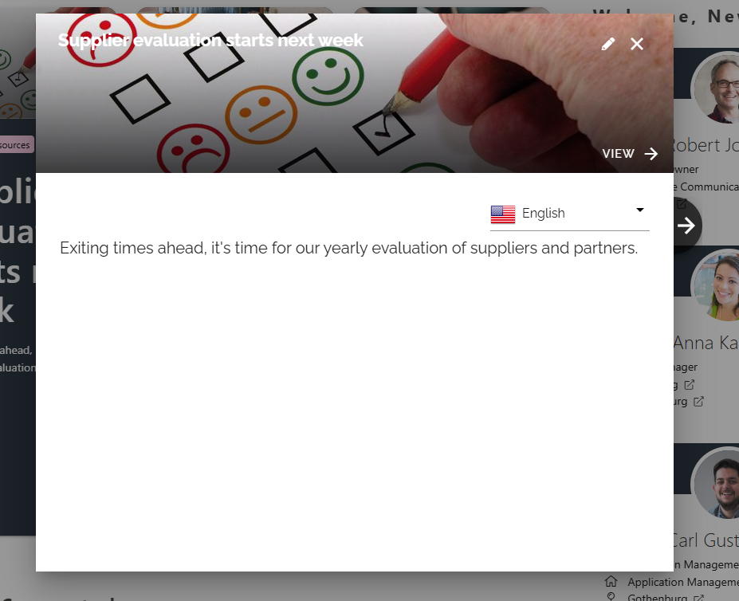

.. image:: quick-edit-dialog.png

Also in SharePoint
~~~~~~~~~~~~~~~~~~~~~~~~~~~~~~~~~~~~~~~~~~~~~~~~~~~~~~
- **SharePoint page picker.** Pick SharePoint pages where an Omnia page is expected, such as in links and rollups.
- **Team News Rollup.** Improved querying, multiple views and additional filter options, so team and site news from SharePoint can be presented the way each audience needs. REVIEW: confirm whether existing instances get the new views automatically.
- **Process blocks on SharePoint pages.** Process documents and blocks can now be used on SharePoint pages.
- **Sign-off requests include SharePoint pages.** Governance of important content also applies to pages that live in SharePoint.
- **SharePoint Brand Center.** Omnia supports the SharePoint Brand Center, so branding set there is respected.
- **Matomo Analytics for SharePoint pages.** Page statistics also cover pages in SharePoint.
- **The Omnia footer script runs on SharePoint sites.**
- **Better performance** of Omnia running in the SharePoint context, including a better CSS load order on SPFx pages.

Navigation and everyday experience
------------------------------------------------------

Everywhere Panel
~~~~~~~~~~~~~~~~~~~~~~~~~~~~~~~~~~~~~~~~~~~~~~~~~~~~~~
The Everywhere Panel places the mega menu in a permanent panel on the left. It is always visible while users browse, and gives them quick access to intranet areas and content in Omnia and SharePoint. Instead of opening a menu every time, readers always have their key destinations within reach.

.. image:: everywhere-panel.png

The panel is switched on with the "Show left panel" setting in the publishing app feature and configured in Workspace settings, under Left panel. Everything that is supported in the mega menu is supported in the panel: layouts and links, audience targeting, theming, responsive views and multilingual titles. If the navigation bar is also placed on the left, the left panel is shown before the left navigation bar.

Key Benefits:

- Orientation: Users always see where they are and where else they can go.
- Reuse: The same mega menu content is used, so there is no second navigation to maintain.
- Targeted: Different audiences can get different panels.

Please note that:

- The panel is placed on the left, regardless of the top or left mode of the mega menu. An existing mega menu that is set to "left" and also uses left navigation nodes will therefore show two menus after the upgrade. See Before you upgrade.
- The Everywhere Panel is not the same as the older "Everywhere panel" component in other products.

.. REVIEW: Three QA items were open on the functional card (OmniaMono #3655): layout theming settings in read mode, max width/height, and left panel alignment in Microsoft Teams. Confirm they are fixed, or add to known issues. Teams is also mentioned on the card as a place where the panel shows.

.. REVIEW: The label in the panel settings still says "mega menu". The Q&A says this will be updated.

New date and time picker
~~~~~~~~~~~~~~~~~~~~~~~~~~~~~~~~~~~~~~~~~~~~~~~~~~~~~~
A new date and time picker has separate tabs for date and time, and is WCAG-compliant. It is quicker to use and works with keyboard and assistive technology.

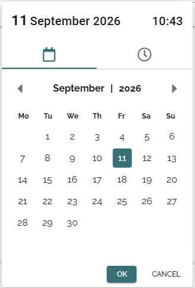

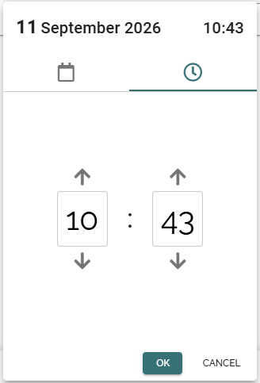

Notifications and subscriptions
~~~~~~~~~~~~~~~~~~~~~~~~~~~~~~~~~~~~~~~~~~~~~~~~~~~~~~
- A count badge in the notification panel shows how many notifications are waiting.
- People can subscribe to publishing channels with a new action button handler, and manage them in a reworked "My subscriptions" view. Readers choose which channels matter to them and stay informed without searching.

Updated "Your session has expired" screen
~~~~~~~~~~~~~~~~~~~~~~~~~~~~~~~~~~~~~~~~~~~~~~~~~~~~~~
The message shown when a session has expired has a new, smaller design that is less disruptive. It uses the theme colors of the tenant.

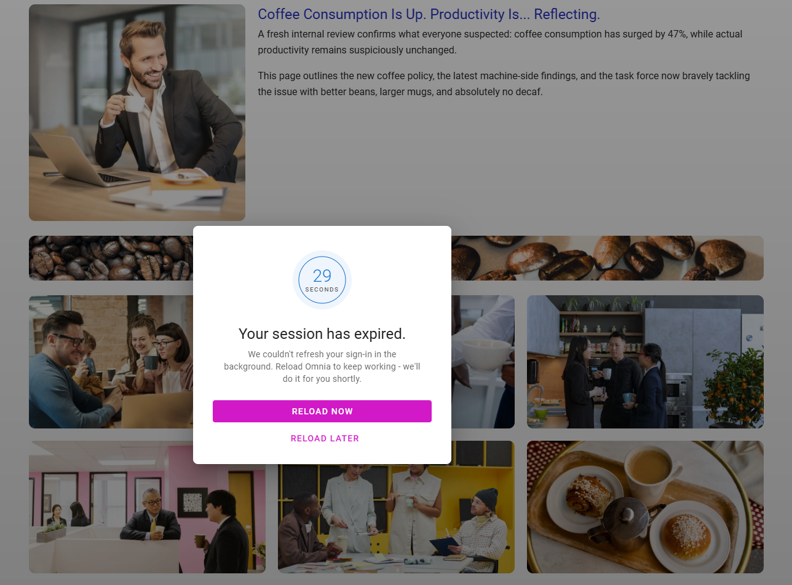

Other everyday improvements
~~~~~~~~~~~~~~~~~~~~~~~~~~~~~~~~~~~~~~~~~~~~~~~~~~~~~~
- The App Selector is aligned with the Microsoft 365 experience. It is still a manually maintained list of links based on Shared links, and supports custom, Microsoft, flag and Font Awesome icons.
- Dynamic font sizing based on action button size.
- Quick Publish dialog improvements.
- The setup wizard can now create a Business Profile.

Governance and administration
------------------------------------------------------

Bypass page approval
~~~~~~~~~~~~~~~~~~~~~~~~~~~~~~~~~~~~~~~~~~~~~~~~~~~~~~
Selected users can bypass page approval, for example when something urgent must be published without delay. This keeps the approval process strict for everyone else, while still allowing exceptions for authorized users.

.. REVIEW: Add who can bypass (role/permission) and whether it is logged.

Group membership synchronization for Sign-off requests
~~~~~~~~~~~~~~~~~~~~~~~~~~~~~~~~~~~~~~~~~~~~~~~~~~~~~~
Sign-off requests can follow group membership, so the right people are always asked to sign off when teams change. Fewer manual updates, and fewer people missing a request.

Page collection administrators can take control
~~~~~~~~~~~~~~~~~~~~~~~~~~~~~~~~~~~~~~~~~~~~~~~~~~~~~~
Page collection administrators can cancel an approval and take control of a page. A page stuck in approval because the approver is absent no longer needs to wait.

Other governance improvements
~~~~~~~~~~~~~~~~~~~~~~~~~~~~~~~~~~~~~~~~~~~~~~~~~~~~~~
- Machine translation of reusable sections.
- Distribution groups can be used in promotion channels.
- Navigating without a variation.

Performance
------------------------------------------------------
Omnia 7.12 includes a broad performance improvement. Most of the client code has been migrated to the Vue Composition API, the editor is only loaded when it is needed, fewer bundles are loaded with each page, and pages jump around less while they load. SharePoint (SPFx) pages also load their CSS in a better order.

The result is a faster and calmer experience for readers, and a quicker start for editors who only read most of the time.

.. REVIEW: No benchmark numbers are available, so none are given.

Accessibility (WCAG)
------------------------------------------------------
7.12 continues the work to make the intranet usable by everyone, which is also important for organizations with accessibility requirements, such as public sector customers.

- Header search is WCAG-compliant.
- WCAG improvements for the Page Rollup calendar view (with a new design), the card view, People Rollup and the filter components across all rollups.
- WCAG improvements for the notification panel, comments, tutorials, metrics and the export buttons.
- New refiners in Advanced Search are WCAG-compliant.
- A new WCAG-compliant date and time picker.
- The heading element can be configured on all blocks, not only the FAQ block, so authors can keep a correct heading hierarchy (H1, H2, H3, and so on).
- Dialog headers are standardized as H2.
- Missing alternative texts are fixed throughout.
- A shared, accessible pagination control.

.. REVIEW: "Calendar rollup new design" - confirm this is the Page Rollup calendar view.

Before you upgrade
------------------------------------------------------
- **Custom CSS or JavaScript.** The WCAG work and the move to the Composition API have touched many frontend elements. Tenants with custom CSS or JavaScript should be checked after the upgrade.
- **Extensions.** Check custom extensions for compatibility.
- **Mega menu.** A menu set to "left" that also has left navigation nodes will show two menus after the Everywhere Panel is turned on.

Recently added
------------------------------------------------------
Already announced in 7.11.x, and included in 7.12:

- Bidirectional relationships in People Rollup.
- Search limited to specific properties.
- Burmese and Traditional Chinese languages.
- .url shortcuts open from search.
- GPT-5.5 support for Semantic Search.
- Semantic Search pre- and post-prompts.

Versions
------------------------------------------------------

.. REVIEW: Add version list in the same format as 7.0.
