Release 7.12 (Functional release notes, draft)
========================================================

.. REVIEW NOTE: Rewritten as a lightweight pitch: capability first, key user named, no settings detail. Items marked "REVIEW" in rst comments need a fact check and are not rendered.

Omnia 7.12 helps every part of your intranet team do more with less effort. Authors get a simpler, smarter way to create engaging content. Intranet owners can see the intranet through their audiences' eyes. Organizations that live in SharePoint can bring Omnia pages with them. And everyone gets a faster, more accessible experience.

Each feature below names the people who benefit most:

- **Employees** - everyone who reads and uses the intranet.
- **Authors** - the people who create content within the blocks already on a page.
- **Editors** - the people who design pages by adding, removing and configuring blocks.
- **Intranet owners** - communications and intranet managers responsible for the whole experience.
- **Administrators** - the people who configure and govern the platform.

**Highlights**

- `Content Builder`_ - build engaging pages quickly, with AI assistance that follows your organization's editorial standards.
- `Omnia pages in SharePoint`_ - view, create and edit Omnia pages directly from SharePoint.
- `Run as persona`_ - see the intranet exactly as a target audience sees it.
- `Everywhere Panel`_ - your key destinations, always one click away.
- `Performance`_ - a broad overhaul that makes Omnia faster and smoother.

**More in 7.12**

- `Create content faster`_ - calls to action, dividers, your own fonts, one-click page creation, scheduling.
- `Omnia and SharePoint, working as one`_ - quick edit, document libraries, SharePoint governance and branding.
- `Know your audience`_ - targeted search filters.
- `Find things and find your way`_ - navigation styles, app launcher, search and AI.
- `Engage your readers`_ - reactions, banners, events, table of contents, threaded comments.
- `Governance with less friction`_ - approvals, sign-off and administration.
- `Accessibility (WCAG)`_ - improvements across the intranet.
- `Before you upgrade`_ and `Recently added`_ - what to check, and what you may have missed.

Create content faster
------------------------------------------------------

Content Builder
~~~~~~~~~~~~~~~~~~~~~~~~~~~~~~~~~~~~~~~~~~~~~~~~~~~~~~
**Who it's for:** Authors, and the editors and intranet owners who want consistent content.

Not everyone who writes for the intranet is a designer. Content Builder gives authors a simple, guided way to build engaging content: pick ready-made elements, rearrange them, change their layout, and see the result as they go.

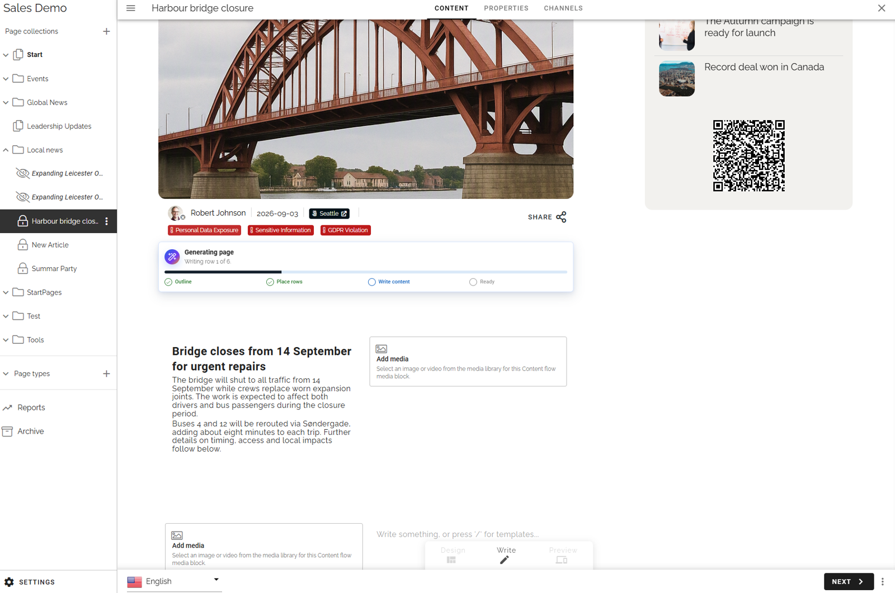

With AI assistance, authors can get a full draft or a single paragraph in seconds. Administrators set the tone of voice and content standards, such as accessibility requirements, once, and every author in the business profile gets AI suggestions that follow them. The result is faster publishing with a more consistent voice, without taking the author out of control.

Content Builder works like any other block: it can be added to page types, content can be connected to properties and found in search, and it works with reusable content. It can also be used instead of the rich text editor.

.. REVIEW: Does the customer need to bring their own AI model/provider for Content Builder AI? The Q&A answer was unclear. Add a sentence once confirmed.

Good to know: There is no migration from the rich text editor, so Content Builder is for new content.

Call to action, dividers and links to people
~~~~~~~~~~~~~~~~~~~~~~~~~~~~~~~~~~~~~~~~~~~~~~~~~~~~~~
**Who it's for:** Authors and editors.

Three small additions that make pages clearer and more actionable. Authors can add a **call to action** button straight from the text editor, so readers know what to do next, and every button follows the organization's design. A new **Divider** block gives editors an easy way to give long pages structure. And authors can **link directly to a person** from text, so readers reach the right contact in one click.

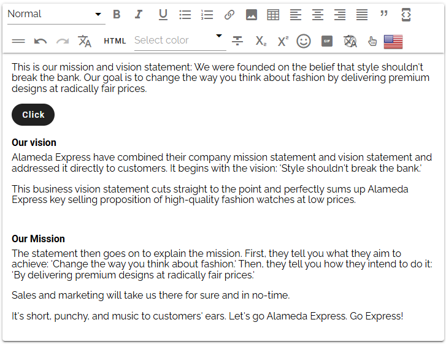

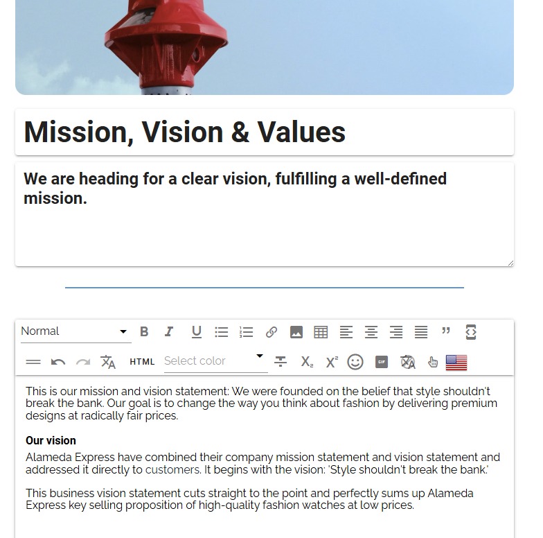

Your brand, everywhere
~~~~~~~~~~~~~~~~~~~~~~~~~~~~~~~~~~~~~~~~~~~~~~~~~~~~~~
**Who it's for:** Intranet owners and administrators.

Make the intranet look like your organization. Upload your **own fonts** and use your corporate typography, apply **consistent text styles** to all content, and give images and cards **rounded corners** for a modern look. The result is an intranet that feels like part of your brand, not a separate tool.

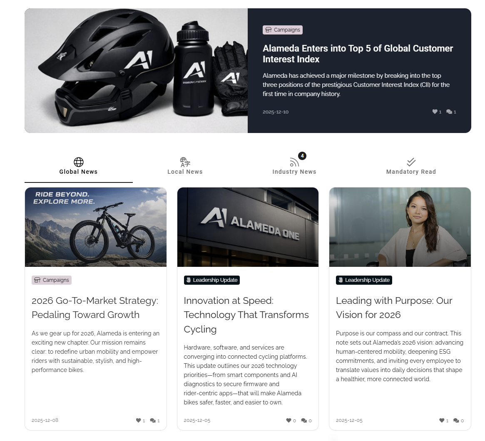

.. REVIEW: The deck asks whether Custom Font can replace a custom extension. Confirm before claiming it reduces custom code.

One-click page creation
~~~~~~~~~~~~~~~~~~~~~~~~~~~~~~~~~~~~~~~~~~~~~~~~~~~~~~
**Who it's for:** Intranet owners and employees who contribute.

Turn contribution into a button. A "Share a story" or "Submit an idea" action button now creates the right type of page in a dialog, so contributors never have to leave the page they are on or choose between page types they do not need.

Plan ahead, publish automatically
~~~~~~~~~~~~~~~~~~~~~~~~~~~~~~~~~~~~~~~~~~~~~~~~~~~~~~
**Who it's for:** Authors.

Scheduled publishing and auto-publishing can now be combined, so authors can plan campaigns and announcements ahead of time and spend less time on manual follow-up.

.. REVIEW: Confirm what "auto-publishing" refers to here (e.g. after approval) and add a concrete example.

More for authors and editors
~~~~~~~~~~~~~~~~~~~~~~~~~~~~~~~~~~~~~~~~~~~~~~~~~~~~~~~
- **A faster start:** new page and page type templates.
- **Easier navigation picking:** choose both links and labels when selecting navigation.
- **Easier property picking:** an improved property selector.
- **Better multilingual work:** formatting in multilingual plain-text fields, auto-translated variations that keep the original section order, and machine translation of reusable sections.
- **Fewer detours:** edit document links directly in the rich text editor.
- **Announcements:** non-sticky announcements are handled in the page editor and on SharePoint.

Omnia and SharePoint, working as one
------------------------------------------------------

Omnia pages in SharePoint
~~~~~~~~~~~~~~~~~~~~~~~~~~~~~~~~~~~~~~~~~~~~~~~~~~~~~~
**Who it's for:** Organizations that work in SharePoint, and the authors and employees in them.

Some organizations have decided to work inside SharePoint, and others have a mix of people in SharePoint and Omnia. With 7.12, they no longer have to choose. Omnia pages can be **viewed, created and edited from SharePoint**, so people stay in the tool they use every day, and the content stays the same everywhere. Employees can even react to content from Page Rollup directly in SharePoint.

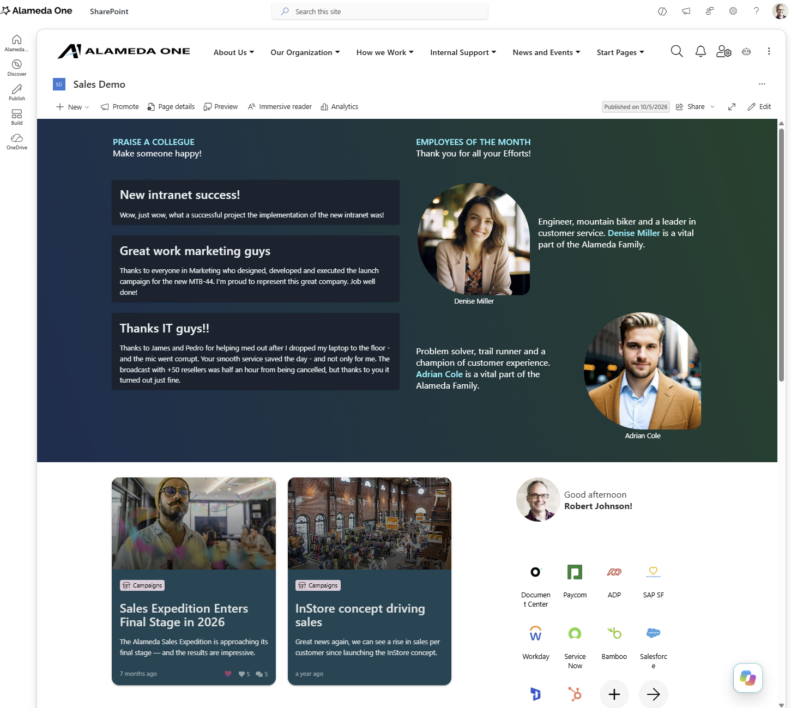

Quick publish and edit
~~~~~~~~~~~~~~~~~~~~~~~~~~~~~~~~~~~~~~~~~~~~~~~~~~~~~~
**Who it's for:** Authors.

Spot a typo or an old date? Authors can now open a page in a dialog, fix it and publish, without leaving the page they are on. The dialog also handles variations, takes control of a page when needed, and warns before publishing a machine-translated variation.

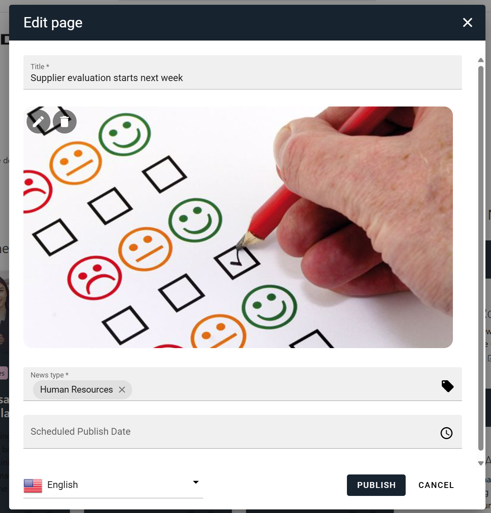

SharePoint content and governance in Omnia
~~~~~~~~~~~~~~~~~~~~~~~~~~~~~~~~~~~~~~~~~~~~~~~~~~~~~~
**Who it's for:** Intranet owners and administrators.

Omnia increasingly treats SharePoint content as a first-class citizen:

- **Team News Rollup** gets better querying, multiple views and more filters, so team news can be shown the way each audience needs it.
- **SharePoint page picker** lets authors and editors select SharePoint pages where an Omnia page is expected.
- **Process blocks** can be used on SharePoint pages.
- **Sign-off requests** include SharePoint pages, so governance applies to important content wherever it lives.
- **SharePoint Brand Center** is supported, so branding done there is respected.
- **Matomo Analytics** covers SharePoint pages.
- **The Omnia footer script** runs on SharePoint sites.
- **Faster pages:** better performance of Omnia in SharePoint, including a better CSS load order on SPFx pages.

.. REVIEW: Team News Rollup - confirm whether existing instances get the new views automatically.

Document Library Display
~~~~~~~~~~~~~~~~~~~~~~~~~~~~~~~~~~~~~~~~~~~~~~~~~~~~~~
**Who it's for:** Employees and editors.

Documents stay in SharePoint, but employees should not have to go looking for them. The Document Library Display block shows files and folders from a SharePoint document library right on the Omnia page, and employees can browse folders and search without leaving the intranet. Editors can reuse the views already maintained in SharePoint, so there is nothing extra to keep in sync. More SharePoint column types are supported, including currency and SharePoint-style date and time.

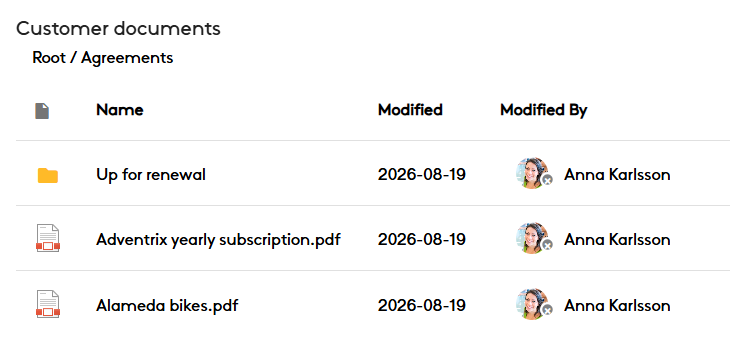

.. REVIEW: The existing 7.12 notes call this block "Document Rollup". Confirm the final name.

Know your audience
------------------------------------------------------

Run as persona
~~~~~~~~~~~~~~~~~~~~~~~~~~~~~~~~~~~~~~~~~~~~~~~~~~~~~~
**Who it's for:** Intranet owners, editors and administrators.

One of the most requested features from last year's Omnia Conference! Targeting is powerful, but until now it was hard to know what a given audience really sees. With targeting personas, selected users can experience the intranet as a predefined persona, for example a frontline employee in a specific country, and verify that the right content reaches the right people. No test accounts, no asking colleagues to check.

A clear frame around the screen shows when a persona is active. Personas affect targeting only: they do not impersonate anyone or give additional permissions.

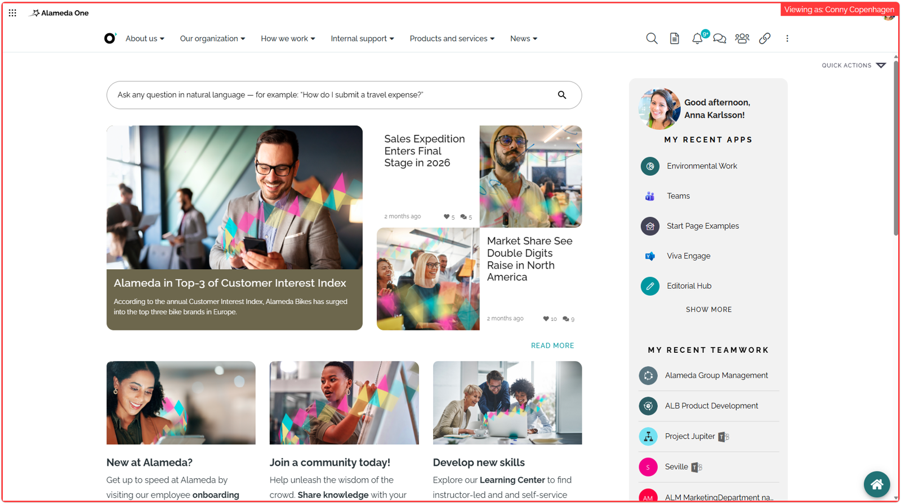

Targeted search filters
~~~~~~~~~~~~~~~~~~~~~~~~~~~~~~~~~~~~~~~~~~~~~~~~~~~~~~
**Who it's for:** Employees and administrators.

Semantic Search filters can be targeted to the user, so each audience only sees the filters that are relevant to them. Targeting filters can also hide the "include child terms" option for a simpler experience.

Find things and find your way
------------------------------------------------------

Everywhere Panel
~~~~~~~~~~~~~~~~~~~~~~~~~~~~~~~~~~~~~~~~~~~~~~~~~~~~~~
**Who it's for:** Employees, and intranet owners who design the navigation.

Keep the key destinations always within reach. The Everywhere Panel puts the mega menu in a permanent panel on the left, visible while employees browse, in Omnia and SharePoint. Because it reuses the mega menu, there is no second navigation to maintain, and different audiences can get different panels.

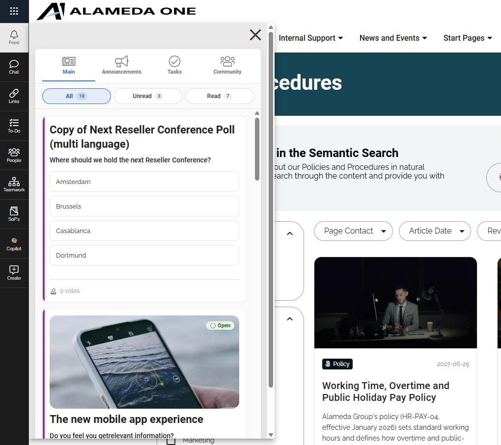

.. REVIEW: The label in the panel settings still says "mega menu"; the Q&A says this will be updated.

.. REVIEW: Three QA items were open on the functional card (OmniaMono #3655): layout theming in read mode, layout max width/height, and left panel alignment in Microsoft Teams. Confirm they are fixed, or list them as known issues.

.. REVIEW: "Everywhere Panel" is also the name of an older component in another product. Make sure support does not mix them up.

Navigation that fits your design
~~~~~~~~~~~~~~~~~~~~~~~~~~~~~~~~~~~~~~~~~~~~~~~~~~~~~~
**Who it's for:** Intranet owners.

Make the navigation match the intranet design in a few clicks. Current navigation and Breadcrumb now come with style presets and a live preview, and the workspace mega menu can be centered, with or without icons and uppercase letters.

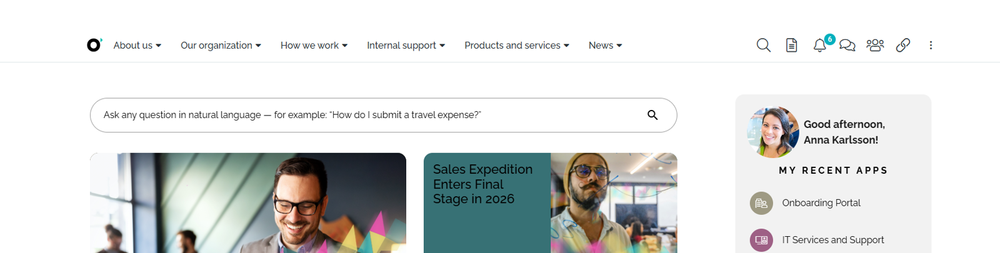

A better app launcher
~~~~~~~~~~~~~~~~~~~~~~~~~~~~~~~~~~~~~~~~~~~~~~~~~~~~~~
**Who it's for:** Employees and intranet owners.

The app launcher has a new design with default icons provided, and it is aligned with the Microsoft 365 experience. It gives colleagues a clear "my apps" area in a style they already know.

Better search results
~~~~~~~~~~~~~~~~~~~~~~~~~~~~~~~~~~~~~~~~~~~~~~~~~~~~~~
**Who it's for:** Employees and search administrators.

When results come from several sources, they should still look like one search. Search result templates are now aligned, so pages, documents and other content show the same key information, and employees recognize what each result is at a glance, while keeping content-specific features such as document preview.

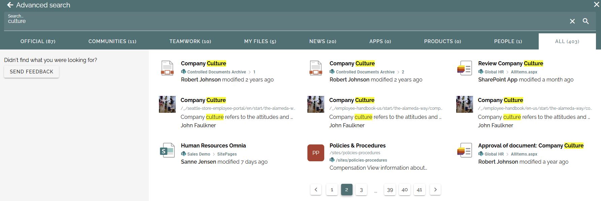

Header search also has a Microsoft 365 look and feel and is WCAG-compliant, and Advanced Search has new refiners.

Semantic Search: fresher and broader
~~~~~~~~~~~~~~~~~~~~~~~~~~~~~~~~~~~~~~~~~~~~~~~~~~~~~~
**Who it's for:** Employees and administrators.

Employees can now get answers from **Excel files** too. Administrators can **reindex** the page and document indexes if something looks stale or out of sync, while employees keep searching: the new index is built in the background and only takes over when it is ready.

AI-ready content
~~~~~~~~~~~~~~~~~~~~~~~~~~~~~~~~~~~~~~~~~~~~~~~~~~~~~~
**Who it's for:** Administrators and intranet owners.

The way Omnia stores content has been improved to help Copilot and other AI find and understand it.

.. REVIEW: "Admin customization of AI prompts (pre- and post-prompts)" is listed for 7.13. In 7.12 central pre- and post-prompts are in Content Builder AI, and Semantic Search pre- and post-prompts were announced in 7.11.x. Confirm whether the 7.13 item is the same or an extension.

Engage your readers
------------------------------------------------------

React and discover in Page Rollup
~~~~~~~~~~~~~~~~~~~~~~~~~~~~~~~~~~~~~~~~~~~~~~~~~~~~~~
**Who it's for:** Employees and intranet owners.

Employees can react to content directly from Page Rollup, without opening the page, which makes engagement effortless and shows authors what resonates. A new horizontal card view adds extra metadata, so readers can choose what to read faster.

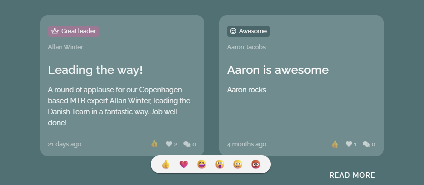

Better banners
~~~~~~~~~~~~~~~~~~~~~~~~~~~~~~~~~~~~~~~~~~~~~~~~~~~~~~
**Who it's for:** Editors and intranet owners.

The Banner block has been redesigned with new views and a new editor with live preview. Editors can place the image to the left or right of the text, and see the result straight away, for more variation in campaigns and messages without design work.

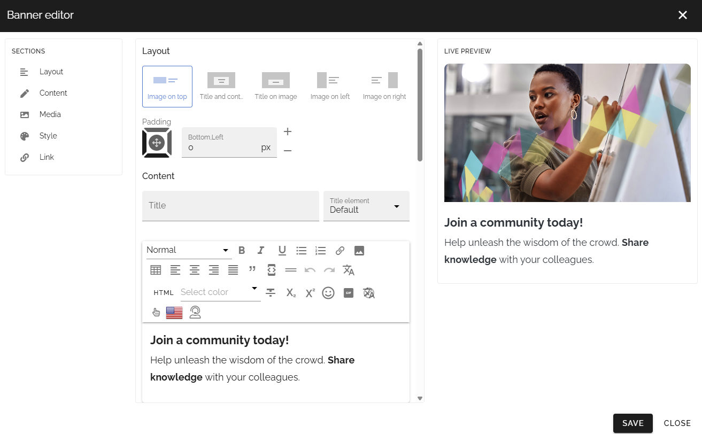

Events people can act on
~~~~~~~~~~~~~~~~~~~~~~~~~~~~~~~~~~~~~~~~~~~~~~~~~~~~~~
**Who it's for:** Employees and event organizers.

The Event Rollup card view shows richer event information, and a new participant counter shows "registered / max" and a clear full state. Attendees see at a glance if there is still room, and organizers answer fewer questions.

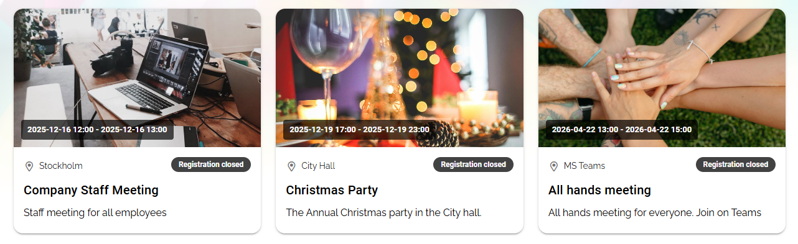

Long pages that are easy to navigate
~~~~~~~~~~~~~~~~~~~~~~~~~~~~~~~~~~~~~~~~~~~~~~~~~~~~~~
**Who it's for:** Employees and editors.

The new Table of contents block builds navigation from the headings on a page, or from a configured property. Policies, guides and handbooks become much easier to scan, and readers can jump straight to what they need.

.. REVIEW: Landed after 7.11 but was never announced. Confirm the property-based option, and whether a screenshot is available.

Conversations that are easy to follow
~~~~~~~~~~~~~~~~~~~~~~~~~~~~~~~~~~~~~~~~~~~~~~~~~~~~~~
**Who it's for:** Employees and editors.

Comments can be shown in a threaded view, so replies stay together under the comment they respond to. Longer discussions on news and announcements are much easier to follow.

Stay informed
~~~~~~~~~~~~~~~~~~~~~~~~~~~~~~~~~~~~~~~~~~~~~~~~~~~~~~
**Who it's for:** Employees.

Employees can subscribe to the publishing channels they care about, and manage them in a reworked "My subscriptions" view. A count badge in the notification panel shows what is waiting.

More for readers
~~~~~~~~~~~~~~~~~~~~~~~~~~~~~~~~~~~~~~~~~~~~~~~~~~~~~~
- **Cleaner pages:** blocks such as Document Rollup and process documents can hide themselves when they have nothing to show.
- **A new date and time picker** that is quick to use and WCAG-compliant.
- **A calmer "session expired" screen** with a new, smaller design.
- **Better lists:** a search box in List Rollup.

Governance with less friction
------------------------------------------------------
**Who it's for:** Intranet owners and administrators.

- **Bypass page approval** for selected users, so urgent content can be published without delay while the process stays strict for everyone else.
- **Sign-off requests follow group membership**, so the right people are always asked as teams change.
- **Page collection administrators can take control** of a page and cancel its approval, so a page does not wait for an absent approver.
- **Distribution groups** can be used in promotion channels.
- **Navigating without a variation** is supported.
- **Setup wizard** can now create a business profile.
- **Glossary terms** can have a default style, and built-in properties can be shown in dialogs.
- **A new "Omnia Content" enterprise property type.**

.. REVIEW: Bypass page approval - add who can bypass (role/permission) and whether it is logged.

Faster, smoother, more accessible
------------------------------------------------------

Performance
~~~~~~~~~~~~~~~~~~~~~~~~~~~~~~~~~~~~~~~~~~~~~~~~~~~~~~
**Who it's for:** Everyone.

A broad performance overhaul makes Omnia feel faster. The editor loads only when needed, fewer bundles load with each page, and pages jump around less while loading. SharePoint pages load their styling in a better order too.

.. REVIEW: No benchmark numbers are available, so none are given.

Accessibility (WCAG)
~~~~~~~~~~~~~~~~~~~~~~~~~~~~~~~~~~~~~~~~~~~~~~~~~~~~~~
**Who it's for:** Employees, and organizations with accessibility requirements, such as public sector customers.

An intranet that works for everyone. 7.12 brings WCAG improvements to header search, Page Rollup (card view and the calendar view with its new design), People Rollup, filters in all rollups, the notification panel, comments, tutorials, metrics, export buttons and the new Advanced Search refiners. Alt texts are fixed throughout, pagination is now one shared accessible control, and dialog headers are standardized. Editors can set the heading level of every block, not only the FAQ block, to keep a correct heading structure.

.. REVIEW: "Calendar rollup new design" - confirm this is the Page Rollup calendar view.

Before you upgrade
------------------------------------------------------
**Who it's for:** Administrators and consultants.

- **Custom CSS or JavaScript:** the WCAG work and the move to the Vue Composition API have touched many frontend elements. Check tenants with custom CSS or JavaScript after the upgrade.
- **Extensions:** check custom extensions for compatibility.
- **Mega menu:** a mega menu set to "left" that also has left navigation nodes will show two menus when the Everywhere Panel is turned on.

Recently added
------------------------------------------------------
Already announced in 7.11.x, and included in 7.12:

- Bidirectional relationships in People Rollup.
- Search limited to specific properties.
- Burmese and Traditional Chinese languages.
- .url shortcuts open from search.
- GPT-5.5 support for Semantic Search.
- Semantic Search pre- and post-prompts.

Versions
------------------------------------------------------

.. REVIEW: Add version list in the same format as 7.0.
