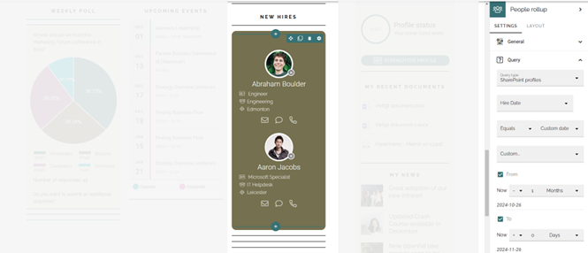
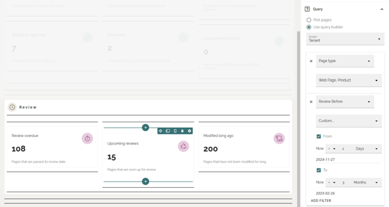
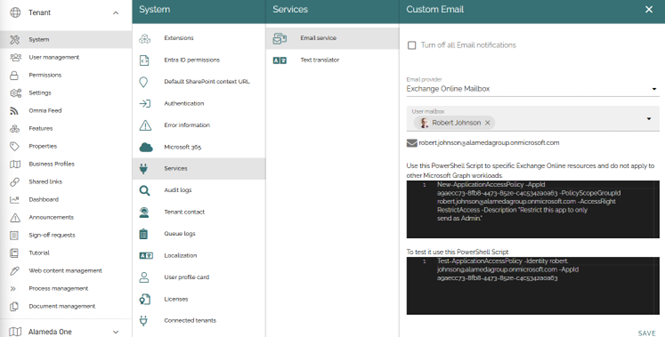
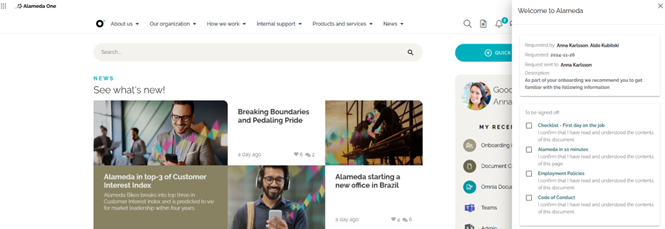
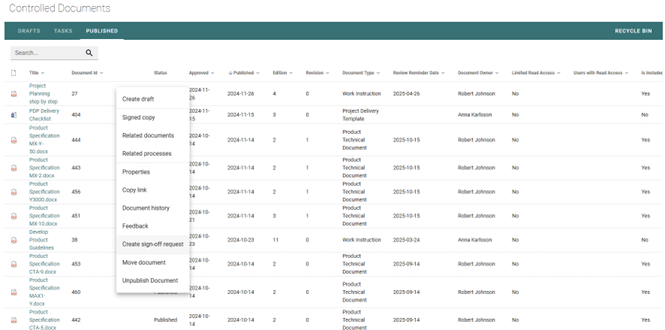

Release 7.7
========================================

Additional Query Options with Date Properties
----------------------------------------

It is now possible to perform more advanced queries for Processes, People, Documents, and Teamwork apps based on date properties. By selecting the “Custom date” option, you can create dynamic queries relative to the current date and specify the start and end of a period either before or after the current date.

For example, this feature can be used to display people who have started in your organization within the last month.

Or documents that are due for review within the next 3 months.

Restrict Who Omnia Can Send Emails As Through Exchange
----------------------------------------

To use Exchange for sending emails from Omnia, the Microsoft permission model currently requires Omnia to be granted permission to send emails on behalf of any user in the organization. This approach may raise security concerns. To address this, we have included a guide for the Exchange admin to restrict Omnia to only send emails as a specified user.

Sign-Off Requests for Controlled Documents
----------------------------------------

It is now possible to include controlled documents in the Sign-Off Request functionality. A Sign-Off Request can be used to create an overview of multiple documents, which is particularly useful during onboarding or as part of a periodic process.

By combining controlled documents and pages, you can provide an easy-to-understand overview of relevant information in each context. The Sign-Off Request can be sent to individuals or groups to ensure it reaches the right people.

Sign-Off Requests can also be created directly from a controlled document to ensure a record is kept, confirming that an individual or group has received specific information.

Versions
-----------------------------------------

.. toctree::
   :titlesonly:

   versions
