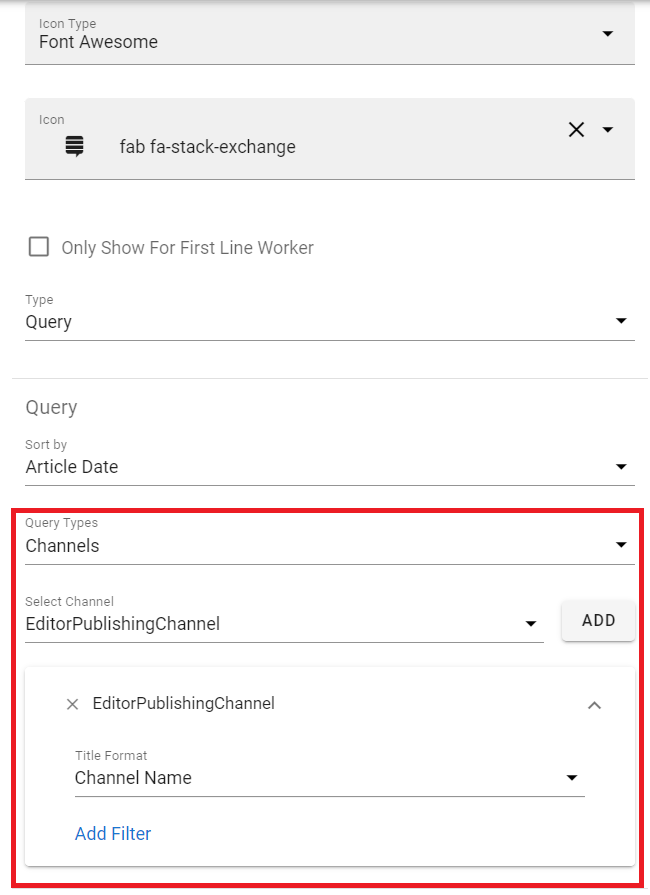

Release 6.10
========================================

Channel Management
--------------------------------------
Support Publishing Channels in query tab.
It support all types of filter like Page Collection

Setting Notification for pages with variations
--------------------------------------
When a default page variation create it will wait 600s (10 minutes) before it sync to Omnia Feed.
This to improve notification flow and prevent user get notification of variations that they should not see. 
This is configurable you can contact support team to change this config fit your need.

Yammer comments
--------------------------------------
Omnia Feed will sync comments with Yammer if page has setup Yammer intergation.

6.10.0
---------------------------------------

- Support sync Yammer comments.
- Support Channel management in query tab.
- Support rich text for announcements.
- Make Read Contact permission on Android to optional.
- Improve webview in app.
- Improve notification for pages with variations.
- Improved sync user properties and user avatar, Fix issue on External users (#139455).
- Fix issue usiness profile auto changes the Publish status when save color settings (#137572).
