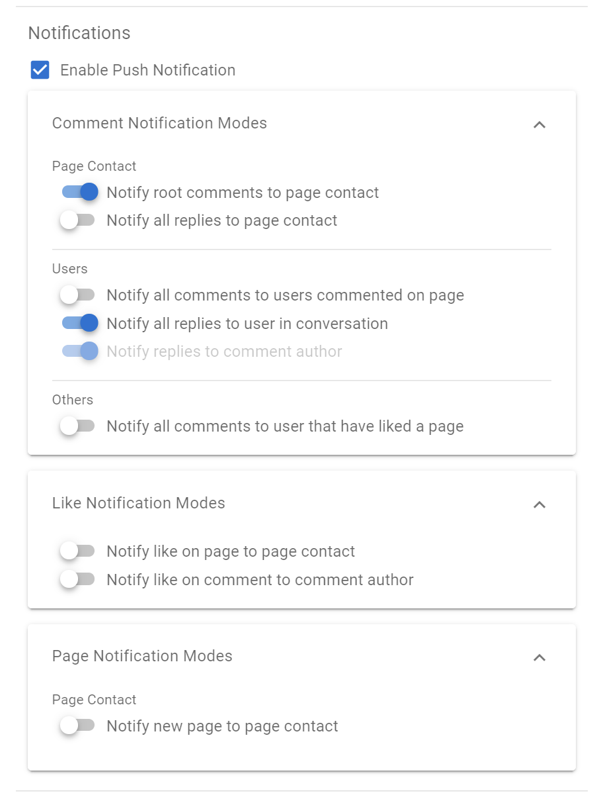
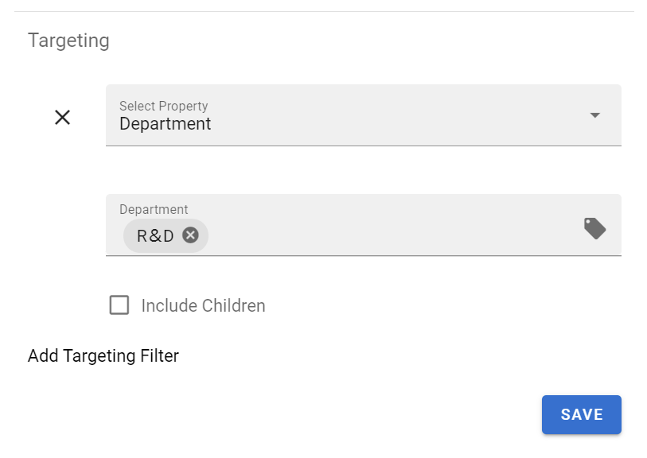
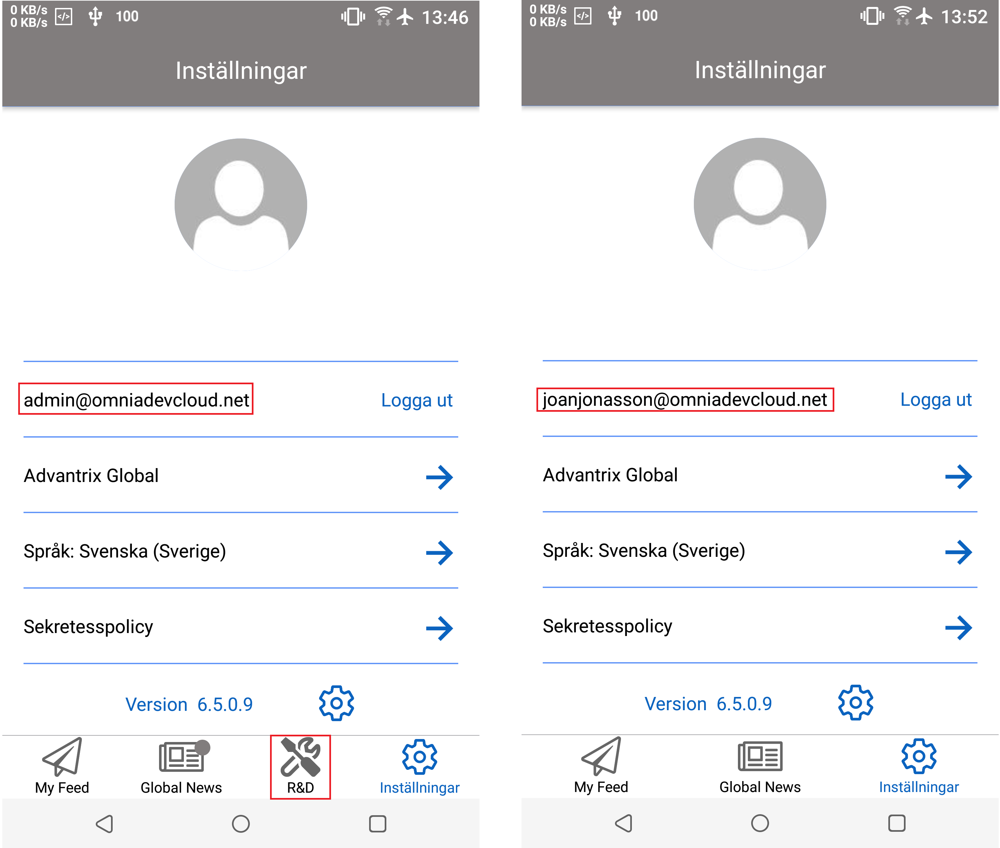
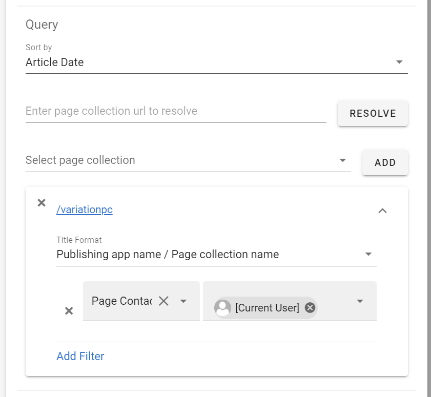
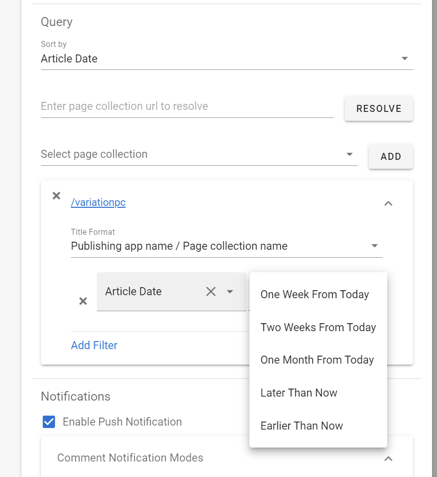
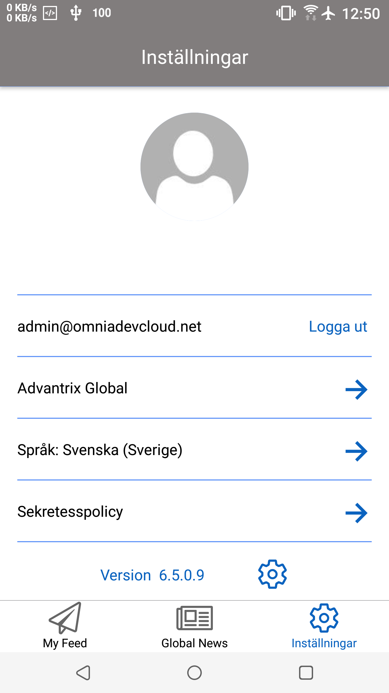
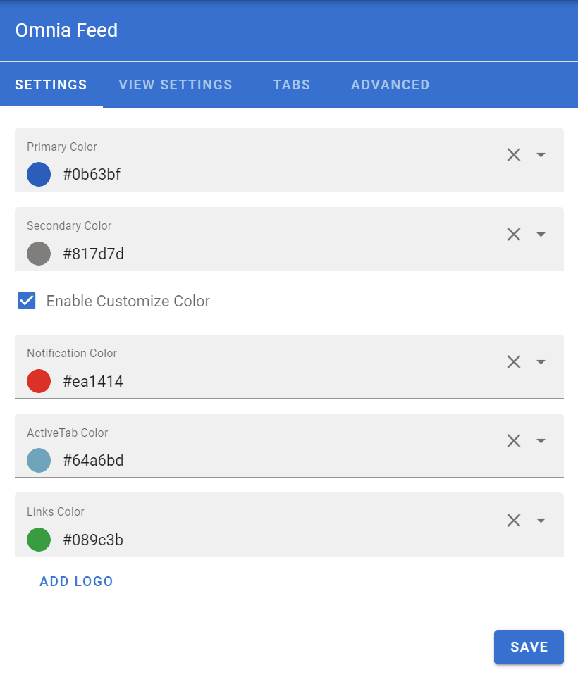
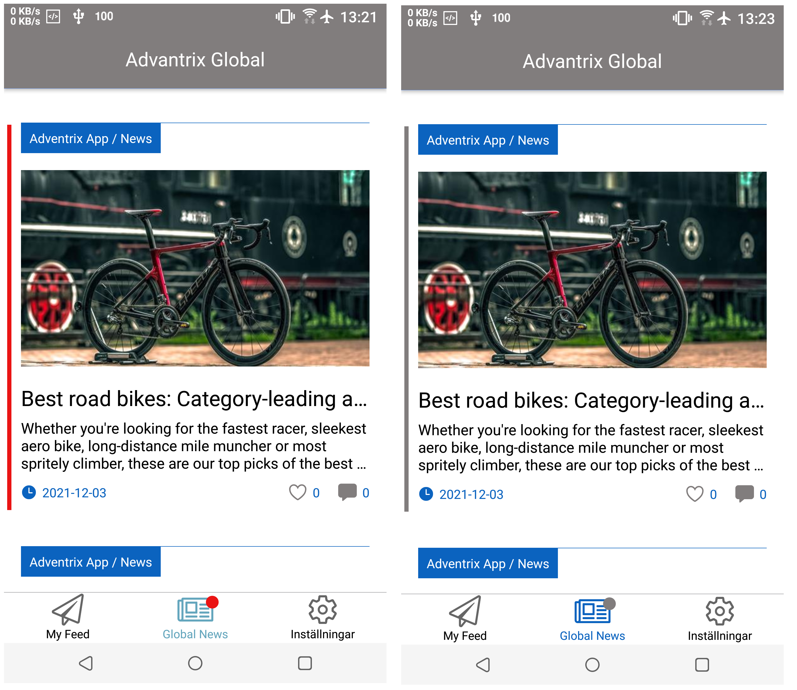

Release 6.6
========================================

Configurable Notifications
--------------------------------------

The rules for when to receive a push notification is now configurable. 
In the settings for Omnia Feed in Omnia Admin you can set all rules related to who gets a notification on a page.

Targeting per tab in the mobile app
--------------------------------------

Each tab on each business profile can now be targeted using the normal targeting framework. 
This allows you to create user specific feeds or embeds. 

This will show different tabs to different users on the same business profile. 

Date Queries and Current User Queries
--------------------------------------
Its now possible to configure Omnia Feed to deliver notifications to a user when they match a Person property.

This is useful for supporting the editors of your omnia solution. Combined with date queries, these features can be used to give editors a push notification when they have a page to review.

Mobile App Localization
--------------------------------------
It’s now possible to translate any label in the mobile app from Omnia Admin. All languages officially supported in Omnia will also be supported in the mobile app.

Remember to set your language in the settings of the mobile app.

Color Settings
--------------------------------------
Several color options are now configurable from Omnia Admin per Business Profile. 

Example:

Improved Performance
--------------------------------------
Omnia Feed should now load much quicker when opening the app and looking for new content. 
Detection for new content in both pages and announcements have also improved.

6.6.0
---------------------------------------

- Major performance improvments.
 - Data load from the app.
 - Improved detection of Important Announcements and Pages.
- Better error handling (#134054).
- Variation setting logic is now aligned with the Page Rollup.
- When explicitly logging out, notification will no longer be sent (#120725).
- All comment and like notifications are now configurable
- Corrected an issue that would sometimes prevent RTF images from being displayed (#132697).
- All labels in the Mobile App can now be translated. Translated versions of the app will be rolled out shortly after release.
- Additional color settings for different elements in the mobile app. Per Business Profile. 
- Date Filters can now be made in page queries. 
- Current user filters can now be made in page queries.
- RTF Styles for tables have improved.
- When navigating to a web tab in the app, it is reset to avoid being stuck in certain login scenarios (#132296).
- Targeting is now possible on the tabs. 
- And several other improvements.