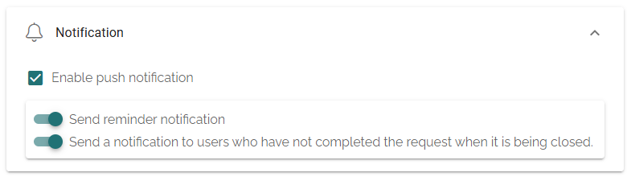
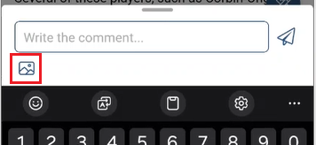
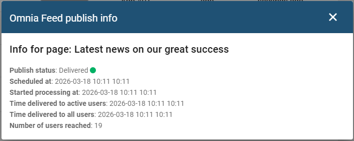

Release 7.11
============

Version **7.11** introduces enhanced layout options for feed tabs, Matomo statistics in the mobile app, and improvements to theming, localization, and link handling.

.. note::

   When upgrading to 7.11, existing *Query* tabs will be automatically migrated to *Multiple Query* tabs.

Layout engine
-------------
Omnia Feed now supports custom templates for both feed and detail views. You can add and style Omnia blocks to fully control how content is presented.

This new rendering approach also introduces several new blocks for content display. See below for brief descriptions of some of them.

For more information on how to work with the layout engine, see the documentation :doc:`here </admin-settings/business-group-settings/omnia-feed/layout-settings/index>`.

Bookmarks
*********
Users can now bookmark pages in the Omnia Feed app.

Configurable news title in header
*********************************
With the introduction of the Tags block, the header title can now be configured to display content other than the page name.

Sign off sign-off requests
**************************
Sign-off requests can now be completed directly within the Omnia Feed app using the action button.

Matomo statistics
-----------------
Matomo tracking is now supported in the mobile app, making it possible to see how many users access pages from the app.

Colors and contrasts
--------------------
The app icon now supports both light and dark themes. Status bar contrast is also improved: icons automatically adjust to black or white depending on the header color.

Reminders for sign-off requests
-------------------------------
You can now send reminders for incomplete or closed sign-off requests to the targeted users.

Images in comments
------------------
Users can now include images when commenting on news articles in the app.

Omnia Feed distribution status in page rollup block
---------------------------------------------------
A new view in the page rollup block shows the distribution status of pages in the Omnia Feed app.

Alignment with Omnia
--------------------

Settings for page likes and comments
************************************
Settings configured in Omnia for page likes and comments are now respected in the Omnia Feed app.

Support for multiple instances of the same page collection in the query tabs
****************************************************************************
It is now possible to add multiple instances of the same page collection to a query, enabling targeting with different properties using an OR operator. This is equivalent to the functionality that exists in Omnia page rollup queries.

Filtering based on page type
****************************
Query tabs now support filtering by page type, consistent with Omnia page rollup functionality.

Miscellaneous
-------------

Links
*****
Links not configured to open in a new window will now open inside the app instead of in a browser.

Localization
************
Additional labels in the mobile app are now localized.

Support for custom domain URL
*****************************
Custom domain URLs are now supported in the embedded web view, when opening a page in the browser, link sharing, and related links.

Possible to publish Omnia feed without a Multiple query tab
**************************************************
This version enables you to publish an Omnia Feed tab configuration without requiring a Multiple query tab.
