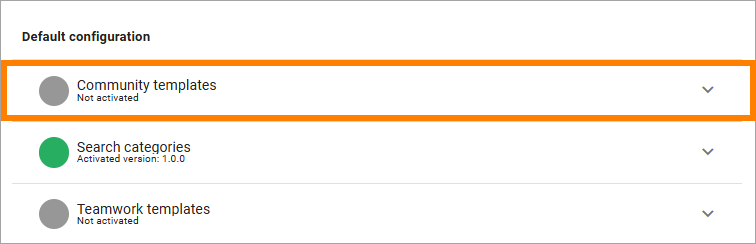

Setup Communities
===========================================

Here's to setup the communities functionality in Omnia:

1. Go to Omnia Admin > Features (Tenant).
2. Make sure the feature "Web content management core" is  active. It must be for communities to work.

3. Activate the feature "Communities". 

Default community properties and page types are also provisioned when you do. 

4. Go to the business profile where you want to deploy communities.
5. Activate the feature "Community templates".

6. Refresh the web browser (F5).
