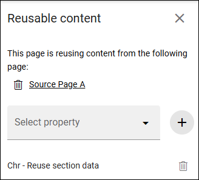

Setup reusable sections
=========================

In Omnia 7.11 and later, you can use reusable sections to reuse content across pages.

Prerequisite
***************
Before you start, make sure "Enable reusable content" is turned on in Publishing app settings.

See: :doc:`Publishing app settings </pages/page-settings/index>`

Set up a reusable section
**************************
Follow these steps:Follow these steps to setup a reusable section:

1. **Create an enterprise property of type Data.**
2. **Create a page type.**
  + Add a section of type Reusable section. 
  + Map it to the property from step 1.
  + Publish the page type.
3. **Create a source page using the page type from step 2.**
  + Add blocks to the reusable section.
  + Publish the page.
4. **Create a target page using the same page type.**
  + Open reusable content configuration. 
  + Select the source page from step 3. 
  + add the property from step 1. 
  + Publish the page.

When content in the reusable section on the source page is updated and published, the same content is reflected on the target page.

Verification
***************
To confirm setup is correct:

+ Edit content in the source page reusable section.
+ Publish the source page.
+ Open the target page and verify the updated content is shown.

More information
****************
More information on reusable content is found here: :doc:`Reusable content </pages/reusable-content/index>`

