Setup AI
=====================================

Currently, all AI services in Omnia require Azure OpenAI to be set up. To deploy semantic search, you must also set up Azure AI Search.

Azure OpenAI
-------------------------------------

**Step 1**: Browse into your subscription in the Azure Portal and find the Azure OpenAI service.

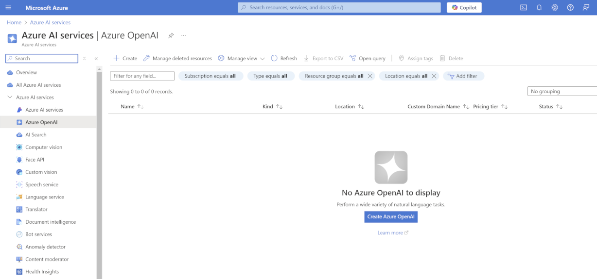

**Step 2**: Click on 'Create Azure OpenAI'.

**Step 3**: Create a new OpenAI instance in your subscription by selecting a region and a name for the instance.
We currently recommend choosing East US 2 or Sweden Central due to the availability of AI models in these regions.
We recommend using your unique M365 domain as a basis for the service name for better identification. (Domain: contoso.com > Name: constosocom)

.. Note:: Different regions have different AI models available. Check out this page for more information: https://learn.microsoft.com/en-us/azure/ai-services/openai/concepts/models.

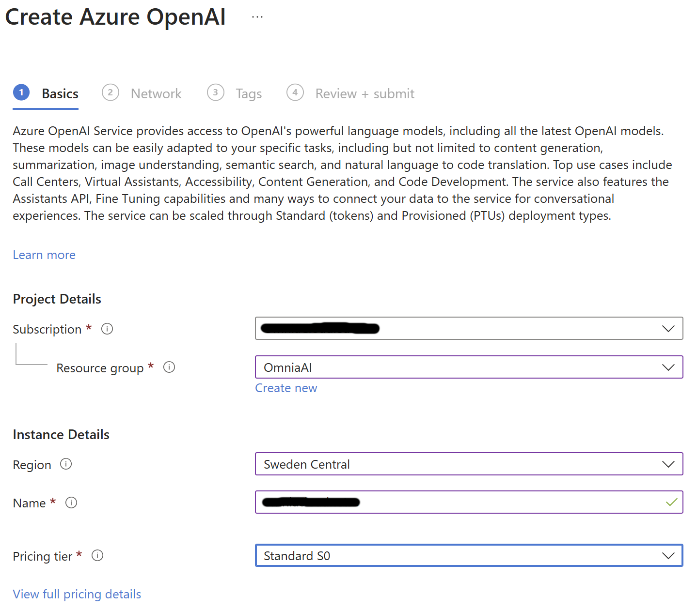

**Step 4**: If you have no specific requirements, you can keep the default settings for 'Network' and 'Tags'.

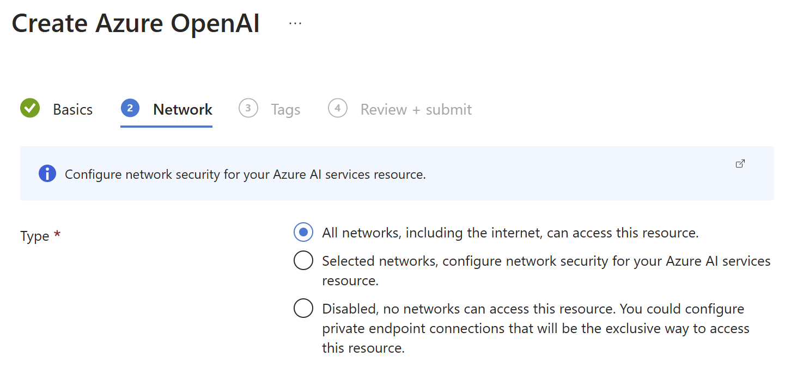
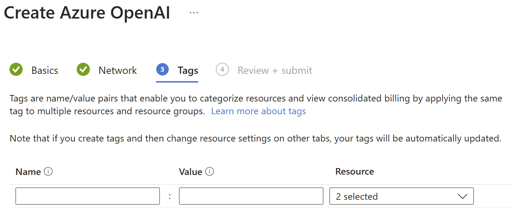

**Step 5**: Review the settings and submit the deployment request.

**Step 6**: The service may take some time to become available. Why not grab a coffee while you wait?

**Step 7**: Once the service is up and running, you can browse into it an click on 'Go to Azure AI Foundry portal'.

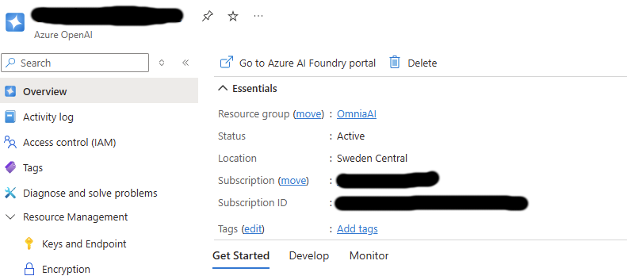

**Step 8**: Browse to the Chat Playground and create a new deployment from base models.

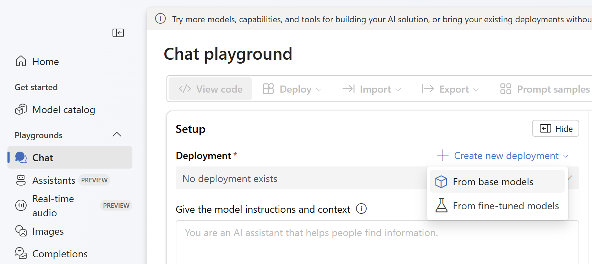

**Step 9**: As of today, we recommend using the 'GPT-4o Mini' model.

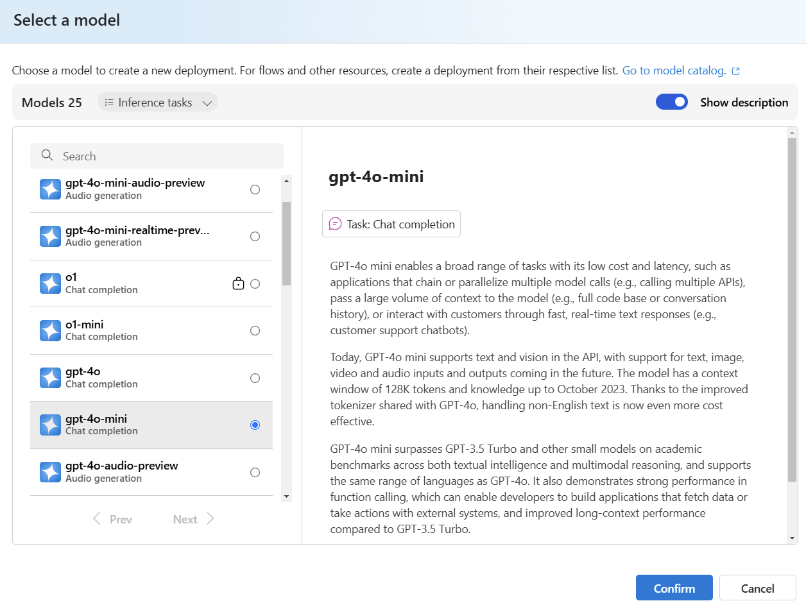

**Step 10**: Add a deployment name. We recommend using the model name for better identification.

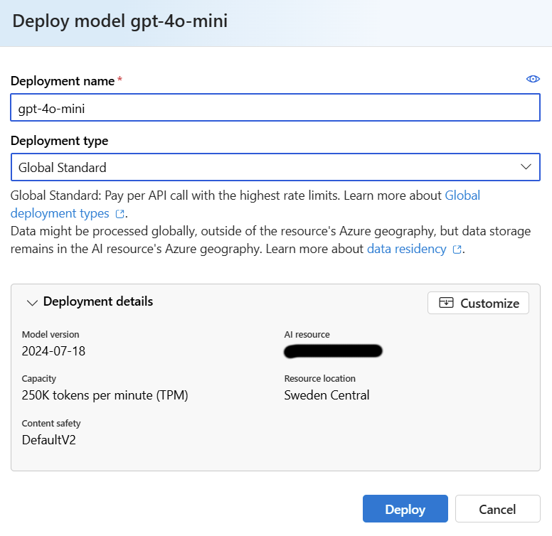

**Step 11**: Browse to 'Keys and Endpoints' in the OpenAI service. Copy 'KEY 1' and 'Endpoint' to notepad.

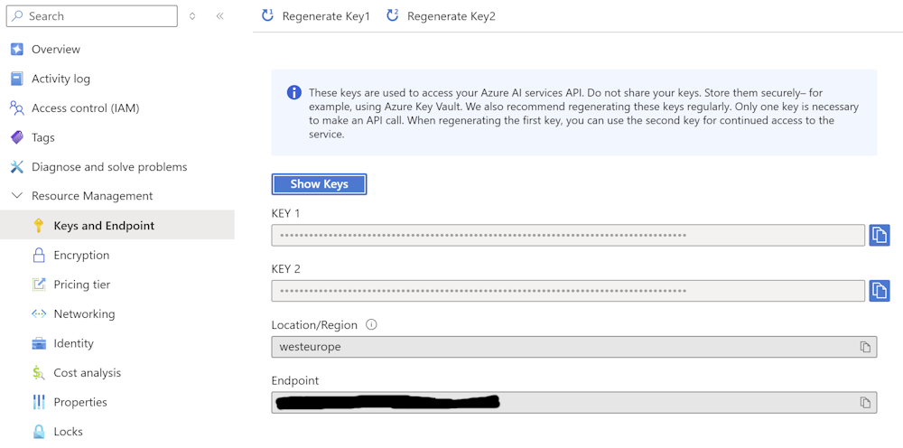

**Step 12**: Go to Omnia Admin > Permissions > Secrets > AI features: OpenAI API and paste the key and url.

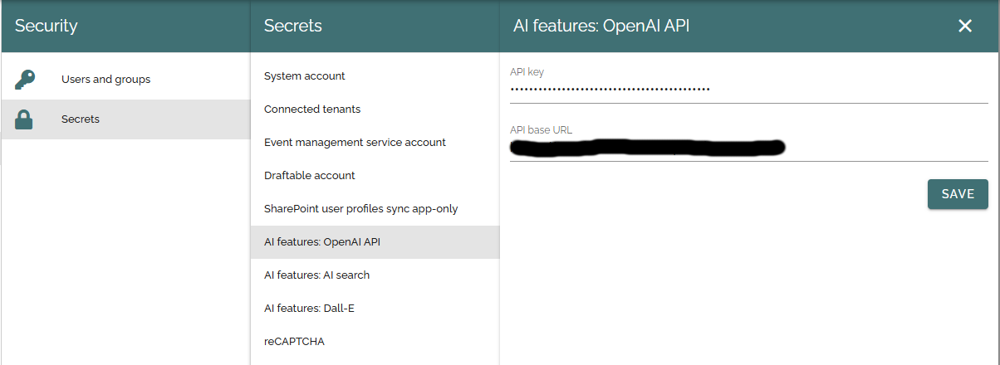

Azure AI Search
-------------------------------------

**Step 1**: Browse into your subscription in the Azure Portal and find the AI Search service.

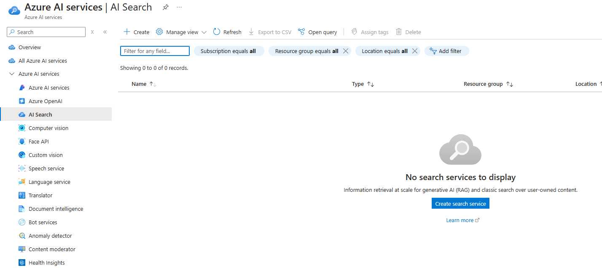

**Step 2**: Click on 'Create search service'.

Text completion and content analysis
-------------------------------------

Dall-E for AI generated images
-------------------------------------

Semantic search
-------------------------------------