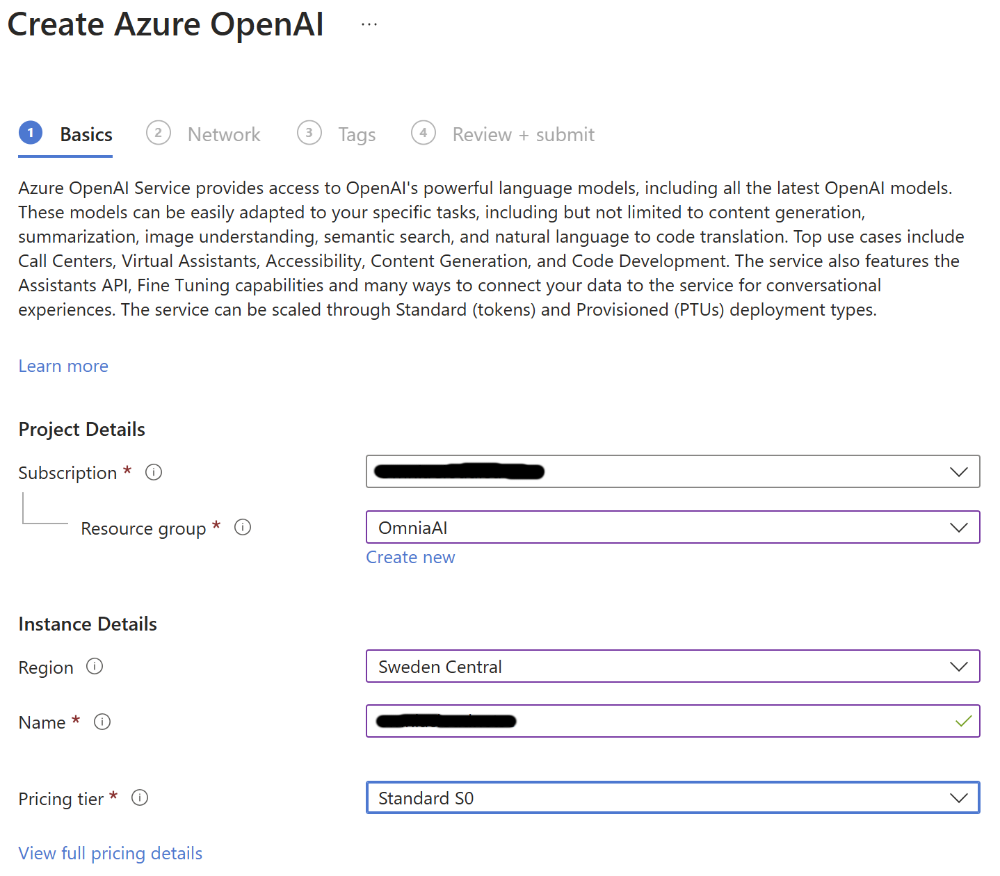
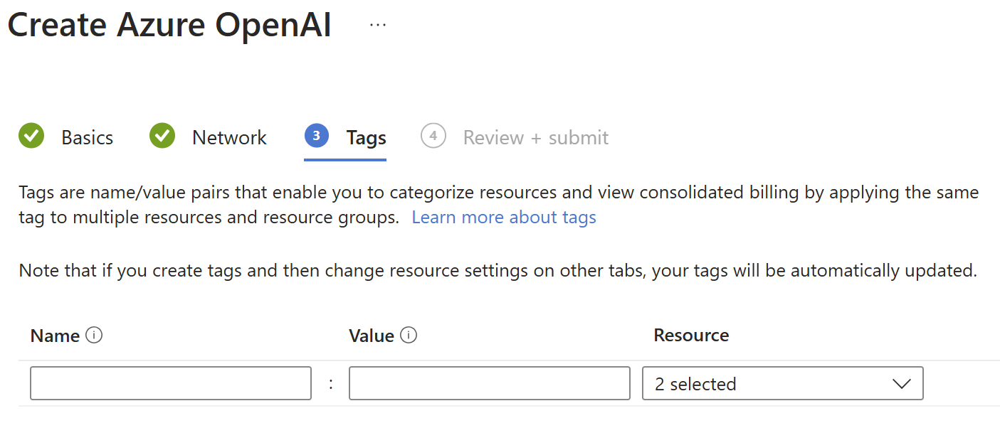
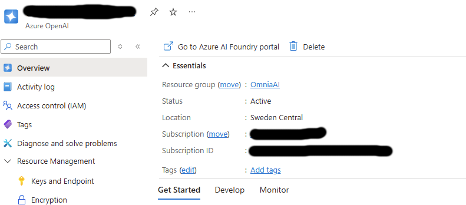
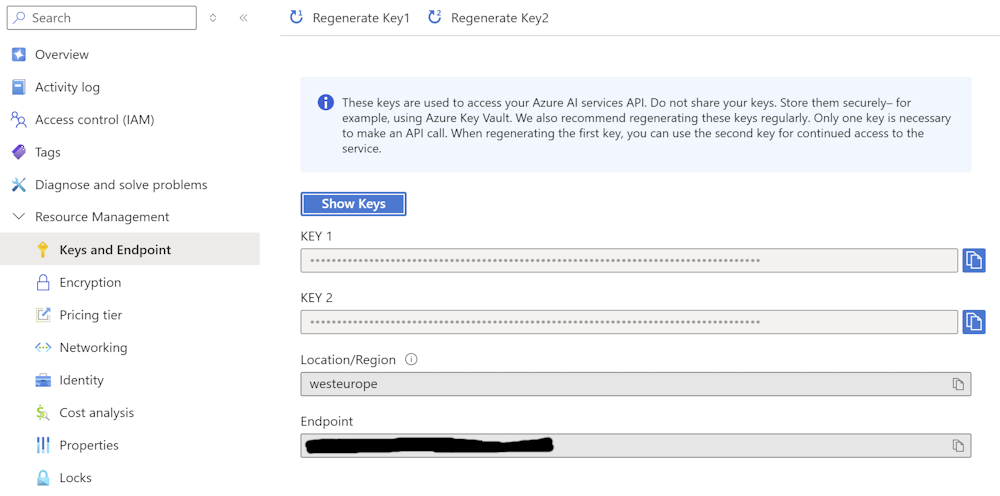
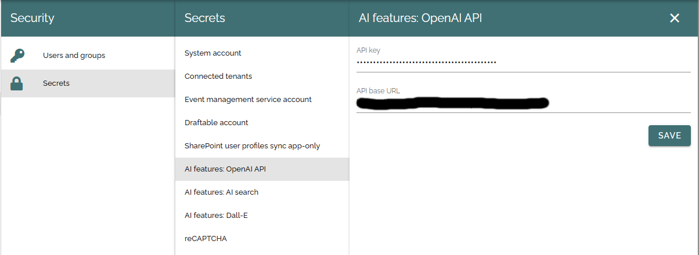
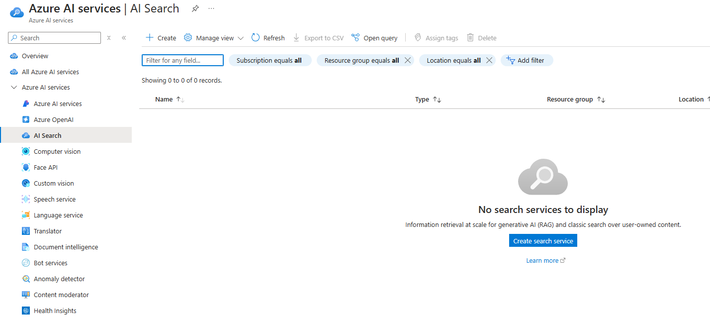
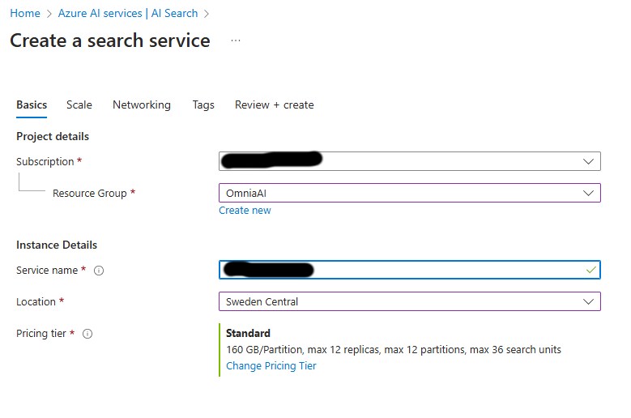
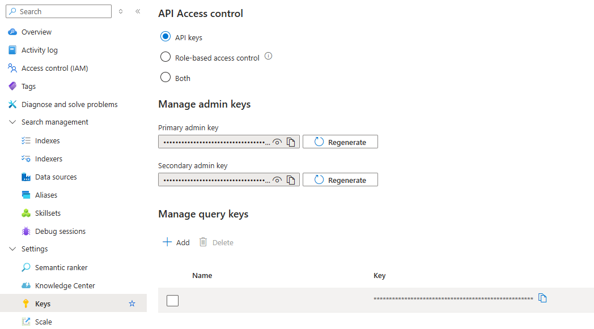
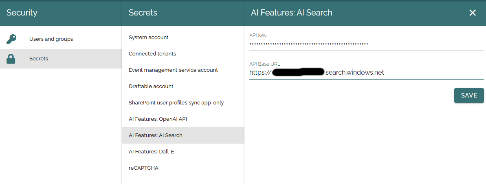

Setup AI
=====================================

Currently, all AI services in Omnia require Azure OpenAI to be set up. To deploy semantic search, you must also set up Azure AI Search.

Before creating model deployments, see :doc:`Recommended AI models </setup/recommended-ai-models/index>` for the current model IDs and guidance.

Azure OpenAI
-------------------------------------

**Step 1**: Browse into your subscription in the Azure Portal and find the Azure OpenAI service.

**Step 2**: Click on 'Create Azure OpenAI'.

**Step 3**: Create a new OpenAI instance in your subscription by selecting a region and a name for the instance. Choose a region and deployment type in which all required models are available for your subscription and quota. We recommend using your unique domain as a basis for the service name for better identification (Domain: contoso.com > Name: constosocom).

.. note::
   Model availability changes over time. Check the `current Azure model availability <https://learn.microsoft.com/en-us/azure/foundry/foundry-models/concepts/models-sold-directly-by-azure-region-availability>`_ before creating the resource.

**Step 4**: If you have no specific requirements, you can keep the default of the rest of the settings.

**Step 5**: Review the settings and submit the deployment request.

**Step 6**: The service may take some time to become available. Why not grab a coffee while you wait?

**Step 7**: Once the service is up and running, browse into it and click 'Go to Microsoft Foundry portal'.

**Step 8**: In Microsoft Foundry, open **Models + endpoints** and create a separate deployment for each required model listed on the :doc:`Recommended AI models </setup/recommended-ai-models/index>` page.

**Step 9**: Select each model by its model ID.

**Step 10**: Add a deployment name. We recommend using the model ID as the deployment name for easier identification.

**Step 11**: Browse to 'Keys and Endpoints' in the OpenAI service. Copy 'KEY 1' and 'Endpoint' to notepad.

**Step 12**: Navigate to Omnia Admin > Permissions > Secrets > AI features: OpenAI API and paste the key and url.

Azure AI Search
-------------------------------------

.. note:: This service is required only if you plan to deploy Semantic search.

**Step 1**: Browse into your subscription in the Azure Portal and find the AI Search service.

**Step 2**: Click on 'Create search service'.

**Step 3**: Input a service name. We recommend using your unique domain as a basis for the service name for better identification (Domain: contoso.com > Name: constosocom).

**Step 4**: Choose a location for the service and select a pricing tier. We recommend the Standard pricing tier.

**Step 5**: If you have no specific requirements, you can keep the default settings for 'Scale', 'Network' and 'Tags'.

**Step 6**: Review the settings and create the service.

**Step 7**: Once the service is up and running, browse to the settings section of the service and 'Keys'.

**Step 8**: Copy the 'Primary admin key' to notepad.

**Step 9**: Go to 'Omnia Admin > Permissions > Secrets > AI features: AI Search' and paste the key. Fill in the base URL to your search service https://[service name].search.windows.net.

Text completion and content analysis
-------------------------------------

**Step 1**: Navigate to 'Omnia Admin > Settings > AI features > Model configuration > Text completion configuration'. Add an alias for the AI bot and enter the text-completion deployment name from your previous OpenAI setup. Use the current recommendation on the :doc:`Recommended AI models </setup/recommended-ai-models/index>` page.

Semantic search
-------------------------------------

**Step 1**: Open the OpenAI service you created in the previous step and click 'Go to Azure AI Foundry Portal'.

**Step 2**: Open **Models + endpoints** and create separate deployments for the recommended semantic-search LLM and ``text-embedding-3-small`` if you did not create them earlier.

**Step 3**: Select ``text-embedding-3-small`` for vectorization. Current Omnia semantic search indexes use 1,536 dimensions, which matches this model. Do not use ``text-embedding-3-large`` with the current index configuration.

**Step 4**: Add a deployment name. We recommend using the model ID as the deployment name for easier identification. Keep all other settings as is, if you don't have any specific requirements.

**Step 5**: Navigate to 'Omnia Admin > Settings > AI features > Model configuration > Semantic search'.
Enter the recommended semantic-search LLM deployment name in **LLM deployment name** and the ``text-embedding-3-small`` deployment name in **Embeddings deployment name**. GPT-5.6 models are reasoning models; use them only after confirming that your Omnia version and the semantic-search feature support GPT-5 reasoning models.

If you change the embeddings model for an existing semantic search installation, start a **Semantic Search Full Reindex** after saving the new configuration.

Image generation
-------------------------------------

.. note::
   The tenant feature **GPT Image** must be active before its secret and model-configuration options are available in Omnia Admin.

**Step 1**: Create a deployment for the recommended GPT Image model in **Models + endpoints** if you did not create it earlier.

**Step 2**: Go to 'Omnia Admin > Permissions > Secrets > AI features: GPT Image' and enter the Azure API key and base URL.

**Step 3**: Navigate to 'Omnia Admin > Settings > AI features > Model configuration > GPT Image' and enter the deployment name.

**Step 4**: Where an Omnia image setting offers a size choice, select ``1024x1024``. The legacy ``512x512`` and ``256x256`` options are not valid for GPT Image 1.5 or GPT Image 2.
