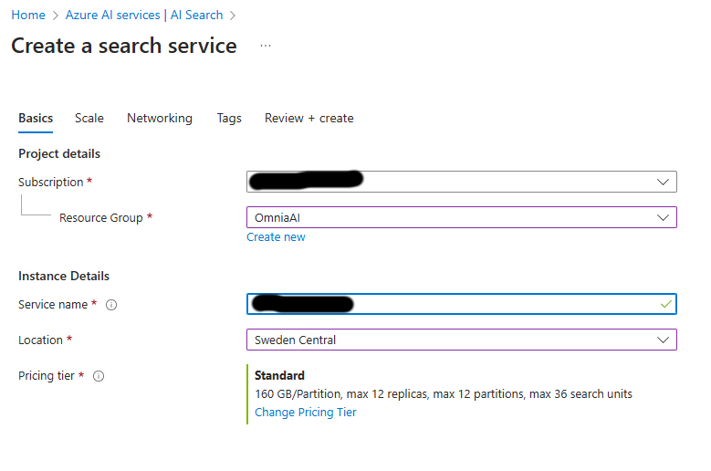
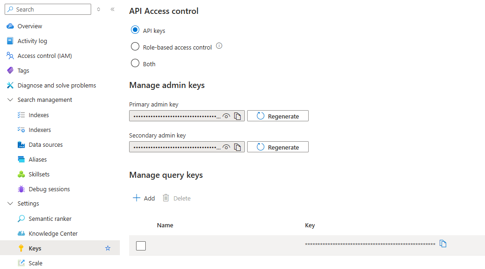
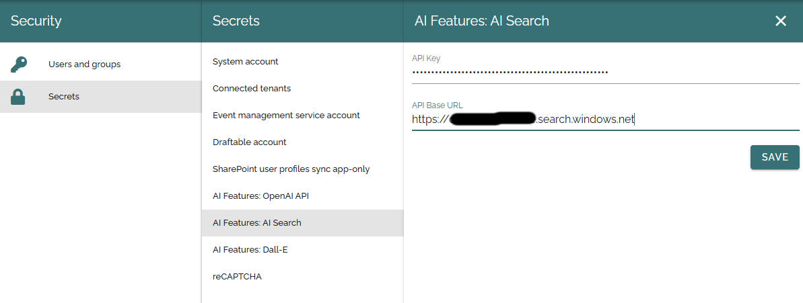
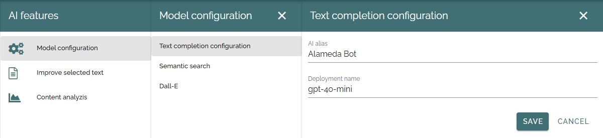
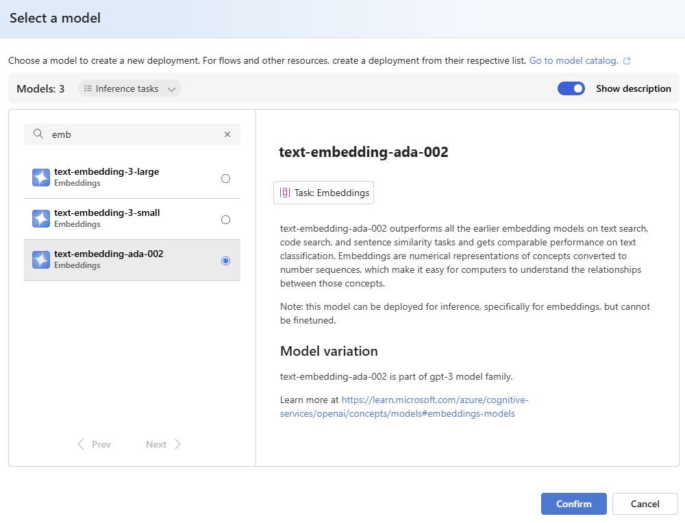
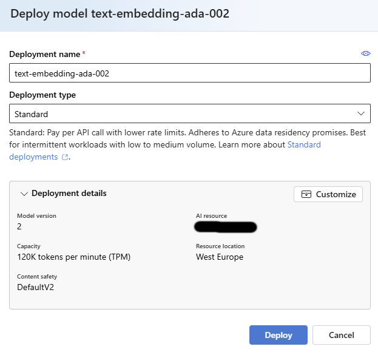
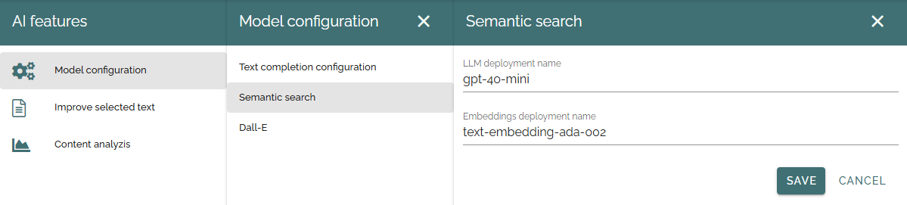

Setup AI
=====================================

Currently, all AI services in Omnia require Azure OpenAI to be set up. To deploy semantic search, you must also set up Azure AI Search.

Azure OpenAI
-------------------------------------

**Step 1**: Browse into your subscription in the Azure Portal and find the Azure OpenAI service.

**Step 2**: Click on 'Create Azure OpenAI'.

**Step 3**: Create a new OpenAI instance in your subscription by selecting a region and a name for the instance.
We currently recommend choosing East US 2 or Sweden Central due to the availability of AI models in these regions.
We recommend using your unique domain as a basis for the service name for better identification (Domain: contoso.com > Name: constosocom).

.. Note:: Different regions have different AI models available. Check out this page for more information: https://learn.microsoft.com/en-us/azure/ai-services/openai/concepts/models.

**Step 4**: If you have no specific requirements, you can keep the default settings for 'Network' and 'Tags'.

**Step 5**: Review the settings and submit the deployment request.

**Step 6**: The service may take some time to become available. Why not grab a coffee while you wait?

**Step 7**: Once the service is up and running, you can browse into it an click on 'Go to Azure AI Foundry portal'.

**Step 8**: Browse to the Chat Playground and create a new deployment from base models.

**Step 9**: As of today, we recommend using the 'GPT-4o Mini' model.

**Step 10**: Add a deployment name. We recommend using the model name for better identification.

**Step 11**: Browse to 'Keys and Endpoints' in the OpenAI service. Copy 'KEY 1' and 'Endpoint' to notepad.

**Step 12**: Navigate to Omnia Admin > Permissions > Secrets > AI features: OpenAI API and paste the key and url.

Azure AI Search
-------------------------------------

.. note:: This service is required only if you plan to deploy Semantic search.

**Step 1**: Browse into your subscription in the Azure Portal and find the AI Search service.

**Step 2**: Click on 'Create search service'.

**Step 3**: Input a service name. We recommend using your unique domain as a basis for the service name for better identification (Domain: contoso.com > Name: constosocom).

**Step 3**: Choose a location for the service and select a pricing tier. We recommend the Standard pricing tier.

**Step 4**: If you have no specific requirements, you can keep the default settings for 'Scale', 'Network' and 'Tags'.

**Step 5**: Review the settings and create the service.

**Step 6**: Once the service is up and running, browse to the settings section of the service and 'Keys'.

**Step 7**: Copy the 'Primary admin key' to notepad.

**Step 8**: Go to 'Omnia Admin > Permissions > Secrets > AI features: AI Search' and paste the key. Fill in the base url to your search service https://[service name].search.windows.net.

Text completion and content analysis
-------------------------------------

**Step 1**: Navigate to 'Omnia Admin > Settings > AI features > Model configuration > Text completion configuration'. Add an alias for the AI bot and enter the model name from your previous OpenAI setup.

Dall-E for AI generated images
-------------------------------------

[To be done]

Semantic search
-------------------------------------

**Step 1**: Open the OpenAI service you created in the previous step and click 'Go to Azure AI Foundry Portal'.

**Step 2**: Navigate to 'Deployments' and create a new deployment.

**Step 3**: Select an embeddings model for vectorization. As of today, we recommend the model 'text-embedding-ada-002'.

**Step 4**: Add a deployment name. We recommend using the model name for better identification. Keep all other settings as is, if you don't have any specific requirements.

**Step 5**: Navigate to 'Omnia Admin > Settings > AI features > Model configuration > Semantic search'.
Enter the LLM deployment name from your OpenAI setup and the embeddings deployment name you just created.

