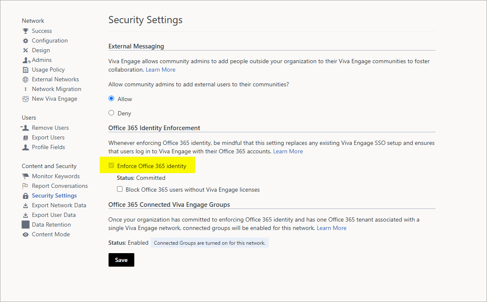

Setup Viva Engage in Omnia
============================

**Reports indicate that this way of setting up Viva Engage has been deprecated by Microsoft. You may not be able to follow this instruction. This page will be updated or replaced shortly.**

Follow these steps to setup Viva Engage (former Yammer) in Omnia Online. 

**1**. The account used to create the Viva Engage App needs to be at least Verified Admin in Viva Engage (Network Admin level is not enough), or alternatively Global Administrator in Microsoft 365. We recommend using a non-personal service account for creating the Viva Engage App, as the app stops working if the account used to create the app is deleted.

**2**. Navigate to the following URL (replace m365x249588 with your tenant), as the new Viva Engage does not have a direct link to client applications.

https://www.yammer.com/m365x249588.onmicrosoft.com/client_applications

**3**. Create the Viva Engage App.

This is what you have to enter:

Note the question marks. You can click them for info.

**4**. After creating the new app, click the link to generate the app token.

**Note!** Don't forget to copy the token, it will disappear when the page is closed.

**5**. Go to Network admin -> Security settings. 

**6**. Check "Enforce Office 365 identity". If it's not ticked, select it.

**7**. Activate the tenant feature "Viva Engage integration" (Note: consent is needed).

**8**. Add the Viva Engage secret, using the token created in step 4, in all business profiles where Viva Engage will be used.

**9**. Setup templates (Teamwork and/or Community for Viva Engage groups), as needed.

**10**. Additional setup as needed: Promotion channels and Viva Engage integration for page collections.

For more information, see:

+ :doc:`Teamwork templates </admin-settings/business-group-settings/team-collaboration/teamwork-v7/templates/index>`

+ :doc:`Templates for communities </admin-settings/business-group-settings/communities/communities-v7/templates/index>`

+ :doc:`Page collection settings </pages/page-collections/page-collection-settings/index>`

+ :doc:`The Viva Engage feed block </blocks/yammer-feed/index>`

