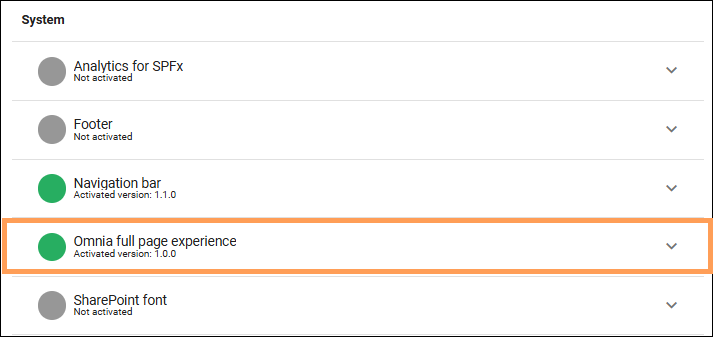
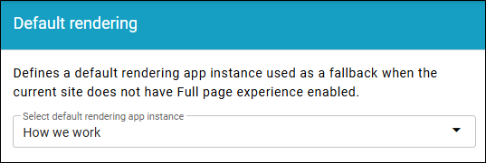
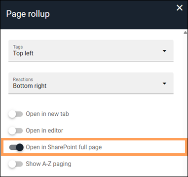
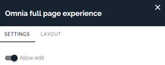
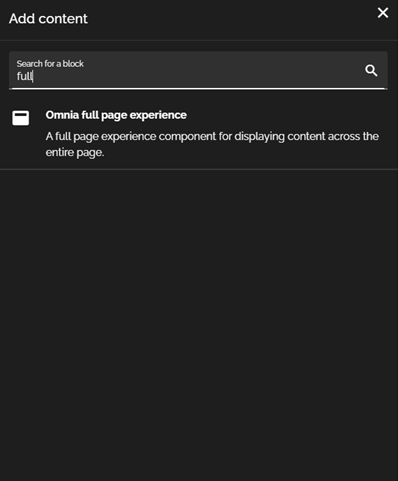
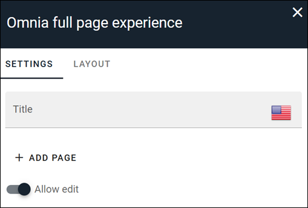
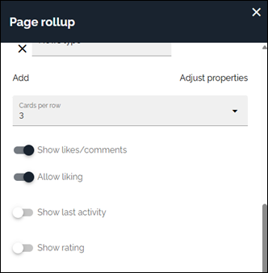

The full page experience
==========================

The full page experience, available in SharePoint 7.12 and later, is meant to be used with Omnia page rollup. The intended use is to show and present news articles in the Omnia rollup inside SharePoint and can show the full page on a SharePoint page. It is configurable to allow edit of the Omnia page inside SharePoint.

Enabling the full page experience
***********************************
To use the Omnia full page experience a feature needs to be enabled in the publishing app settings. When enabling, the feature will create a page called Omnia.aspx on the behind SharePoint site page library. This page provides the host for displaying Omnia pages inside SharePoint.

1. Enable the feature.

2. Go to Default rendering in Omnia admin and select the publishing app or site used for the full page experience.

Default rendering is found at business profile level under Settings.

The app instance shown is, as the text states, a fallback. Find sites where the feature has been activated by opening the list.

Configuring opening and editing in SharePoint
*************************************************
It is possible to allow the full page experience by enabling it on a page rollup inserted on a Sharepoint page. By enabling “Open in SharePoint full page” users clicking the news article in the page rollup will be redirected to the Omnia system page where it is possible to see the Omnia page inside SharePoint.

On the Omnia system page it is possible to enable/disable “Allow edit”. This setting controls whether users can access editing within the SharePoint experience. When editing is enabled, users can update and publish the page if they have the right permissions to the Omnia pages presented in SharePoint.

The SharePoint editing experience has not the full functionality compared to an Omnia page. For example, it does not include the Design option. For access to the full Omnia editing tools, a shortcut can be clicked and the user will be redirected to the same page inside Omnia where the full editing experience is possible.

Full page experience block
*****************************
In addition to the full page experience a new Omnia block is available - the Omnia full page experience block, which can be added to a SharePoint page to display a selected Omnia page. In the block settings, “Add page” lets the administrator select the Omnia page that should be displayed on the SharePoint page.

Like on the system page it is possible to “Allow edit” in the block settings. This works the same way as on the system page where it will allow editing the page inside SharePoint.

Reacting directly from a page rollup
*****************************************
Users can react to Omnia pages directly from a page rollup, both in SharePoint and in Omnia. This lets users respond to a page item without first opening the page. 

This functionality is implemented in most of the view templates in the page rollup. The capability is enabled in the page rollup settings using “Allow liking” under the Display section.

