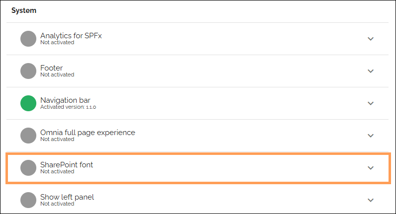
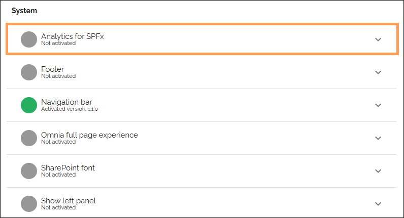

How to use Omnia in SharePoint
================================

In this section you will find documentation on how to use various parts of Omnia in SharePoint.

**The work on these pages has just started. More will be added in the coming weeks.**

Webparts from Omnia in SharePoint
**********************************
There's a lot of useful blocks in Omnia. Most of them can be used as webparts on any SharePoint page. Find them in the tenant settings in Omnia admin here: System > Microsoft 365 > Webparts

How to use the Omnia webparts is described on this page: :doc:`Webparts </admin-settings/tenant-settings/system/microsoft-365/system-webparts/index>`

Using the same font
*********************
In Omnia 7.12 and later the font that has been configured in SharePoint can be applied to Omnia as well. (In Omnia up to 7.11, only the default SharePoint could be used in Omnia).

Activate this feature for each publishing app where it should be used:

Automated user activity tracking on SharePoint pages via Matomo
****************************************************************
Activity tracking via Matomo can be activated for any publishing app:

For more information about Matomo analytics, see page: :doc:`Analytics (Matomo) settings </admin-settings/business-group-settings/settings/analytics/index>`

