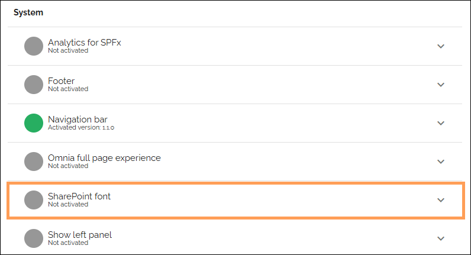
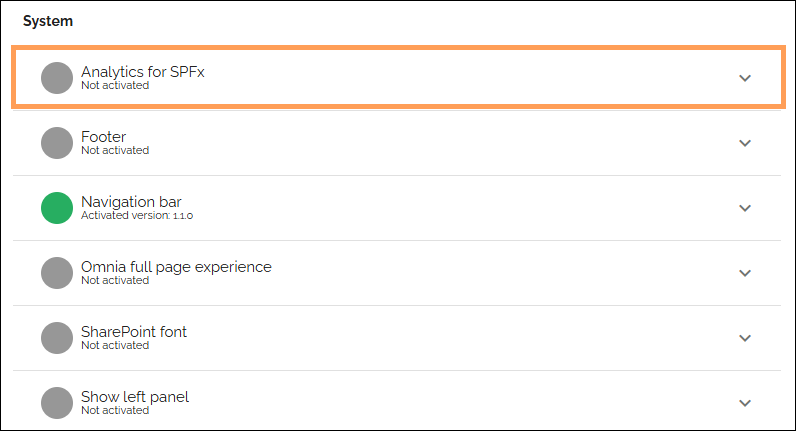

How to use Omnia in SharePoint
================================

In this section you will find documentation on how to use various parts of Omnia in SharePoint.

**The work on these pages has just started - there's a lot of new features and options in Omnia 7.12 that will be described here. More information will be added in the coming weeks.**

Webparts from Omnia in SharePoint
**********************************
This is an option that has been available for some time, and still is. There's a lot of useful blocks in Omnia. Some of them can be used as webparts on any SharePoint page. Find them in the tenant settings in Omnia admin here: System > Microsoft 365 > Webparts

How to use the Omnia webparts is described on this page: :doc:`Webparts </admin-settings/tenant-settings/system/microsoft-365/system-webparts/index>`

In Omnia 7.12 and later, a new concept is available, with considerably added possibiblites to use Omnia functionality in a SharePoint set up, see below.

Using the same font
*********************
In Omnia 7.12 and later the font that has been configured in SharePoint can be applied to Omnia as well. (In Omnia up to 7.11, only the default SharePoint could be used in Omnia).

Activate this feature for each publishing app where it should be used:

Automated user activity tracking on SharePoint pages via Matomo
****************************************************************
Activity tracking via Matomo can be activated for any publishing app:

For more information about Matomo analytics, see page: :doc:`Analytics (Matomo) settings </admin-settings/business-group-settings/settings/analytics/index>`

Omnia 7.12 and later and SharePoint
*************************************
Omnia 7.12 introduces several improvements that bring Omnia and SharePoint Online closer together. These features allow users to access, navigate and work with Omnia content directly within SharePoint, creating a more consistent experience across both platforms.

The full page experience
---------------------------
The main, intended use is to show and present news articles in the Omnia rollup inside SharePoint and to show the full page on a SharePoint page.

See this page for more information: :doc:`The full page experience </use-omnia-in-sharepoint/full-page-experience/index>`

The Everywhere panel
---------------------
Also called "Left panel". When activated, available in both Omnia and SharePolint. See this page for more information: :doc:`The Everywhere panel </general-assets/the-everywhere-block/index>`

