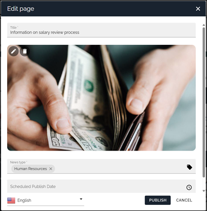
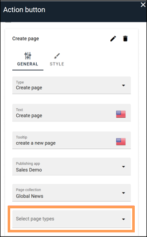

How to use Omnia in SharePoint
================================

In this section you will find documentation on how to use various parts of Omnia in SharePoint.

**This page is a work in progress - there's a lot of new features and options in Omnia 7.12 that will be described here. More information will be added in the coming weeks.**

Webparts from Omnia in SharePoint
**********************************
This is an option that has been available for some time, and still is. There's a lot of useful blocks in Omnia. Some of them can be used as webparts on any SharePoint page. Find them in the tenant settings in Omnia admin here: System > Microsoft 365 > Webparts

How to use the Omnia webparts is described on this page: :doc:`Webparts </admin-settings/tenant-settings/system/microsoft-365/system-webparts/index>`

In Omnia 7.12 and later, a new concept is available, with considerably added possibiblites to use Omnia functionality in a SharePoint set up, see below.

Using the same font
*********************
In Omnia 7.12 and later the font that has been configured in SharePoint can be applied to Omnia as well. (In Omnia up to 7.11, only the default SharePoint could be used in Omnia).

Activate this feature for each publishing app where it should be used:

.. image:: sharepoint-font-feature.png

Automated user activity tracking on SharePoint pages via Matomo
****************************************************************
Activity tracking via Matomo can be activated for any publishing app:

.. image:: sharepoint-matomo-feature.png

For more information about Matomo analytics, see page: :doc:`Analytics (Matomo) settings </admin-settings/business-group-settings/settings/analytics/index>`

Omnia 7.12 and later and SharePoint
*************************************
Omnia 7.12 introduces several improvements that bring Omnia and SharePoint Online closer together. These features allow users to access, navigate and work with Omnia content directly within SharePoint, creating a more consistent experience across both platforms.

The full page experience
---------------------------
The main, intended use is to show and present news articles in the Omnia rollup inside SharePoint and to show the full page on a SharePoint page.

See this page for more information: :doc:`The full page experience </use-omnia-in-sharepoint/full-page-experience/index>`

The Everywhere panel
---------------------
Also called "Left panel". When activated it's available on the left while users browse different pages, allowing quick access to intranet areas and content in both Omnia and SharePoint. 

See this page for more information: :doc:`The Everywhere panel </general-assets/the-everywhere-panel/index>`

Quick editing and publish from a dialog
----------------------------------------------
It is now possible to do a light editing of a page in combination with the “Open page as a dialog”. An edit pencil is added to the page dialog. This pencil appears in SharePoint and is shown only to users who have permission to edit the page. 

Clicking the pen opens a quick edit dialog where the author can change page information and publish the page directly.

The properties available in the quick edit dialog are controlled by the page type. Properties configured with “Show in new page” appear in this window. The dialog handles a page that another person has taken control of. It displays “Take control” in place of Publish so the author can take control before continuing working with the page.

Restrict page types in the Create page action
--------------------------------------------------
An additional page type setting for an action button is available to the button type “Create page”. The option is available in both SharePoint and Omnia.

This allows the administrator to specify which page types the user can choose when creating a page using that button.

If no page types are selected in the action button settings, users can choose from all page types allowed by the selected page collection. If one or more page types are selected, users can choose only from that configured selection.

This makes it possible to provide a creation button with a focused choice of page types for its particular purpose. 

Sign-off requests for SharePoint pages
----------------------------------------
Sign-off requests can now be sent for SharePoint pages as well. Here's how it works:

+ The LinkPicker provider is used to select SharePoint pages when creating sign-off requests.
+ A Sign-off banner is shown on the SharePoint page. Look and feel is similar to Omnia pages. If the SharePoint page contains an Omnia Action Button of type “End-User Sign-Off”, the banner is not displayed (as the button is used instead).

Other than that, it works the same way to sign-off Omnia pages and SharePoint pages. For more information, see:

:doc:`Sign-off requests </admin-settings/tenant-settings/sign-off-requests-613/index>`

:doc:`Sign-off requests rollup block </blocks/sign-off-requests-rollup-613/index>`

