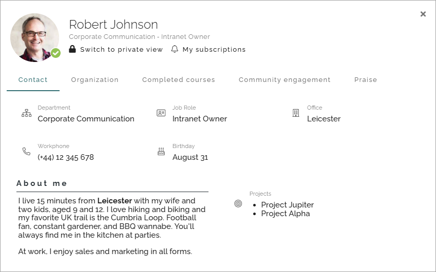

Edit your user profile card
==================================

In Omnia 7.7 an additional way of working with user information has been added. The user profile card has been around for a while, but the way to edit the information is new.

If your organization uses this functionality, this is how you do.

You can open your profile card in a number of ways, depending on how Omnia is set up. One way that is always available is selecting "My profile" here:

The user profil card is opened in private view, meaning some information only you can see.

 
How the card looks can vary a lot depending on how it's set up. It can also look different for different groups of colleagues. The private view can also look quite different from the public view, again depending on how it's set up. What you see here is just an example.

Note that you can always switch to the public way to evaluate what others can see on your card. 

Here's an example of the public view for the card seen above:

Editing your card
************************
As you surely have figured out already, editing is done by clicking the pen for the section you want to edit.

Edit a text field
-----------------------
When editing a text field, you can use th RTF editor, for example:

.. image:: card-edit-text.png

For more information on how you can use the RTF editor, see: :doc:`Editing text with the RTF editor </general-assets/rtf-editor/index>`

Generally, when you have finished editing a section, click here to save the changes (or the x to not save):

my-profile-edit-metadata-clocktag-select-save

Editing metadata
---------------------
Here's an example of how you edit metadata:

Click the x to remove a metadata. Click the tag to add new:

Select one or more metadata from the list.

(Don't forget to save the changes, see above).

