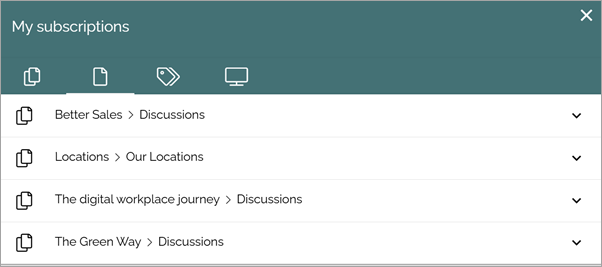

My subscriptions
==================

You can subscribe to a community, articles and discussions in a community, to tags and to channels.

It's also possible that subscription of a channel can be created automatically for specific colleagues or groups, if setup in the channel.

For information about subscriptions regarding communities, see: :doc:`Subscriptions in communities </using-communities/subscriptions/index>`

For information about how to subscribe and unsubscribe to channels, see below.

Use My subscriptions for an overview of your subscriptions. You can unsubscribe using this as well.

My descriptions is available under "My Profile":

My subscriptions is then available on your profile card:

Here's an example of subscriptions:

The left tab (shown in the image above) lists all page collections you subscribe to - meaning you subscribe to ALL activities on all pages in that page collection. 

The second tab lists all pages you subscribe to, for example:

You can click the title to go to the page or discussion.

The third tab displays a list of all tags you subscribe to, for example:

.. image:: my-subscriptions-3-78.png

You can unsubscribe to any subscription, on any tab, by clicking the dust bin.

Subscribing to channels and unsubscribing
********************************************
You can subscribe to channels, if any are setup. Use this tab:

To add a channel, do the following:

1. Select the tab and click ADD CHANNEL.

Available channels are shown, for example:

2. Click ADD for the channel to subscribe. 

In the list of selected channels you can click the dust bin if you no longer want to subscribe to a channel. Note that mandatory channels can not be unsubscribed.

