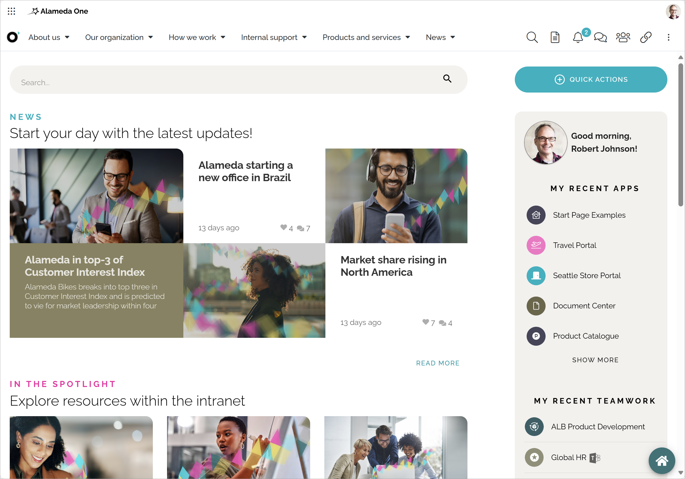
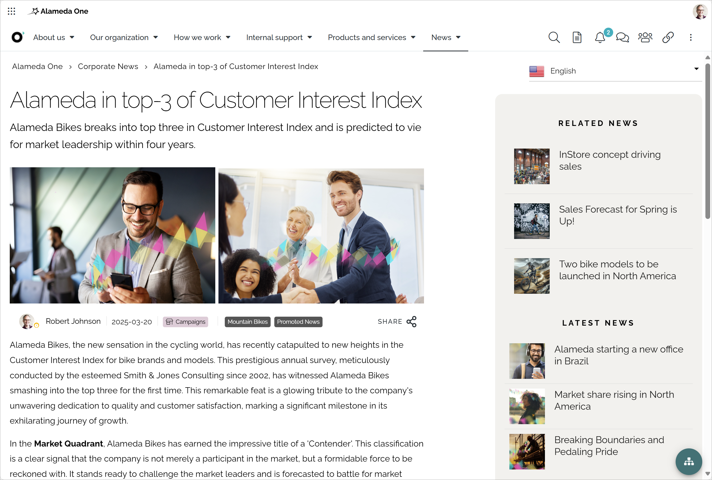
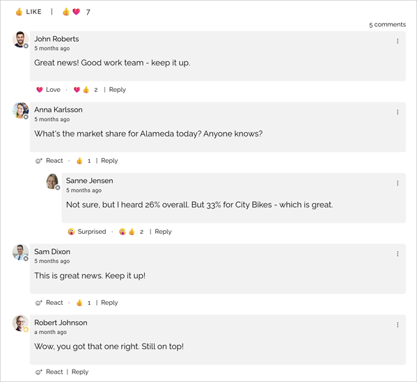
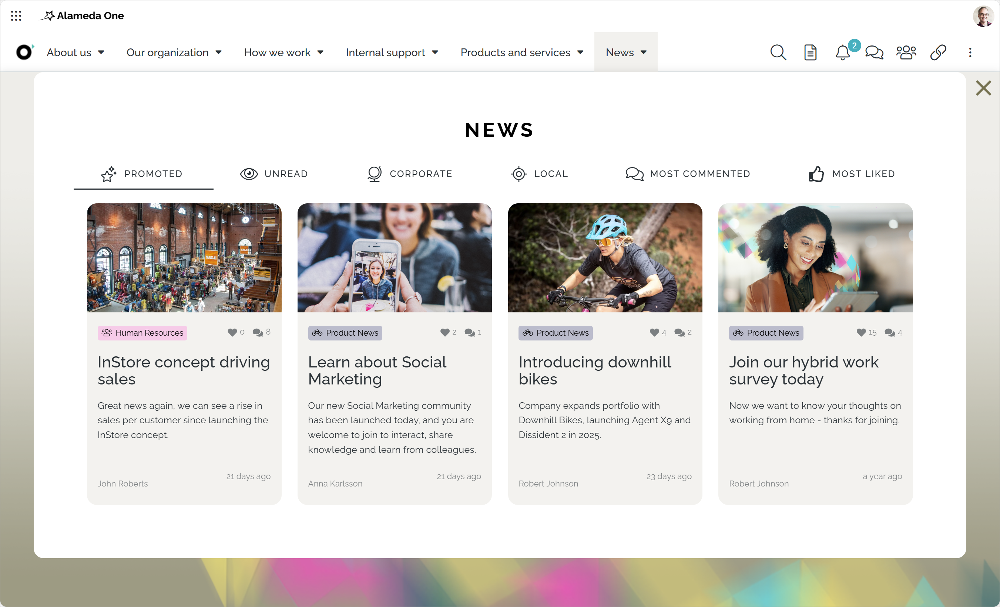
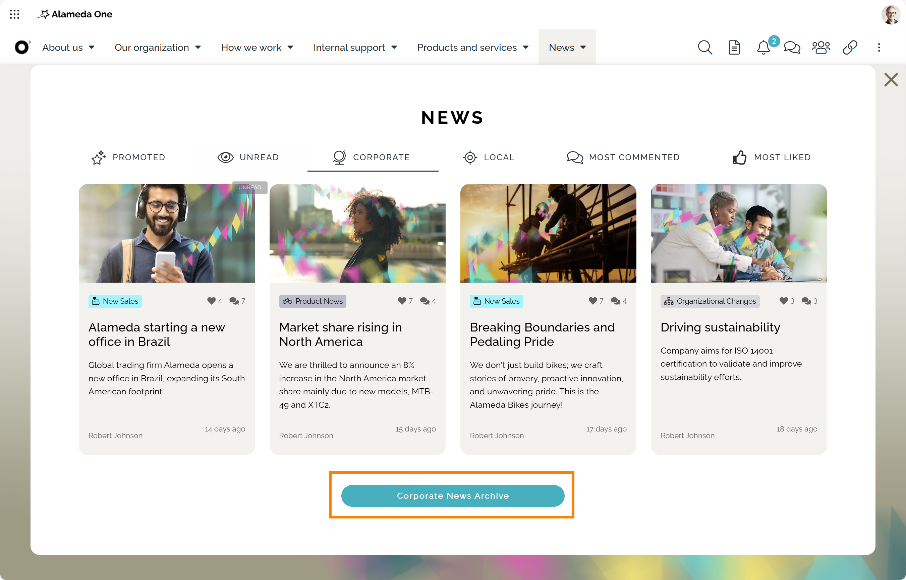
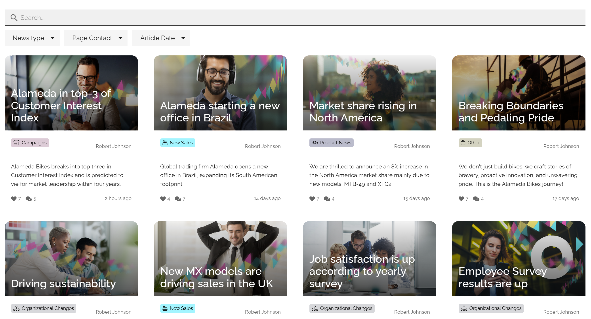

Read news
===========================================

News is very often an important part of an Omnia implementation. How news articles are made available and read can be set up in many ways. 

Normally you can read both the latest news and older news. You can also find news articles through search using quick search and advanced search.

A common solution is that the latest news is available at the start page. Here's an example:

Just click the image for the news you want to read. When reading, it can look like this:

Note the two lists to the right: Related news and Latest news. You can read additional news by just clicking there.

When reading a news article, you can often like (or react in some other way), share and comment the article. Here's an example:

Liking, sharing and commenting works the same way here as for publishing pages in Omnia.

A news center
******************
A news center can also be set up in a number of ways. Here's an example using card views and where the news articles are divied into four types (plus promoted and unread).

If a news archive is available, it's indicated by a link or button, for example:

In a news archive, you can read older news as well. In this example, you can search for news here and filter the list on news type, page contact and article date.

