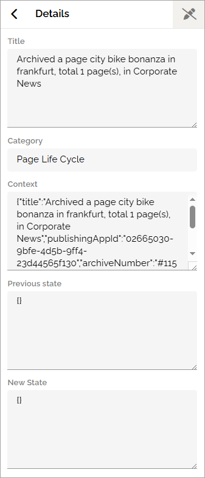
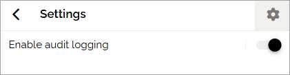

Audit logs
=====================================

This option logs some important events in Omnia:

+ Any changes of permissions anywhere in Omnia.
+ When this functionality is turned on or off.

+ **Title**: Here you can see a description of what has been changed.
+ **Logged by**: The name of the person that did the change is shown here.
+ **Logged at**: Date and time for when the change was made is shown in this column. You can also sort the list on this column.

You can filter the list on dates, category and person (just click FILTERS).

Further information can be accessed by expanding a post.

Here's an example:

The settings
**************
You access the setting by clicking the cogwheel.

What you can do in the settings is simply turning Audit logging on or off (which is also logged).

