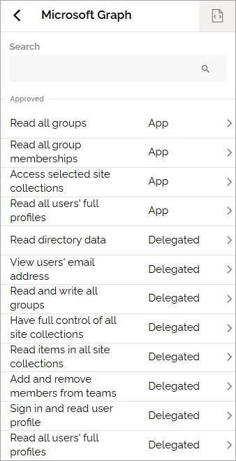

Entra ID permissions
=====================================

Here, a tenant administrator can view all permissions consented to Omnia in Entra ID.

+ CONSENT PENDING/CONSENT LINK – When a feature is activated that requires new consent for the app, the button shows CONSENT PENDING. After consent has been granted, the button changes to CONSENT LINK. You can click it again if the consent needs to be updated. When Omnia permissions have changed, users need to sign out and sign back in for the changes to take effect. Open the dot menu and select this option to force all users to sign out of Omnia. (See more details below.)
+ Microsoft Graph – Displays a list of Microsoft Graph permissions consented to Omnia.
+ Office 365 Sharepoint online – Shows the list of permissions Omnia requests in Microsoft 365.
+ Viva Engage – If available, displays the list of permissions Omnia requests in Viva Engage.

Here’s an example of the Microsoft Graph permissions list:

It looks like this in the legacy ui: !Click to show image(/https://github.com/omniaintranet/OmniaDocsG2/blob/master/v8/admin/system/azure-ad-permissions/azure-ad-permissions-graph-v8.png)

Invalidate all user tokens
******************************************
If you click **Invalidate all user tokens**, all users are signed out of Omnia. This action affects only Omnia — not SharePoint, Office apps, email, or other Microsoft services.

If an editor or author is working on a page when the logout occurs, the user will be signed out, but any changes made are automatically saved frequently, even if not published, to minimize content loss.

