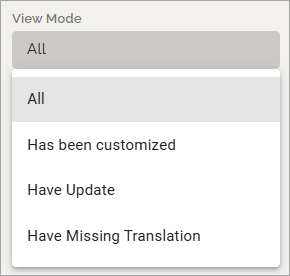

Localization
=====================================

The Localization Editor is used to view and edit label translations for different languages, as well as export translated labels.

Filters
**************
Click FILTERS to choose what is displayed in the list and what you want to work with:

.. image:: localization-view-mode-v8.png

View mode
************
Choose what to display:

+ All – Displays all labels within the selected service.
+ Has been customized – Shows labels that have been edited directly in the editor (without export). See more information below.
+ have update – Lists all labels that have been updated.
+ Have missing translation – Displays labels that have not yet been translated.

Omnia service
***************
Select the part of Omnia for which you want to view or translate labels. If you are translating, note that each part of Omnia must be translated separately, as each contains unique label.

.. image:: localization-service-v8.png

**Note!** If the service name ends with “worker”, it must not be translated.

Language
************
Select the output language from the available tenant languages. 

.. image:: localization-language-v8.png

If you are translating missing labels, it can be useful to export both English (United States) — the base language for Omnia — and the target language. This allows you to compare existing translations with the base text.

Available languages are configured under **Tenant Settings** → **Regional Settings**.

Export
***********
When you have selected your options, click EXPORT to export the list to a file.

The texts that need translation are exported to a JSON file, saved in your computer’s Downloads folder.

Correcting Individual Translations
************************************
If you only need to correct one or a few translations, you can edit them directly in the editor without exporting.

**Important**:

This type of change is categorized as "Has been customized" in the View Mode selector. Customized labels are not overwritten when importing a translated JSON file, which means updates made by the Omnia translation team will not apply to these labels.

Don’t forget to save your changes when you’re done.

