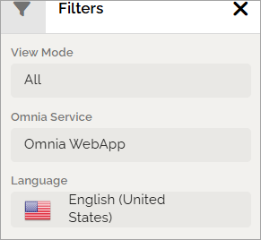
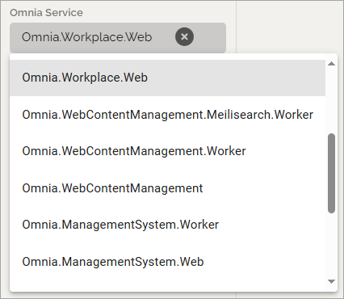
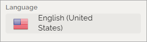

Localization
=====================================

The localization editor is used to view translations of different labels in different languages, edit these translations, and export the translated labels.

For translation, or simply editing, of Email messages from Omnia, see this page for more information: :doc:`Tokens in Omnia Emails </admin-settings/tenant-settings/system/tokens-in-emails/index>`

+ **View Mode**: Use this list to select the output:

In order to view the labels that have yet not been translated, select **Have missing translation**.

+ **Omnia service**: Here you can select the part of omnia that you would like to view the labels of. If the purpose is translating labels, then each part needs to be translated, since each part has different labels:

**Note!** If the name of the service ends with "worker", it must not be translated.

When View mode and Service has been selected, a list is shown. In this example everything in Web content management that don't have a translation yet is listed.

You can point at the i-icon for information about which languages, of the available languages, are missing.

.. image:: localization-info-v8.png

+ **Language**: Select language for the output here, from the available tenant languages. 

If the purpose is translating untranslated labels, it can be useful to create output for both English (United states), that is the base language for Omnia, and the language you wish to translate to. You can then always check existing translations, what labels was translated from.

Available languages are set up under Tenant-Settings-Regional settings, see: :doc:`Regional settings </admin-settings/tenant-settings/settings/index>`

+ **Export**: When you have finished the settings, click this button to export to a file.

.. image:: localization-button-v8.png

The texts that needs to be translated are now exported to a json file. The file is placed in the Downloads folder on your computer.

Just correcting a few translations
************************************
If you only need to correct one, or a few, translations, you don't need to download the file/files. You can then simply change the translation directly here. 

**important note!** This method is what is called "Has been customized" in the View mode selector. Changes you make this way are NOT overwritten if you import a translated JSON file to the system, which also means changes that the Omnia translation staff do is not implemented for these labels/messages.

Don't forget to save when you're done.

