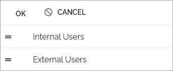
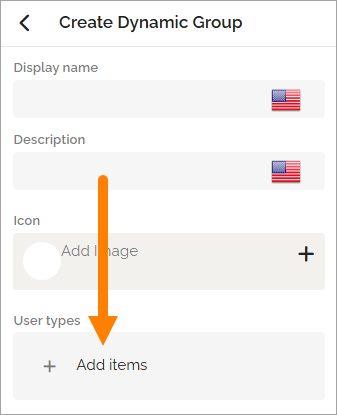

Active dynamic groups
=====================================

Here the active dynamic groups are listed. You can edit a group by expanding its entry, and you can create new dynamic groups.

The available options are the same when creating or editing groups (see below).

You can manage the list by arranging the order in which groups appear in various views. Use drag and drop.

Settings for dynamic groups
******************************
The following settings are available when you create a new group or edit an existing one:

+ Display name: The name shown in lists.
+ Description: Add a description for additional details.
+ Add image: If you want to include an image for the group, click this button and use the Media picker to select one.
+ User types: Use this list to select one or more user types (see below).

Add user types to a group
****************************
To add user types to a group, open the list and select one or more of the available types.

If you add a user type by mistake, click the x to remove it.

Click CREATE to save a new group, or SAVE to apply changes to an existing group.

Read more
*********
For more information, see: :doc:`Using the media picker </v8/common/using-media-picker/index>`

